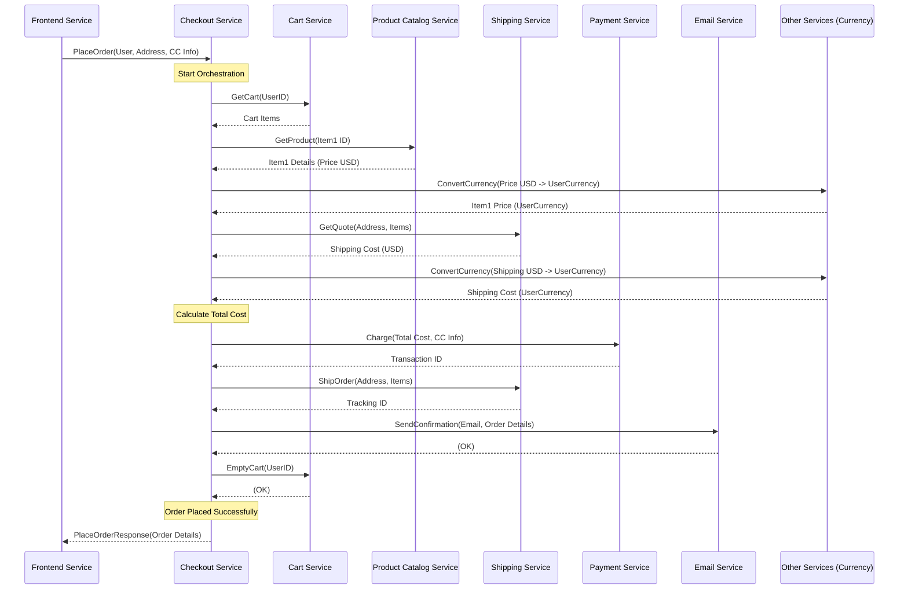

# Chapter 3: Checkout Service

Welcome back! In [Chapter 2: Frontend Service](02_frontend_service_.md), we explored the `frontend` service, which acts as the main entry point for users interacting with our Online Boutique website. We saw how it gathers information from various backend services to display pages.

Now, let's look at what happens when a user decides to buy the items in their cart. This is where the **Checkout Service** comes into play.

## What Problem Does the Checkout Service Solve?

Imagine you've finished shopping in a real store and head to the checkout counter. The cashier doesn't just take your money; they scan your items, maybe check your loyalty card, calculate the total (including tax), process your payment, bag your items, and give you a receipt. It's a multi-step process involving different actions.

In our online store, the **Checkout Service** is like that diligent cashier and the back-office manager combined. When you click the "Place Order" button on the website, the `frontend` service sends a request to the `checkoutservice`. This service then takes charge of the entire process to finalize your purchase. It ensures all the necessary steps are completed in the correct order.

**Use Case: Placing an Order**

You've added items to your cart, reviewed them, entered your shipping address and payment details, and finally clicked "Place Order". What needs to happen next?

*   The system needs to know exactly what's in your cart.
*   It needs to calculate the final cost, including item prices, shipping fees, and potentially converting currencies.
*   It needs to charge your credit card.
*   It needs to "ship" the order (in our demo, this is just a simulated step).
*   It needs to send you a confirmation email with the order details.
*   Finally, it needs to empty your shopping cart.

The Checkout Service manages this entire sequence.

## Key Concepts

1.  **Orchestrator:** This is the most important role of the Checkout Service. Like the conductor of an orchestra directing different musicians, the Checkout Service directs other microservices to perform their specific tasks in the right order to fulfill an order. It doesn't process payments or calculate shipping costs *itself*; it calls the specialized services that do.
2.  **Workflow Manager:** It manages the "workflow" of placing an order, ensuring each step (get cart, calculate costs, charge payment, ship, confirm, empty cart) happens successfully.
3.  **State Management (Minimal):** While it coordinates the process, the Checkout Service itself tries to remain relatively simple. It doesn't permanently store order history (that might be another service's job in a real, larger system). Its main job is to manage the *current* checkout process.

## How the Checkout Service Works: Finalizing Your Purchase

Let's trace the "Place Order" use case step-by-step, focusing on the Checkout Service's actions:

1.  **User:** Clicks "Place Order" on the website.
2.  **Frontend Service:** Sends a `PlaceOrder` request to the Checkout Service via gRPC. This request includes the user's ID, address, email, and credit card information.
3.  **Checkout Service:** Receives the `PlaceOrder` request. Now the orchestration begins:
    *   **a. Get Cart:** Asks the `cartservice`: "What items are in this user's cart?"
    *   **b. Get Product Details & Costs:** For each item in the cart, asks the `productcatalogservice`: "What are the details (like price in USD) for this product?"
    *   **c. Calculate Shipping Cost:** Asks the `shippingservice`: "What's the shipping cost for these items to this address?"
    *   **d. Convert Currencies:** If the user's currency isn't USD, asks the `currencyservice`: "Convert the item prices and shipping cost from USD to the user's currency."
    *   **e. Calculate Total Cost:** Adds up the converted item costs and the converted shipping cost.
    *   **f. Charge Card:** Asks the `paymentservice`: "Charge this total amount to this credit card." (This is fake in the demo).
    *   **g. Ship Order:** Asks the `shippingservice`: "Ship these items to this address." (This is also fake/mocked, returning a tracking ID).
    *   **h. Empty Cart:** Asks the `cartservice`: "Empty this user's cart."
    *   **i. Send Confirmation:** Asks the `emailservice`: "Send an order confirmation email to the user with these order details (items, cost, tracking ID)."
4.  **Backend Services:** Each service performs its task and responds to the Checkout Service. For example, `paymentservice` returns a transaction ID, `shippingservice` returns a tracking ID.
5.  **Checkout Service:** Once all steps are successfully completed, it packages the final order details (like the order ID it generated, the tracking ID, final costs) into a response.
6.  **Checkout Service:** Sends the `PlaceOrderResponse` back to the `frontend` service.
7.  **Frontend Service:** Receives the response and displays an order confirmation page to the user.

Here’s a simplified diagram of that flow:


*(Note: Some intermediate calls like currency conversion for every item are simplified in the diagram for clarity).*

## A Peek Inside the Code (Go)

The Checkout Service is written in Go. Let's look at some simplified snippets from `src/checkoutservice/`.

**1. Starting the Service and Connecting (`src/checkoutservice/main.go`)**

Like the `frontend`, the `checkoutservice` needs to know the addresses of the services it calls. It reads these from environment variables and establishes gRPC connections when it starts.

```go
// Simplified main function in src/checkoutservice/main.go

package main

// ... imports ...

func main() {
	// ... (logging, tracing, profiler setup) ...

	port := listenPort
	if os.Getenv("PORT") != "" {
		port = os.Getenv("PORT")
	}

	svc := new(checkoutService) // Our service struct

	// Read service addresses from environment variables
	mustMapEnv(&svc.shippingSvcAddr, "SHIPPING_SERVICE_ADDR")
	mustMapEnv(&svc.productCatalogSvcAddr, "PRODUCT_CATALOG_SERVICE_ADDR")
	mustMapEnv(&svc.cartSvcAddr, "CART_SERVICE_ADDR")
	// ... etc for currency, email, payment ...

	// Establish gRPC connections to other services
	ctx := context.Background()
	mustConnGRPC(ctx, &svc.shippingSvcConn, svc.shippingSvcAddr)
	mustConnGRPC(ctx, &svc.productCatalogSvcConn, svc.productCatalogSvcAddr)
	mustConnGRPC(ctx, &svc.cartSvcConn, svc.cartSvcAddr)
	// ... etc for currency, email, payment ...

	log.Infof("service config: %+v", svc)

	lis, err := net.Listen("tcp", fmt.Sprintf(":%s", port))
	// ... (error handling) ...

	// Create and register the gRPC server (listens for requests)
	srv := grpc.NewServer(/*...interceptors for tracing...*/)
	pb.RegisterCheckoutServiceServer(srv, svc) // Register our service implementation
	healthpb.RegisterHealthServer(srv, svc)    // Register health check handler

	log.Infof("starting to listen on tcp: %q", lis.Addr().String())
	err = srv.Serve(lis) // Start listening for incoming gRPC calls
	log.Fatal(err)
}

// Helper to read environment variables
func mustMapEnv(target *string, envKey string) {
	v := os.Getenv(envKey)
	if v == "" {
		// In real code, better error handling or defaults might exist
		panic(fmt.Sprintf("environment variable %q not set", envKey))
	}
	*target = v
}

// Helper to establish gRPC connection
func mustConnGRPC(ctx context.Context, conn **grpc.ClientConn, addr string) {
	// ... (simplified connection logic with timeout) ...
	var err error
	*conn, err = grpc.DialContext(ctx, addr, grpc.WithInsecure(), /*...tracing interceptors...*/)
	if err != nil {
		panic(fmt.Sprintf("grpc: failed to connect %s: %v", addr, err))
	}
}
```

*Explanation:* The `main` function sets up logging and potentially tracing/profiling. It creates an instance of our `checkoutService` struct. Crucially, it uses `mustMapEnv` to read environment variables like `SHIPPING_SERVICE_ADDR` (set by Kubernetes/Helm, see chapters below) to find other services. It then uses `mustConnGRPC` to connect to these services. Finally, it creates a gRPC server, registers the `checkoutService` implementation to handle incoming requests, and starts listening for connections on its port (5050).

**2. Handling the `PlaceOrder` Request (`src/checkoutservice/main.go`)**

This is the core orchestration logic. When the `frontend` calls `PlaceOrder`, this function runs.

```go
// Simplified PlaceOrder function in src/checkoutservice/main.go

// Import generated protobuf code alias
import pb "github.com/GoogleCloudPlatform/microservices-demo/src/checkoutservice/genproto"

func (cs *checkoutService) PlaceOrder(ctx context.Context, req *pb.PlaceOrderRequest) (*pb.PlaceOrderResponse, error) {
	log.Infof("[PlaceOrder] user_id=%q user_currency=%q", req.UserId, req.UserCurrency)

	// Generate a unique order ID
	orderID, _ := uuid.NewUUID() // Simplified: Real code handles errors

	// Step 1: Get cart, product costs, shipping quote, convert currencies
	prep, err := cs.prepareOrderItemsAndShippingQuoteFromCart(ctx, req.UserId, req.UserCurrency, req.Address)
	if err != nil {
		return nil, status.Errorf(codes.Internal, err.Error()) // Simplified error
	}

	// Step 2: Calculate the grand total
	total := calculateTotal(prep.orderItems, prep.shippingCostLocalized, req.UserCurrency) // Simplified helper

	// Step 3: Charge the credit card
	txID, err := cs.chargeCard(ctx, &total, req.CreditCard)
	if err != nil {
		return nil, status.Errorf(codes.Internal, "failed to charge card: %+v", err) // Simplified error
	}
	log.Infof("payment went through (transaction_id: %s)", txID)

	// Step 4: Ship the order (mocked)
	shippingTrackingID, err := cs.shipOrder(ctx, req.Address, prep.cartItems)
	if err != nil {
		return nil, status.Errorf(codes.Unavailable, "shipping error: %+v", err) // Simplified error
	}

	// Step 5: Empty the user's cart
	_ = cs.emptyUserCart(ctx, req.UserId) // Ignore error for simplicity here

	// Step 6: Prepare the final order result
	orderResult := &pb.OrderResult{
		OrderId:            orderID.String(),
		ShippingTrackingId: shippingTrackingID,
		ShippingCost:       prep.shippingCostLocalized,
		ShippingAddress:    req.Address,
		Items:              prep.orderItems,
	}

	// Step 7: Send confirmation email (asynchronously)
	// Use 'go' to run in background - don't wait for email to be sent
	go cs.sendOrderConfirmation(ctx, req.Email, orderResult)

	log.Infof("order placed successfully, order_id: %s", orderID.String())
	// Return response to the frontend
	return &pb.PlaceOrderResponse{Order: orderResult}, nil
}

```

*Explanation:* This function executes the steps outlined previously. It calls helper functions like `prepareOrderItemsAndShippingQuoteFromCart`, `chargeCard`, `shipOrder`, `emptyUserCart`, and `sendOrderConfirmation`. Each of these helpers makes one or more gRPC calls to other microservices. Notice how it coordinates these calls sequentially (except for the email confirmation, which is sent in the background using `go`). The specific details of requests and responses (like `pb.PlaceOrderRequest`, `pb.OrderResult`) are defined in `.proto` files, covered in [Chapter 4: gRPC Service Definitions (Protobufs)](04_grpc_service_definitions__protobufs__.md).

**3. Example Helper: Calling Other Services (`src/checkoutservice/main.go`)**

Let's look at a simplified version of `getUserCart` to see how it calls the `cartservice`.

```go
// Simplified getUserCart function in src/checkoutservice/main.go

func (cs *checkoutService) getUserCart(ctx context.Context, userID string) ([]*pb.CartItem, error) {
	// Create a client for the CartService using the pre-established connection
	cartClient := pb.NewCartServiceClient(cs.cartSvcConn)

	// Make the gRPC call to the CartService's GetCart method
	cart, err := cartClient.GetCart(ctx, &pb.GetCartRequest{UserId: userID})
	if err != nil {
		return nil, fmt.Errorf("failed to get user cart: %+v", err) // Simplified error
	}
	// Return the items from the response
	return cart.GetItems(), nil
}

```

*Explanation:* This function uses the `cs.cartSvcConn` (the gRPC connection established in `main`) to create a `CartServiceClient`. This client object (`cartClient`) is generated from the Protobuf definitions ([Chapter 4: gRPC Service Definitions (Protobufs)](04_grpc_service_definitions__protobufs__.md)) and knows how to talk to the `cartservice`. The line `cartClient.GetCart(...)` makes the actual network call to the `cartservice`, sending a `GetCartRequest` and receiving a `Cart` response (or an error).

**4. Configuration for Service Discovery (`kubernetes-manifests/checkoutservice.yaml`)**

How does the Checkout Service know the actual network address (`hostname:port`) for `cartservice`, `paymentservice`, etc.? This is configured during deployment, typically via environment variables set by Kubernetes.

```yaml
# Simplified snippet from kubernetes-manifests/checkoutservice.yaml
apiVersion: apps/v1
kind: Deployment
metadata:
  name: checkoutservice
spec:
  template:
    spec:
      containers:
        - name: server
          image: checkoutservice # Container image name
          ports:
          - containerPort: 5050  # Port this service listens on
          env:
          # --- Environment variables telling Checkout where others are ---
          - name: PORT
            value: "5050"
          - name: PRODUCT_CATALOG_SERVICE_ADDR
            value: "productcatalogservice:3550" # Address for Product Catalog
          - name: SHIPPING_SERVICE_ADDR
            value: "shippingservice:50051"       # Address for Shipping
          - name: PAYMENT_SERVICE_ADDR
            value: "paymentservice:50051"        # Address for Payment
          - name: EMAIL_SERVICE_ADDR
            value: "emailservice:5000"           # Address for Email
          - name: CURRENCY_SERVICE_ADDR
            value: "currencyservice:7000"        # Address for Currency
          - name: CART_SERVICE_ADDR
            value: "cartservice:7070"           # Address for Cart
          # ... other env vars like tracing/profiling ...
```

*Explanation:* This Kubernetes configuration defines the `checkoutservice` deployment. The `env` section lists environment variables that will be injected into the running container. The Go code in `main.go` reads these variables (e.g., `CART_SERVICE_ADDR`) to know the addresses (`servicename:port`) for connecting to the other services. Kubernetes handles the internal networking to ensure these names resolve correctly. We'll learn more about this in [Chapter 5: Kubernetes Manifests (Base Deployment)](05_kubernetes_manifests__base_deployment_.md) and [Chapter 7: Helm Chart (Packaging and Deployment)](07_helm_chart__packaging_and_deployment__.md).

## Conclusion

The Checkout Service is the central orchestrator for the final stage of a customer's purchase. It doesn't perform tasks like payment processing or shipping itself, but instead coordinates calls to the specialized microservices responsible for each step (`cartservice`, `paymentservice`, `shippingservice`, `emailservice`, etc.). It receives a request from the `frontend`, manages the multi-step workflow using gRPC calls, and ensures the order is processed correctly before responding.

In the next chapter, we'll take a closer look at the communication contracts between these services: [Chapter 4: gRPC Service Definitions (Protobufs)](04_grpc_service_definitions__protobufs__.md). This will explain *how* the services know what functions to call on each other and what data to send and receive.

---

Generated by [AI Codebase Knowledge Builder](https://github.com/The-Pocket/Tutorial-Codebase-Knowledge)
