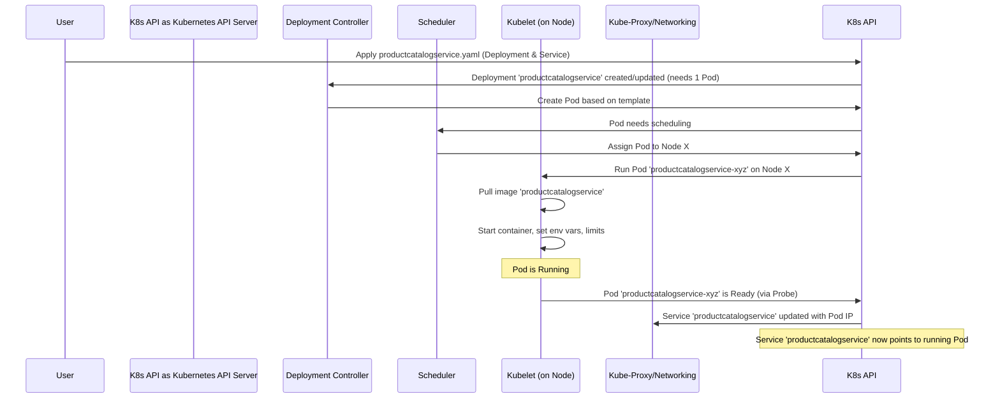

# Chapter 5: Kubernetes Manifests (Base Deployment)

Welcome back! In [Chapter 4: gRPC Service Definitions (Protobufs)](04_grpc_service_definitions__protobufs__.md), we learned how our different microservices define a clear contract using `.proto` files, allowing them to communicate effectively even if they're written in different languages.

Now we have all these individual microservices (like `frontend`, `productcatalogservice`, `cartservice`, etc.). We know *how* they talk to each other, but how do we actually get them running and managed together? How do we tell our system, "Hey, I need one copy of the `frontend` running, and three copies of the `productcatalogservice`, and make sure they can find each other"?

This is where **Kubernetes** and **Kubernetes Manifests** come in.

## What Problem Do Kubernetes Manifests Solve?

Imagine you've built all the parts for a complex Lego model (our microservices). You need instructions to put them together correctly. Kubernetes is like the master builder, and the **manifest files** are the detailed blueprints or instruction manuals for each part.

*   **Kubernetes:** Think of Kubernetes as a powerful "orchestrator". It manages our running applications (which are packaged into containers - like standardized boxes). It handles starting them, stopping them, making sure the right number are running, helping them find each other, and much more. It's like a city manager for our application services.
*   **Manifests:** These are configuration files, typically written in a format called **YAML** (Yet Another Markup Language - it's human-readable and uses indentation to show structure). Manifests tell Kubernetes *exactly* what we want it to do. For each microservice, we'll have a manifest that describes:
    *   Which container image (the "box" containing our service code) to use.
    *   How many copies (replicas) of the service should run.
    *   What resources (like CPU power and memory) the service needs.
    *   Any special configuration (like environment variables).
    *   How other services can connect to this one (its network address).

**Use Case: Deploying the Product Catalog Service**

Let's say we want to deploy our `productcatalogservice`. We need to tell Kubernetes:
1.  Use the `productcatalogservice` container image.
2.  Run one instance (replica) of it.
3.  It needs a small amount of CPU and memory.
4.  It listens for connections on port 3550 inside its container.
5.  Other services should be able to reach it using the name `productcatalogservice` on port 3550.

Kubernetes manifests are how we provide these precise instructions.

## Key Concepts

1.  **YAML:** The language used for manifests. It uses `key: value` pairs and indentation (spaces, not tabs!) to define structure. It's designed to be easy for humans to read and write.
2.  **Kubernetes Objects:** Manifests describe desired "objects" in Kubernetes. Think of these as different types of resources Kubernetes manages. The two most important ones for us right now are:
    *   **Deployment:** This object tells Kubernetes how to run and manage stateless applications (like most of our microservices). It ensures the specified number of copies (called **Pods**) are running and handles updates or rollbacks. (Analogy: The blueprint for an apartment building, specifying the type of apartments and how many).
    *   **Pod:** The smallest deployable unit in Kubernetes. It represents a single running instance of your application container (or sometimes multiple tightly coupled containers). Deployments create and manage Pods. (Analogy: An individual apartment instance within the building).
    *   **Service:** This object provides a stable network identity (a fixed internal IP address and DNS name) for a set of Pods (usually those managed by a Deployment). Even if Pods are stopped and started (and get new internal IPs), the Service name stays the same, allowing other services to reliably connect to it. (Analogy: The building's permanent address and mailbox, which doesn't change even if residents move in or out of apartments).

## How It Works: The Blueprints for `productcatalogservice`

The basic instructions for deploying our microservices live in the `kubernetes-manifests/` directory. Let's look at the file for the `productcatalogservice`: `kubernetes-manifests/productcatalogservice.yaml`.

This file actually defines *two* Kubernetes objects: a `Deployment` and a `Service`, separated by `---`.

**1. The Deployment Object (How to Run It)**

```yaml
# Simplified from kubernetes-manifests/productcatalogservice.yaml
apiVersion: apps/v1  # Specifies the Kubernetes API version to use
kind: Deployment    # Specifies the type of object: a Deployment
metadata:
  name: productcatalogservice # The name we give this Deployment object
spec: # The specification - the desired state
  selector:
    matchLabels:
      app: productcatalogservice # Finds Pods with the label "app: productcatalogservice"
  template: # The blueprint for the Pods this Deployment will create
    metadata:
      labels:
        app: productcatalogservice # Adds the label "app: productcatalogservice" to created Pods
    spec: # The specification for the Pods
      # ... (serviceAccountName, securityContext - details for later) ...
      containers: # List of containers to run in the Pod (usually just one)
      - name: server # A name for the container
        image: productcatalogservice # The container image to use (like 'productcatalogservice:v1.0')
                                     # This name will be replaced by a full registry path later
        ports:
        - containerPort: 3550 # The network port the application listens on INSIDE the container
        env: # Environment variables to set inside the container
        - name: PORT
          value: "3550"
        # - name: DISABLE_PROFILER # Example of other config
        #   value: "1"
        resources: # How much CPU/Memory the container needs/can use
          requests: # Minimum required
            cpu: 100m # 100 millicpu (0.1 CPU core)
            memory: 64Mi # 64 Mebibytes of memory
          limits: # Maximum allowed
            cpu: 200m
            memory: 128Mi
        readinessProbe: # How Kubernetes checks if the app is ready to serve traffic
          grpc:
            port: 3550 # Check the gRPC endpoint on port 3550
        livenessProbe: # How Kubernetes checks if the app is still alive (if not, restart it)
          grpc:
            port: 3550
```

*Explanation:*
*   `kind: Deployment`: Tells Kubernetes we want to define a deployment.
*   `metadata.name`: Names this specific deployment `productcatalogservice`.
*   `spec.selector.matchLabels`: This is crucial. It tells the Deployment which Pods it "owns" – any Pod with the label `app: productcatalogservice`.
*   `spec.template`: This section is the blueprint used to *create* the Pods.
    *   `template.metadata.labels`: It applies the label `app: productcatalogservice` to each Pod it creates, linking them back to the Deployment's selector.
    *   `template.spec.containers`: Defines the actual container(s) to run.
        *   `image`: Specifies the container image name. Kubernetes will pull this image from a container registry (like Docker Hub or Google Container Registry). We'll see how the exact image name/tag gets set later using tools like Kustomize or Helm.
        *   `ports.containerPort`: Declares that the application inside the container listens on port 3550.
        *   `env`: Sets environment variables for the running application (like the `PORT` the service should listen on).
        *   `resources`: Very important for managing cluster resources. `requests` guarantees a minimum amount, while `limits` prevents a service from hogging resources.
        *   `readinessProbe`/`livenessProbe`: These tell Kubernetes how to check if the application is healthy and ready to receive traffic, ensuring reliability.

**2. The Service Object (How to Find It)**

```yaml
# Simplified from kubernetes-manifests/productcatalogservice.yaml
--- # Separator between objects in the same file
apiVersion: v1
kind: Service       # Specifies the type of object: a Service
metadata:
  name: productcatalogservice # The name we give this Service object (used for DNS)
spec: # The specification for the Service
  type: ClusterIP   # Exposes the service on an internal IP in the cluster. Only reachable from within the cluster.
  selector:
    app: productcatalogservice # Forwards traffic to Pods with the label "app: productcatalogservice"
  ports:
  - name: grpc
    port: 3550      # The port the Service will listen on (internal cluster IP:3550)
    targetPort: 3550 # The port on the Pods to forward traffic to (containerPort: 3550)
```

*Explanation:*
*   `kind: Service`: Tells Kubernetes we want to define a service.
*   `metadata.name`: Names this Service `productcatalogservice`. This is the name other services will use to connect to it within the cluster! Kubernetes provides internal DNS, so other Pods can simply connect to `productcatalogservice:3550`.
*   `spec.type: ClusterIP`: Makes this Service accessible only *within* the Kubernetes cluster. (Other types like `LoadBalancer` expose services externally).
*   `spec.selector`: This links the Service to the Pods. It selects all Pods that have the label `app: productcatalogservice` (the same label the Deployment manages). Any traffic sent to the Service IP/name will be automatically routed to one of these healthy Pods.
*   `spec.ports`: Defines the port mapping. `port: 3550` is the port the Service itself listens on. `targetPort: 3550` is the `containerPort` on the Pods where the traffic should be sent.

**Connecting the Dots: How the Frontend Finds the Product Catalog**

Now, remember how the `frontend` service needed to know the address of the `productcatalogservice`? Let's look at a snippet from its Deployment manifest (`kubernetes-manifests/frontend.yaml`):

```yaml
# Simplified snippet from kubernetes-manifests/frontend.yaml
apiVersion: apps/v1
kind: Deployment
metadata:
  name: frontend
spec:
  template:
    spec:
      containers:
        - name: server
          image: frontend
          env:
          # --- This is how the Frontend finds the ProductCatalogService ---
          - name: PRODUCT_CATALOG_SERVICE_ADDR
            value: "productcatalogservice:3550" # Service name + Service port
          # ... other service addresses ...
          - name: CURRENCY_SERVICE_ADDR
            value: "currencyservice:7000"
          - name: CART_SERVICE_ADDR
            value: "cartservice:7070"
          # ...
```

*Explanation:* The environment variable `PRODUCT_CATALOG_SERVICE_ADDR` is set to `"productcatalogservice:3550"`. When the `frontend` code tries to connect to this address, Kubernetes' internal DNS resolves the name `productcatalogservice` to the internal IP address assigned to the `productcatalogservice` *Service*. The Service then forwards the connection to one of the healthy `productcatalogservice` *Pods* listening on port 3550.

## The Deployment Process (Simplified)

What happens when you tell Kubernetes to use these manifests? Typically, you'd use a command-line tool called `kubectl`:

```bash
kubectl apply -f kubernetes-manifests/productcatalogservice.yaml
kubectl apply -f kubernetes-manifests/frontend.yaml
# ... apply manifests for all other services ...
```

Here's a simplified flow of what Kubernetes does when you apply the `productcatalogservice.yaml`:

1.  **Parse:** Kubernetes reads the YAML file.
2.  **Create/Update Deployment:** It creates (or updates if it exists) the `Deployment` object named `productcatalogservice`.
3.  **Deployment Controller:** A controller inside Kubernetes notices the Deployment and sees it needs 1 replica (the default if not specified, though our real files might specify it).
4.  **Create Pod:** The controller creates a `Pod` based on the `spec.template` defined in the Deployment.
5.  **Schedule Pod:** The Kubernetes scheduler decides which worker Node (a server in the cluster) is best suited to run this Pod based on resource requests etc.
6.  **Run Container:** The Kubelet (an agent running on the worker Node) gets instructions to start the Pod. It pulls the `productcatalogservice` container image (if not already present) and starts the container, injecting the environment variables and setting resource limits.
7.  **Create/Update Service:** Kubernetes creates (or updates) the `Service` object named `productcatalogservice`.
8.  **Link Service to Pod:** Kubernetes continuously watches for Pods matching the Service's selector (`app: productcatalogservice`). As the Pod starts and becomes ready (passes its readiness probe), Kubernetes includes its internal IP address in the list of endpoints for the `productcatalogservice` Service.
9.  **DNS:** Kubernetes ensures that the name `productcatalogservice` resolves to the Service's internal ClusterIP address within the cluster's DNS system.



Now, when the `frontend` Pod tries to connect to `productcatalogservice:3550`, the request goes through Kubernetes networking (`KubeProxy` and internal DNS), which knows the IP address of the healthy `productcatalogservice` Pod and routes the traffic correctly.

## Conclusion

Kubernetes manifests are the essential YAML blueprints that tell Kubernetes how to run and manage our microservices. We use `Deployment` objects to define *how* to run the application containers (image, replicas, resources, environment variables) and `Service` objects to provide a stable network name and IP address (`ClusterIP`) so other services can reliably connect to them within the cluster.

These base manifests in `kubernetes-manifests/` define the core configuration for each service. However, you might want slightly different configurations for development vs. production (e.g., different resource limits, different image tags). In the next chapter, [Kustomize Components (Deployment Variations)](06_kustomize_components__deployment_variations_.md), we'll explore how Kustomize helps us manage these variations without duplicating all the manifest files.

---

Generated by [AI Codebase Knowledge Builder](https://github.com/The-Pocket/Tutorial-Codebase-Knowledge)