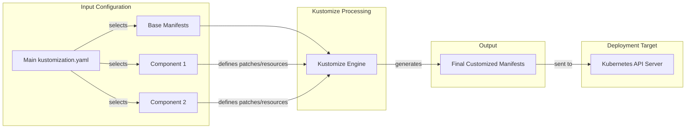

# Chapter 6: Kustomize Components (Deployment Variations)

In [Chapter 5: Kubernetes Manifests (Base Deployment)](05_kubernetes_manifests__base_deployment_.md), we learned how to define the basic setup for running our microservices using Kubernetes Deployment and Service manifests. These files in the `kubernetes-manifests/` directory describe the standard, default way to run the Online Boutique.

But what if we want to run slightly different versions? For example:
*   Maybe we want to change the website's branding from "Online Boutique" to something else, like "Cymbal Shops".
*   Perhaps we want to enable advanced monitoring and tracing features for debugging in a test environment, but keep them off in a simple local setup.
*   What if we want to switch the `cartservice` from using its simple built-in database (Redis) to using a more powerful cloud database like Spanner or Memorystore?

Do we have to copy *all* the YAML files and manually edit the copies for each variation? That would be very inefficient and hard to maintain! If we needed to update a common setting (like a resource limit), we'd have to change it in many places.

This is the problem that **Kustomize** helps us solve.

## What is Kustomize?

Imagine you buy a basic model car. It runs fine, but you might want to add some optional features: maybe a roof rack, different wheels, or a new paint job. You don't buy a whole new car for each change; you get "customization kits" or "components" that modify your base car.

**Kustomize** is a tool built into `kubectl` (the Kubernetes command-line tool) that lets us do exactly this for our Kubernetes configurations. It allows us to:

1.  Define a **base** configuration (like our default manifests in `kubernetes-manifests/`).
2.  Define reusable **components** (like customization kits) that describe specific changes or additions.
3.  Use a special file (`kustomization.yaml`) to tell Kustomize which base and which components to combine.

Kustomize then intelligently merges these pieces together to generate the final Kubernetes manifests, which we can apply to our cluster. This way, we only define the *differences* in the components, keeping our configurations DRY (Don't Repeat Yourself).

## Key Concepts

1.  **Base:** This is the set of standard Kubernetes manifest files that define the core application deployment. In our project, the manifests inside `kubernetes-manifests/` (copied to `kustomize/base/` for Kustomize use) serve as the base.
    *   File: `kustomize/base/kustomization.yaml` - This file simply lists all the base manifest files (like `frontend.yaml`, `cartservice.yaml`, etc.).

    ```yaml
    # Simplified from kustomize/base/kustomization.yaml
    apiVersion: kustomize.config.k8s.io/v1beta1
    kind: Kustomization
    resources: # Lists all the base manifest files
    - adservice.yaml
    - cartservice.yaml
    - checkoutservice.yaml
    - currencyservice.yaml
    - emailservice.yaml
    - frontend.yaml
    - loadgenerator.yaml
    - paymentservice.yaml
    - productcatalogservice.yaml
    - recommendationservice.yaml
    - shippingservice.yaml
    ```

2.  **Components:** These are self-contained units of customization stored in separate directories (like `kustomize/components/cymbal-branding/` or `kustomize/components/google-cloud-operations/`). Each component usually modifies the base in a specific way (e.g., adds an environment variable, applies a label, adds a new resource).

3.  **Patches:** This is the *mechanism* Kustomize uses within components to modify the base manifests. A patch specifies which base resource to target (e.g., the `frontend` Deployment) and what changes to make (e.g., add an environment variable).

4.  **`kustomization.yaml` (Top-Level):** This is the main control file, usually located at the root of your Kustomize configuration (e.g., `kustomize/kustomization.yaml`). It tells Kustomize:
    *   Where to find the `base` configuration.
    *   Which `components` to apply on top of the base.

    ```yaml
    # Example: kustomize/kustomization.yaml
    apiVersion: kustomize.config.k8s.io/v1beta1
    kind: Kustomization
    resources: # Specifies the base directory
    - base
    components: # Lists the components to apply (optional)
    # - components/cymbal-branding  # Uncomment to apply branding
    # - components/google-cloud-operations # Uncomment to add monitoring
    ```

## How It Works: Changing the Branding to "Cymbal Shops"

Let's walk through our first use case: changing the website branding. The `frontend` service code has logic that checks for an environment variable `CYMBAL_BRANDING`. If set to `"true"`, it displays "Cymbal Shops" instead of "Online Boutique".

**Goal:** Modify the `frontend` Deployment manifest to add this environment variable.

**Step 1: The Base `frontend` Deployment**

Our base `frontend.yaml` (from [Chapter 5: Kubernetes Manifests (Base Deployment)](05_kubernetes_manifests__base_deployment_.md)) *doesn't* have this variable by default:

```yaml
# Simplified base frontend Deployment (kubernetes-manifests/frontend.yaml)
apiVersion: apps/v1
kind: Deployment
metadata:
  name: frontend
spec:
  template:
    spec:
      containers:
      - name: server
        image: frontend
        env:
        - name: PORT
          value: "8080"
        - name: PRODUCT_CATALOG_SERVICE_ADDR
          value: "productcatalogservice:3550"
        # ... other base environment variables ...
        # --- NO CYMBAL_BRANDING variable here ---
```

**Step 2: The `cymbal-branding` Component**

We have a component specifically for this change in `kustomize/components/cymbal-branding/`. It contains a `kustomization.yaml` file that defines the patch:

```yaml
# File: kustomize/components/cymbal-branding/kustomization.yaml
apiVersion: kustomize.config.k8s.io/v1alpha1
kind: Component # Note: kind is Component, not Kustomization
patches: # Defines the modifications to make
- patch: |- # The patch content follows
    # Target the Deployment object
    apiVersion: apps/v1
    kind: Deployment
    metadata:
      name: frontend # Specifically target the 'frontend' Deployment
    spec:
      template:
        spec:
          containers:
          - name: server # Target the 'server' container
            env: # Add this environment variable
            - name: CYMBAL_BRANDING
              value: "true"
```

*Explanation:* This component file tells Kustomize: "Find the Deployment named `frontend`, then find the container named `server` inside its template, and add the `CYMBAL_BRANDING` environment variable to its `env` list."

**Step 3: The Top-Level `kustomization.yaml`**

To activate this component, we edit the main `kustomize/kustomization.yaml` file and add the component path to the `components` list:

```yaml
# File: kustomize/kustomization.yaml (modified)
apiVersion: kustomize.config.k8s.io/v1beta1
kind: Kustomization
resources:
- base # Use the standard base manifests
components:
- components/cymbal-branding # Apply the Cymbal branding changes
# - components/google-cloud-operations # This one is still commented out
```

**Step 4: Applying the Customization**

Now, instead of applying individual YAML files with `kubectl apply -f`, we apply the *directory* containing the main `kustomization.yaml` using the `-k` flag:

```bash
# Navigate to the directory containing the main kustomization.yaml
cd kustomize/

# Apply the customized configuration
kubectl apply -k .
```

*What happens?*
1.  `kubectl` sees the `-k` flag and invokes Kustomize.
2.  Kustomize reads `kustomize/kustomization.yaml`.
3.  It loads the `base` resources (all the manifests listed in `kustomize/base/kustomization.yaml`).
4.  It loads the specified `components` (`components/cymbal-branding`).
5.  It applies the `patches` defined in the component to the corresponding base resources. In this case, it modifies the `frontend` Deployment object in memory.
6.  Kustomize generates the final, merged set of YAML manifests.
7.  `kubectl apply` sends these *final* manifests to the Kubernetes API server.

The `frontend` Deployment that Kubernetes actually receives will look like this (simplified):

```yaml
# Resulting frontend Deployment sent to Kubernetes
apiVersion: apps/v1
kind: Deployment
metadata:
  name: frontend
  # Kustomize might add labels/annotations here
spec:
  template:
    spec:
      containers:
      - name: server
        image: frontend
        env:
        - name: PORT
          value: "8080"
        - name: PRODUCT_CATALOG_SERVICE_ADDR
          value: "productcatalogservice:3550"
        # ... other base environment variables ...
        # --- The variable added by the component ---
        - name: CYMBAL_BRANDING
          value: "true"
```

Kubernetes receives this modified definition and updates the running `frontend` Pods to include the new environment variable. The website branding will change!

## Another Example: Adding Google Cloud Operations

The `kustomize/components/google-cloud-operations/` component does more complex things:
*   It patches *multiple* Deployments (`checkoutservice`, `frontend`, `productcatalogservice`, etc.) to add environment variables like `ENABLE_TRACING`, `ENABLE_PROFILER`, and `COLLECTOR_SERVICE_ADDR`.
*   It adds *new resources* to the deployment: an `opentelemetrycollector` Deployment and Service needed for collecting traces and metrics.

```yaml
# Simplified from kustomize/components/google-cloud-operations/kustomization.yaml
apiVersion: kustomize.config.k8s.io/v1alpha1
kind: Component
resources: # Adds new resources defined in this file
  - otel-collector.yaml # Contains Deployment/Service for the collector
patches: # Multiple patches targeting different services
# Patch for checkoutservice
- patch: |-
    apiVersion: apps/v1
    kind: Deployment
    metadata:
      name: checkoutservice
    # ... adds env vars like ENABLE_TRACING, COLLECTOR_SERVICE_ADDR ...
# Patch for frontend
- patch: |-
    apiVersion: apps/v1
    kind: Deployment
    metadata:
      name: frontend
    # ... adds env vars like ENABLE_TRACING, COLLECTOR_SERVICE_ADDR ...
# ... other patches for other services ...
```

To enable both Cymbal branding and Google Cloud Operations, we simply list both components in the main `kustomization.yaml`:

```yaml
# File: kustomize/kustomization.yaml (modified)
apiVersion: kustomize.config.k8s.io/v1beta1
kind: Kustomization
resources:
- base
components:
- components/cymbal-branding
- components/google-cloud-operations # Also apply monitoring/tracing
```

Running `kubectl apply -k .` again will apply both sets of patches and add the new OpenTelemetry Collector resources.

## Kustomize: Under the Hood

Kustomize acts as a pre-processor. It takes the base manifests and the instructions from the components (via the main `kustomization.yaml`) and generates the final YAML that gets sent to Kubernetes. Kubernetes itself only ever sees the final result; it doesn't know Kustomize was used.



This approach keeps the base configuration clean and makes variations easy to manage and combine by simply editing the `components` list in the main `kustomization.yaml`.

## Conclusion

Kustomize provides a powerful way to manage variations in Kubernetes deployments without duplicating entire sets of manifest files. By defining a `base` configuration and applying modular `components` containing `patches` or new resources, we can easily customize deployments for different environments or features (like branding, monitoring, or database backends). We use the main `kustomization.yaml` file to declare which components to apply and then use `kubectl apply -k` to deploy the customized version.

While Kustomize is great for managing variations of YAML files, another popular tool for packaging, configuring, and deploying Kubernetes applications is Helm. In the next chapter, we'll explore how the Online Boutique application can also be packaged and deployed using a Helm chart: [Chapter 7: Helm Chart (Packaging and Deployment)](07_helm_chart__packaging_and_deployment_.md).

---

Generated by [AI Codebase Knowledge Builder](https://github.com/The-Pocket/Tutorial-Codebase-Knowledge)
