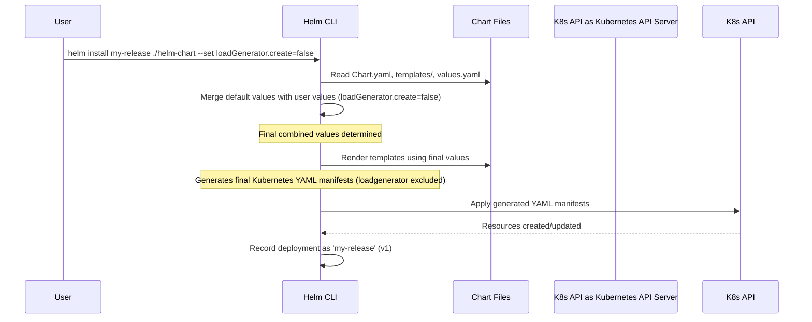

# Chapter 7: Helm Chart (Packaging and Deployment)

In [Chapter 6: Kustomize Components (Deployment Variations)](06_kustomize_components__deployment_variations_.md), we saw how Kustomize helps us manage different configuration variations (like branding or adding monitoring) by patching our base Kubernetes manifests. This is great for managing YAML, but what if we want to bundle our *entire* Online Boutique application – all 11+ microservices and their configurations – into a single, easy-to-share, installable package?

Imagine you want to install a complex software suite on your computer. You wouldn't want to manually install every single component and library, right? You'd probably use an installer package (like `.msi` on Windows, `.dmg` on Mac, or `apt`/`yum`/`brew` commands on Linux) that handles everything for you.

**Helm** is like that installer application, but for Kubernetes. It's the official package manager for Kubernetes.

## What Problem Does Helm Solve?

Our Online Boutique application consists of many Kubernetes `Deployment` and `Service` objects ([Chapter 5: Kubernetes Manifests (Base Deployment)](05_kubernetes_manifests__base_deployment_.md)). Deploying them all manually one by one (`kubectl apply -f ...`) is tedious and error-prone. Even with Kustomize (`kubectl apply -k .`), you're still essentially applying a collection of YAML files.

Helm allows us to package all these related Kubernetes resources into a single unit called a **Chart**. This chart acts like a blueprint for the entire application. The best part is that charts are highly configurable. Users can easily customize the deployment (like changing image repositories, enabling/disabling features, adjusting resource limits) without ever touching the underlying Kubernetes manifests directly.

**Use Case:** Installing the entire Online Boutique application onto a Kubernetes cluster with a *single command*, while maybe specifying that we *don't* want to deploy the `loadgenerator` service.

## Key Concepts

1.  **Chart:** The Helm package format. It's a collection of files and directories following a specific structure, containing all the necessary Kubernetes resource definitions (as templates) and metadata to deploy an application. Think of it as the packaged "box" containing our Online Boutique installer. The `microservices-demo` project has its chart in the `helm-chart/` directory.
2.  **`Chart.yaml`:** A file located at the root of a chart directory. It contains metadata about the chart, such as its name (`onlineboutique`), version (`0.10.2`), and the application version it deploys (`v0.10.2`).
    ```yaml
    # Simplified from helm-chart/Chart.yaml
    apiVersion: v2
    name: onlineboutique
    description: A Helm chart for Kubernetes for Online Boutique
    type: application
    version: 0.10.2 # The chart's version
    appVersion: "v0.10.2" # The version of the application code
    ```
3.  **Templates (`templates/` directory):** This directory contains Kubernetes manifest files (like `frontend.yaml`, `cartservice.yaml`, etc.), but they are written using Go's templating language. They have placeholders like `{{ .Values.someSetting }}` that get filled in during installation. These are the adaptable blueprints inside the box.
4.  **`values.yaml`:** This file, also at the root of the chart directory, defines the default configuration options for the chart. Users can override these values when installing the chart to customize the deployment. This is like the default settings panel for our installer.
    ```yaml
    # Simplified snippet from helm-chart/values.yaml

    # Global image settings
    images:
      repository: us-central1-docker.pkg.dev/google-samples/microservices-demo
      tag: "" # Defaults to chart appVersion if empty

    # Configuration for the frontend service
    frontend:
      create: true # Deploy this service by default? Yes.
      name: frontend
      # ... other settings ...

    # Configuration for the load generator
    loadGenerator:
      create: true # Deploy this service by default? Yes.
      name: loadgenerator
      # ... other settings ...

    # ... configuration for all other services ...
    ```
5.  **Release:** A specific instance of a chart that has been deployed to a Kubernetes cluster using Helm. You can install the same chart multiple times with different configurations, creating different releases (e.g., a 'staging' release and a 'production' release).

## How It Works: Deploying Online Boutique with Helm

Let's tackle our use case: installing the Online Boutique, but disabling the `loadgenerator`.

**Step 1: The Chart Structure**

The `helm-chart/` directory contains everything Helm needs:

```
helm-chart/
├── Chart.yaml          # Metadata about the chart
├── values.yaml         # Default configuration values
├── templates/          # Directory with templated Kubernetes manifests
│   ├── adservice.yaml
│   ├── cartservice.yaml
│   ├── frontend.yaml
│   ├── _helpers.tpl    # Reusable template snippets (optional)
│   └── ... (one file per service/resource)
└── README.md           # Information about using the chart
```

**Step 2: Understanding Templates and Values**

Inside `templates/frontend.yaml`, you'll find Kubernetes YAML mixed with template directives:

```yaml
# Simplified snippet from helm-chart/templates/frontend.yaml

# Only create this Deployment if frontend.create is true in values.yaml
{{- if .Values.frontend.create }}
apiVersion: apps/v1
kind: Deployment
metadata:
  # Use the name defined in values.yaml (e.g., "frontend")
  name: {{ .Values.frontend.name }}
  # Use the namespace Helm installs into (provided by Helm)
  namespace: {{ .Release.Namespace }}
spec:
  template:
    spec:
      containers:
        - name: server
          # Construct image name using values from values.yaml
          image: "{{ .Values.images.repository }}/{{ .Values.frontend.name }}:{{ .Values.images.tag | default .Chart.AppVersion }}"
          env:
          - name: CART_SERVICE_ADDR
             # Use service name from values.yaml
            value: "{{ .Values.cartService.name }}:7070"
          # ... other env vars ...
          resources:
            # Include resource settings from values.yaml
            {{- toYaml .Values.frontend.resources | nindent 12 }}
{{- end }} # End of "if .Values.frontend.create"
```

*Explanation:*
*   `{{- if .Values.frontend.create }}`: This block is only included if the `frontend.create` setting in `values.yaml` (or overridden by the user) is `true`.
*   `{{ .Values.frontend.name }}`: This placeholder will be replaced with the value of `frontend.name` from `values.yaml`.
*   `{{ .Release.Namespace }}`: Helm automatically provides the Kubernetes namespace where the chart is being installed.
*   `{{ .Values.images.repository }}/...`: Values are combined to build the full container image path.
*   `{{ .Chart.AppVersion }}`: If `images.tag` isn't set in `values.yaml`, it defaults to the `appVersion` from `Chart.yaml`.
*   `{{- toYaml .Values.frontend.resources | nindent 12 }}`: This converts the structured `resources` section from `values.yaml` into correctly indented YAML.

**Step 3: Installing the Chart**

To install the chart with default settings, you navigate to the project root directory and run:

```bash
# Install the chart from the local directory, giving it the release name "my-boutique"
helm install my-boutique ./helm-chart
```

This command installs *all* services defined in the chart using the default settings from `helm-chart/values.yaml`.

**Step 4: Installing with Customization**

Now, let's install it *without* the `loadgenerator`. We can override the default `loadGenerator.create` value (which is `true`) using the `--set` flag:

```bash
# Install, but override the loadGenerator.create value
helm install my-boutique ./helm-chart --set loadGenerator.create=false
```

Helm will now process the templates, but because `loadGenerator.create` is `false`, the `{{- if .Values.loadGenerator.create }}` block in `templates/loadgenerator.yaml` will evaluate to false, and the LoadGenerator Deployment and Service **will not be created**.

You can also override multiple values or use a separate YAML file:

```bash
# Example: Override multiple values
helm install my-boutique ./helm-chart \
  --set loadGenerator.create=false \
  --set frontend.resources.requests.cpu="150m" \
  --set images.repository="my-registry/my-project"

# Example: Use a custom values file (my-custom-values.yaml)
# Contents of my-custom-values.yaml:
# loadGenerator:
#   create: false
# frontend:
#   resources:
#     requests:
#       cpu: "150m"
# images:
#   repository: "my-registry/my-project"

helm install my-boutique ./helm-chart -f my-custom-values.yaml
```

Helm intelligently merges the default `values.yaml` with any values provided via `-f` or `--set` flags, with the command-line flags taking the highest precedence.

## Helm: Under the Hood

What actually happens when you run `helm install`?

1.  **Load Chart:** Helm reads the `Chart.yaml` file.
2.  **Load Values:** It loads the default `values.yaml`.
3.  **Merge Values:** It merges the default values with any user-provided values (from `-f` files or `--set` flags).
4.  **Render Templates:** Helm processes the files in the `templates/` directory. It executes the Go templating logic, replacing placeholders like `{{ .Values.xyz }}` and `{{ .Release.Name }}` with the final merged values. Conditional blocks (`{{ if }}`) are evaluated.
5.  **Generate Manifests:** The output of the rendering process is a collection of standard Kubernetes YAML manifests, just like the ones we saw in [Chapter 5: Kubernetes Manifests (Base Deployment)](05_kubernetes_manifests__base_deployment_.md).
6.  **Deploy to Kubernetes:** Helm connects to your Kubernetes cluster and applies these generated manifests (similar to running `kubectl apply`).
7.  **Track Release:** Helm stores information about the deployed release (which chart version, what values were used, which resources were created) within Kubernetes itself. This allows Helm to manage upgrades, rollbacks, and uninstallation later (`helm upgrade`, `helm rollback`, `helm uninstall`).



## Conclusion

Helm is a powerful package manager for Kubernetes that simplifies the deployment and management of complex applications like the Online Boutique. It packages all necessary Kubernetes manifests into a single **Chart**. Using **Templates** and **`values.yaml`**, charts allow for easy configuration and customization at deployment time without modifying the core manifest templates. A single `helm install` or `helm upgrade` command can manage the entire application lifecycle, making deployments more repeatable and reliable.

While Helm is excellent for packaging and deploying released versions, developing microservices often involves rapid build-deploy-test cycles. How can we streamline this inner development loop? In the next chapter, we'll look at a tool designed specifically for that: [Chapter 8: Skaffold Configuration](08_skaffold_configuration_.md).

---

Generated by [AI Codebase Knowledge Builder](https://github.com/The-Pocket/Tutorial-Codebase-Knowledge)
