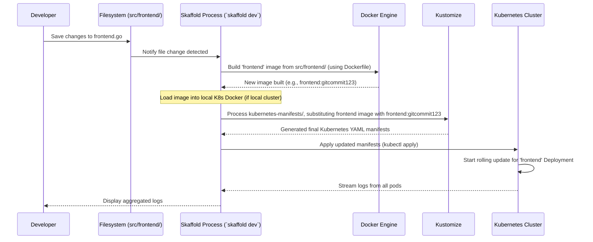

# Chapter 8: Skaffold Configuration

Welcome to the final chapter! In [Chapter 7: Helm Chart (Packaging and Deployment)](07_helm_chart__packaging_and_deployment_.md), we learned how Helm helps package and deploy our entire Online Boutique application as a single unit, making installations and upgrades easier. Helm is great for managing releases.

But what about when you're *developing* the application? Imagine you're a developer working on the `frontend` service. You make a small code change – maybe you fix a typo or change a button color. To see your change running inside the Kubernetes cluster (even a local one like `minikube`), you'd typically have to:

1.  Manually rebuild the `frontend` container image using Docker.
2.  Push the new image to a container registry (or load it into your local cluster's Docker).
3.  Update the `frontend` Deployment manifest in Kubernetes to use the new image tag.
4.  Apply the updated manifest using `kubectl`.
5.  Wait for Kubernetes to roll out the update.
6.  Check the logs or the website to see if your change worked.

Doing this *every single time* you change a line of code is incredibly slow and tedious! This slow feedback loop kills productivity.

This is exactly the problem **Skaffold** solves.

## What is Skaffold?

Think of Skaffold as your personal assistant, dedicated to making the development process for Kubernetes applications super fast and automated. It watches your code, and whenever you make a change, it automatically handles the boring build, push, and deploy steps for you.

**Use Case:** You change one line of HTML in the `frontend` service's code. Within seconds, Skaffold automatically:
1.  Detects the file change.
2.  Rebuilds *only* the `frontend` container image.
3.  Updates the `frontend` Deployment running in your local Kubernetes cluster with the new image.
4.  Streams the logs from all your running microservices right to your terminal.

You just save the file, and Skaffold does the rest, giving you an almost instant feedback loop!

## Key Concepts

1.  **Fast Development Loop:** Skaffold's main goal is to automate the repetitive tasks between coding and seeing your changes live in Kubernetes, making development much faster.
2.  **File Watching:** Skaffold monitors your source code directories for any changes.
3.  **Automated Build:** When a change is detected for a specific microservice, Skaffold knows how to build its container image (usually using Docker).
4.  **Automated Image Tagging:** Skaffold automatically tags the newly built images, often using strategies like the Git commit ID, ensuring Kubernetes notices a change.
5.  **Automated Deploy:** Skaffold takes the newly built image and updates the corresponding Kubernetes resources. It can use tools like `kubectl`, Kustomize ([Chapter 6: Kustomize Components (Deployment Variations)](06_kustomize_components__deployment_variations_.md)), or Helm ([Chapter 7: Helm Chart (Packaging and Deployment)](07_helm_chart__packaging_and_deployment_.md)) to do this. Our project uses Kustomize via `kubectl`.
6.  **Log Aggregation:** Skaffold conveniently collects and displays the logs from *all* the microservices defined in your configuration in one single terminal window, making debugging easier.

## How It Works: The `skaffold.yaml` Configuration

Skaffold knows what to do by reading a configuration file, usually named `skaffold.yaml`, located in the root of your project. This file tells Skaffold:

*   Which microservices exist and where their source code is.
*   How to build container images for each service.
*   How to deploy these services to Kubernetes.

Let's look at simplified parts of our project's `skaffold.yaml`:

**1. Defining What to Build (`build` section)**

This section lists all the microservices (called `artifacts`) that Skaffold needs to know how to build.

```yaml
# Simplified snippet from skaffold.yaml
apiVersion: skaffold/v3
kind: Config
metadata:
  name: app # A name for this configuration set
build:
  # Tell skaffold to build images compatible with these platforms
  platforms: ["linux/amd64", "linux/arm64"]
  artifacts:
  # Define each service that can be built
  - image: emailservice # Name of the image to build
    context: src/emailservice # Directory containing the source code and Dockerfile
  - image: productcatalogservice
    context: src/productcatalogservice
  - image: recommendationservice
    context: src/recommendationservice
  # ... entries for shippingservice, checkoutservice, paymentservice, etc...
  - image: cartservice
    context: src/cartservice/src # Specify exact directory
    docker:
      dockerfile: Dockerfile # Specify the Dockerfile if not default name/location
  - image: frontend
    context: src/frontend
  - image: adservice
    context: src/adservice
  tagPolicy: # How to tag the built images
    gitCommit: {} # Use the Git commit ID as the tag
  local: # Configuration for building locally
    useDockerCLI: true # Use the standard Docker command line
    useBuildkit: true # Use Docker's faster BuildKit engine if available
```

*Explanation:*
*   `artifacts`: This is a list. Each item defines a microservice image Skaffold can build.
*   `image`: The base name for the container image (e.g., `frontend`). Skaffold will add a tag later.
*   `context`: The path to the directory containing the service's source code and its `Dockerfile`. Skaffold will run the `docker build` command in this directory.
*   `docker.dockerfile`: Optionally specify the name of the Dockerfile if it's not just `Dockerfile` in the context directory.
*   `tagPolicy.gitCommit`: Tells Skaffold to automatically tag the built images with the current Git commit ID. This ensures each build has a unique tag.
*   `local`: Settings for when you build images on your development machine (as opposed to a remote builder like Google Cloud Build).

**2. Defining How to Deploy (`manifests` and `deploy` sections)**

This tells Skaffold how to deploy the built images to Kubernetes.

```yaml
# Simplified snippet from skaffold.yaml (continued)

manifests: # How to generate the Kubernetes YAML
  kustomize: # Use Kustomize
    paths:
    - kubernetes-manifests # Directory containing kustomization.yaml and base manifests
deploy: # How to apply the generated manifests
  kubectl: {} # Use the standard 'kubectl apply' command
```

*Explanation:*
*   `manifests.kustomize.paths`: Tells Skaffold to use Kustomize ([Chapter 6: Kustomize Components (Deployment Variations)](06_kustomize_components__deployment_variations_.md)) to generate the final Kubernetes YAML. It points to the `kubernetes-manifests` directory, which contains a `kustomization.yaml` file listing all the base service manifests ([Chapter 5: Kubernetes Manifests (Base Deployment)](05_kubernetes_manifests__base_deployment_.md)). Skaffold automatically tells Kustomize to use the newly built image tags when it generates the manifests.
*   `deploy.kubectl`: Tells Skaffold to deploy the manifests generated by Kustomize using the `kubectl apply` command.

**3. Running Skaffold**

To start the magic, you open your terminal in the project's root directory (where `skaffold.yaml` is) and run:

```bash
skaffold dev
```

*What happens next?*
1.  Skaffold reads `skaffold.yaml`.
2.  It performs an initial build of *all* the images defined in the `artifacts` list.
3.  It generates the Kubernetes manifests using Kustomize, injecting the new image tags.
4.  It deploys everything to your currently configured Kubernetes cluster (e.g., `minikube`, `docker-desktop`, or a cloud cluster).
5.  It starts watching the source code directories defined in the `context` fields for changes.
6.  It starts streaming logs from all deployed services into your terminal.

Now, if you edit and save a file inside `src/frontend/`:

1.  Skaffold detects the change.
2.  It rebuilds *only* the `frontend` image.
3.  It regenerates the manifests with Kustomize, updating *only* the `frontend` Deployment's image tag.
4.  It runs `kubectl apply` with the updated manifests. Kubernetes handles the rolling update of the `frontend` service.
5.  You see the logs update in your terminal, and your change is live!

## Under the Hood: The Skaffold Loop

Let's visualize the process when you save a file in `src/frontend/` while `skaffold dev` is running:



Skaffold orchestrates this cycle continuously, integrating the build system (Docker), manifest generation (Kustomize), and deployment (kubectl) into a seamless workflow triggered by simple file saves.

**Profiles (Advanced Customization)**

`skaffold.yaml` also supports `profiles`. These allow you to define variations in the build or deploy process. For example, the `debug` profile might use a different Dockerfile that includes debugging tools, or the `gcb` profile might tell Skaffold to build images using Google Cloud Build instead of locally. You activate profiles using the `-p` flag: `skaffold dev -p gcb`.

```yaml
# Example of profiles section in skaffold.yaml
profiles:
- name: gcb # Profile named 'gcb'
  build:
    googleCloudBuild: # Override build config to use Google Cloud Build
      projectId: your-gcp-project-id
# ... other profiles ...
- name: debug
  activation: # Automatically activate when 'skaffold debug' is run
  - command: debug
  patches: # Modify the base config for this profile
  - op: replace # Change the Dockerfile used for cartservice
    path: /build/artifacts/7/docker/dockerfile # Index might vary!
    value: Dockerfile.debug
```

This provides flexibility to adapt the development workflow for different needs without completely separate configuration files.

## Conclusion

Skaffold is an indispensable tool for developers working with Kubernetes. It automates the build, tag, and deploy cycle triggered by code changes, providing a rapid feedback loop that significantly boosts productivity. By configuring `skaffold.yaml`, you tell Skaffold where your code is, how to build it, and how to deploy it (often leveraging tools like Kustomize or Helm). Running `skaffold dev` starts a continuous watch-build-deploy process and aggregates logs, streamlining the inner development loop.

This concludes our journey through the `microservices-demo` project! We started with the high-level [Microservices Architecture](01_microservices_architecture_.md), dove into specific services like the [Frontend Service](02_frontend_service_.md) and [Checkout Service](03_checkout_service_.md), understood how they communicate using [gRPC Service Definitions (Protobufs)](04_grpc_service_definitions__protobufs__.md), learned how to define their deployment using [Kubernetes Manifests (Base Deployment)](05_kubernetes_manifests__base_deployment_.md) and manage variations with [Kustomize Components (Deployment Variations)](06_kustomize_components__deployment_variations_.md), packaged the application with a [Helm Chart (Packaging and Deployment)](07_helm_chart__packaging_and_deployment_.md), and finally, saw how [Skaffold Configuration](08_skaffold_configuration_.md) speeds up the development process.

Hopefully, this tutorial has given you a solid foundation for understanding how modern, cloud-native applications are built, deployed, and developed using microservices, containers, and Kubernetes tooling. Happy coding!

---

Generated by [AI Codebase Knowledge Builder](https://github.com/The-Pocket/Tutorial-Codebase-Knowledge)