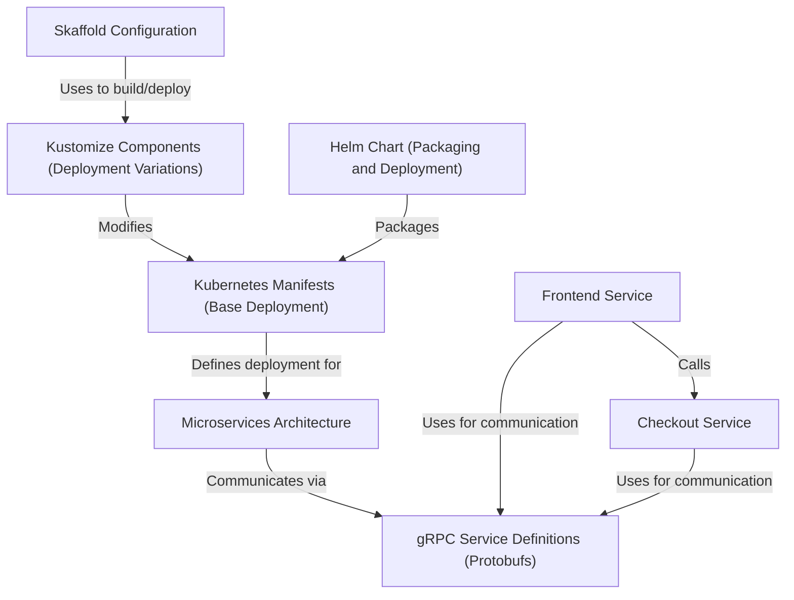

# Tutorial: microservices-demo

This project is a demonstration *online shop* built using a **microservices architecture**.
It shows how different parts of an online store (like the *frontend website*, *shopping cart*, and *checkout process*) can be run as separate, small applications.
These applications, called microservices, talk to each other using **gRPC** (a fast communication method) and are designed to be run and managed on **Kubernetes**.
Tools like *Helm*, *Kustomize*, and *Skaffold* help package, customize, and automate the deployment of these services.

**Source Repository:** [https://github.com/GoogleCloudPlatform/microservices-demo](https://github.com/GoogleCloudPlatform/microservices-demo)

## Chapters

1. [Microservices Architecture
](01_microservices_architecture_.md)
2. [Frontend Service
](02_frontend_service_.md)
3. [Checkout Service
](03_checkout_service_.md)
4. [gRPC Service Definitions (Protobufs)
](04_grpc_service_definitions__protobufs__.md)
5. [Kubernetes Manifests (Base Deployment)
](05_kubernetes_manifests__base_deployment__.md)
6. [Kustomize Components (Deployment Variations)
](06_kustomize_components__deployment_variations__.md)
7. [Helm Chart (Packaging and Deployment)
](07_helm_chart__packaging_and_deployment__.md)
8. [Skaffold Configuration
](08_skaffold_configuration_.md)

---

Generated by [AI Codebase Knowledge Builder](https://github.com/The-Pocket/Tutorial-Codebase-Knowledge)