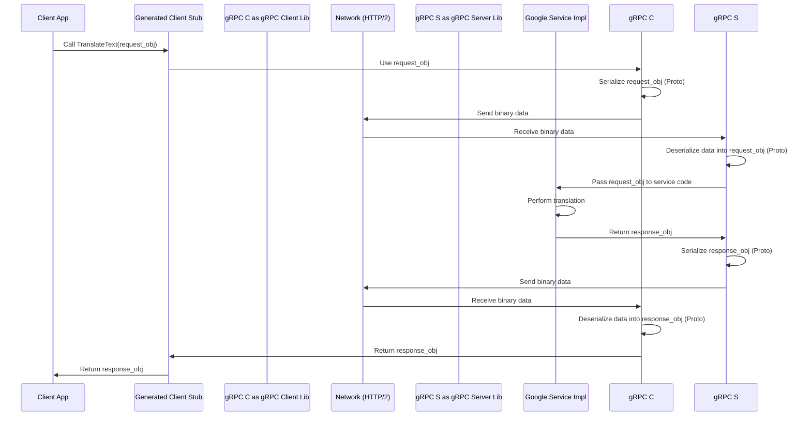

# Chapter 1: Protocol Buffers (Proto) & gRPC

Welcome to the `googleapis` repository! This collection holds the definitions for many of Google's public APIs. But how do different programs, potentially written in different languages, talk to these Google services consistently and efficiently? That's where Protocol Buffers and gRPC come in.

Imagine you want to use a Google service, maybe a simple one that translates text. Your application (let's call it the "client") needs to send the text to Google's server and get the translation back. How should your client format the request? How should the server format the response? How do they communicate reliably over the internet? This chapter explains the fundamental duo that solves this: Protocol Buffers (Proto) and gRPC.

## What are Protocol Buffers (Proto)? The Universal Blueprint

Think of **Protocol Buffers (Proto)** as a universal language for describing data structures and service interfaces. It's like creating a super-precise blueprint for information.

*   **Language-Neutral:** You define your data structure *once* in a special `.proto` file. From this single file, you can generate code for many different programming languages (like Java, Python, C++, Go, etc.). This means your Python client code and Google's Java server code can both understand the exact same data structure without any confusion.
*   **Efficient:** Proto defines how data should be structured, and it's designed to be very compact and fast to send over networks.
*   **Clear Structure:** It forces you to clearly define the fields your data has, their types (like string, integer, boolean), and whether they are required or optional.

**Analogy:** Imagine Lego bricks. Proto defines the exact shape, size, and connection points for each type of brick (your data fields). Everyone using the blueprint knows exactly how to build the structure (your message).

**Example:** Let's define a simple request and response for our hypothetical translation service.

```protobuf
// translator.proto

// Use proto3 syntax
syntax = "proto3";

// Define the structure for the translation request
message TranslateRequest {
  string source_language = 1; // e.g., "en" for English
  string target_language = 2; // e.g., "es" for Spanish
  string text_to_translate = 3; // The actual text
}

// Define the structure for the translation response
message TranslateResponse {
  string translated_text = 1; // The result
}

// Define the service itself - what actions can it perform?
service Translator {
  // Defines a method named 'TranslateText'
  // It takes a TranslateRequest message as input
  // and returns a TranslateResponse message as output
  rpc TranslateText(TranslateRequest) returns (TranslateResponse);
}
```

**Explanation:**

*   `syntax = "proto3";` tells the system we're using version 3 of the Protocol Buffers language.
*   `message TranslateRequest { ... }` defines the "blueprint" for the data we need to *send* to the service. It has three pieces of information (fields): `source_language`, `target_language`, and `text_to_translate`, all of which are strings. The `= 1`, `= 2`, `= 3` are unique tag numbers for each field, used for efficient encoding.
*   `message TranslateResponse { ... }` defines the blueprint for the data we expect to *receive* back. It just has one field: `translated_text`.
*   `service Translator { ... }` defines the actual service. Think of it like defining the functions or methods available.
*   `rpc TranslateText(...) returns (...);` defines a specific action (an "RPC" - Remote Procedure Call) named `TranslateText`. It clearly states it accepts a `TranslateRequest` message and will return a `TranslateResponse` message.

This `.proto` file is the **Interface Definition Language (IDL)** for our simple Translator service. The `googleapis` repository is full of these `.proto` files defining the structure and services for actual Google APIs.

## What is gRPC? The High-Speed Delivery Service

Okay, so we have the blueprint (Proto) that defines *what* the data and service look like. But how does the data actually get sent from your client application to the Google server and back? That's where **gRPC** comes in.

Think of **gRPC** as a high-performance, modern postal service designed specifically to work with Protocol Buffers.

*   **Communication Protocol:** It handles the actual sending and receiving of your Proto-defined messages over the network.
*   **Fast & Efficient:** It uses modern standards like HTTP/2, which allows for things like sending multiple requests and responses over a single connection, making it much faster than older methods.
*   **Works with Proto:** gRPC is designed hand-in-hand with Protocol Buffers. It knows how to take your Proto messages, encode them efficiently (using the Proto definitions), send them, receive responses, and decode them back into objects your code can use.
*   **Cross-Platform:** Like Proto, gRPC libraries are available for many languages, so your Python client can easily talk to Google's Java server using gRPC.

**Analogy:** If Proto is the blueprint for a package's contents, gRPC is the super-fast, reliable courier service that knows exactly how to handle packages built according to that blueprint, delivering them quickly and securely between sender and receiver.

## How They Work Together: Solving the Use Case

Let's revisit our translation example:

1.  **Define:** You start with the `translator.proto` file (the blueprint).
2.  **Generate Code:** You use tools (like `protoc`, the Protocol Buffer compiler, often used with a gRPC plugin, as mentioned in the `Makefile` and `CONTRIBUTING.md` snippets) to generate code in your chosen language (e.g., Python). This generated code will include:
    *   Classes representing `TranslateRequest` and `TranslateResponse`.
    *   A "client stub" – a piece of code that gives you simple functions to call the remote service (like `translator_client.TranslateText(...)`).
3.  **Write Client Code:** In your application, you create a `TranslateRequest` object (using the generated class), fill in the `source_language`, `target_language`, and `text_to_translate`.
4.  **Make the Call:** You call the `TranslateText` method on the generated client stub, passing your request object.
5.  **gRPC Magic:** This is where gRPC takes over:
    *   It serializes (converts) your `TranslateRequest` object into the compact binary Proto format.
    *   It sends this binary data over the network (using HTTP/2) to the Google Translator server's gRPC endpoint.
6.  **Server Side:**
    *   Google's gRPC server receives the binary data.
    *   It deserializes the data back into a `TranslateRequest` object (using the *same* `translator.proto` definition).
    *   The server code performs the translation.
    *   It creates a `TranslateResponse` object with the result.
    *   It serializes the response object into the Proto binary format.
    *   gRPC sends the response back to your client.
7.  **Back to Client:**
    *   Your client's gRPC layer receives the binary response.
    *   It deserializes the data back into a `TranslateResponse` object.
    *   The `TranslateText` function call you originally made returns this `TranslateResponse` object.
8.  **Use the Result:** Your application can now access the `translated_text` field from the response object.

All the complex networking, serialization, and deserialization is handled automatically by gRPC and the code generated from the `.proto` file!

## Under the Hood: A Quick Peek

What's actually happening during that "gRPC Magic"?

**High-Level Flow:**



**Key Components:**

*   **.proto Files:** The source of truth, defining the data structures (`message`) and service methods (`service`, `rpc`). These are stored throughout the `googleapis` repository, organized by service (more on this in [Chapter 3: Repository Structure](03_repository_structure_.md)).
*   **`protoc` Compiler & Plugins:** Tools that read `.proto` files and generate language-specific code. The `Makefile` shows how these tools (`protoc`, `grpc_<language>_plugin`) are invoked (`$(PROTOC) $(FLAGS) $*.proto`).
*   **Generated Code:** Language-specific classes for messages and service stubs. This code handles serialization/deserialization and makes calling remote methods look like calling local functions.
*   **gRPC Library:** The runtime library for your language that handles the low-level communication (HTTP/2, connections, sending/receiving binary data).

You don't usually need to worry about the exact binary format or network details – Proto and gRPC abstract that away, letting you focus on defining your APIs and using them.

## Conclusion

You've learned about the two core technologies used in `googleapis`:

1.  **Protocol Buffers (Proto):** The language-neutral blueprint for defining data structures and service interfaces (`.proto` files).
2.  **gRPC:** The high-performance communication protocol that sends messages defined by Proto over the network.

Together, they provide a robust, efficient, and standardized way for applications to interact with Google APIs, regardless of the programming languages used on either side. They define *how* data is structured and *how* it's transported.

But how do we define broader aspects of an API service, like its name, authentication requirements, or specific HTTP mappings for REST compatibility? That's where API Service Definitions come in.

Ready to learn more? Let's move on to the next piece of the puzzle!

**Next:** [Chapter 2: API Service Definition (YAML)](02_api_service_definition__yaml__.md)

---

Generated by [AI Codebase Knowledge Builder](https://github.com/The-Pocket/Tutorial-Codebase-Knowledge)