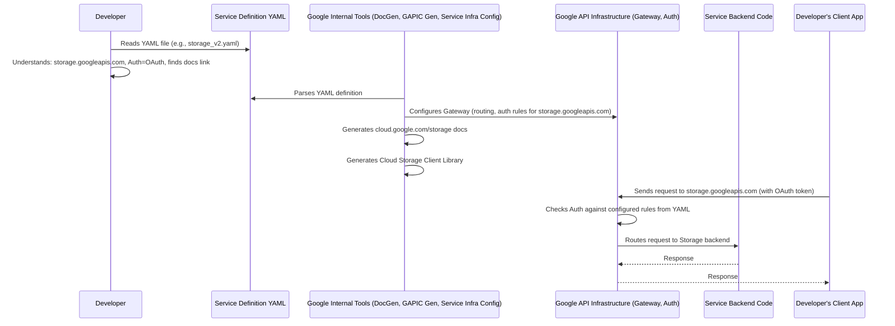

# Chapter 2: API Service Definition (YAML)

In [Chapter 1: Protocol Buffers (Proto) & gRPC](01_protocol_buffers__proto____grpc_.md), we learned how Protocol Buffers (`.proto` files) define the *structure* of data and the specific functions (RPC methods) an API offers, and how gRPC handles the *transport* of that data. They are like the detailed blueprints for individual components and the delivery system.

But how do we define the *overall service*? Things like:

*   What's the official internet address (hostname) for this API? (e.g., `storage.googleapis.com`)
*   What's the user-friendly name? (e.g., "Cloud Storage API")
*   How do I prove who I am to use it (authentication)?
*   Where can I find the official user manual (documentation)?

This information isn't typically found in the `.proto` files. That's where **API Service Definitions**, usually written in YAML format, come in.

## What's the Problem? Finding the API's "Front Door"

Imagine you want to use the Google Cloud Storage API to upload a file. You might know from Chapter 1 that there's probably a `.proto` file defining an `UploadObjectRequest` message and maybe an `UploadObject` RPC method. But:

1.  Where do you *send* this request on the internet? Is it `google.com/storage`? `cloud.google.com/storage_api`? `storage.googleapis.com`?
2.  Can anyone just send requests, or do you need some kind of login or API key (authentication)?
3.  Where can you read the official instructions and rules for using this API?

The `.proto` file focuses on the *shape* of the request and response, not these higher-level service details. We need another layer of definition.

## API Service Definition (YAML): The Specification Sheet

Think of the **API Service Definition (YAML)** file as the official **specification sheet** or **product label** for a Google API service. While the `.proto` file is like the detailed schematic for the engine inside an appliance, the Service Definition YAML is the label on the outside that tells you:

*   **Product Name:** What the appliance is officially called (e.g., `storage.googleapis.com`).
*   **Model:** A friendlier title (e.g., `Cloud Storage API`).
*   **Features:** Which specific functional units (Proto services like `google.storage.v2.Storage`) are included.
*   **Power Requirements:** How to connect securely (authentication rules).
*   **User Manual:** Where to find the documentation.

These YAML files are found throughout the `googleapis` repository, often alongside the `.proto` files for a specific API version. They provide the essential context needed to understand and use the API as a whole. Technically, these YAML files represent a configuration structure defined by another Protocol Buffer message called `google.api.Service`, but YAML is used because it's much easier for humans to read and write than the raw Proto format.

## Anatomy of a Service Definition YAML

Let's look at a simplified snippet from a real service definition file, like `google/storage/v2/storage_v2.yaml`, to see the key parts:

```yaml
# Specifies the structure this file follows (google.api.Service proto message)
type: google.api.Service
config_version: 3

# The official DNS name for the API endpoint
name: storage.googleapis.com

# A human-friendly title for the API
title: Cloud Storage API

# Lists the core Proto services included in this API surface
apis:
- name: google.storage.v2.Storage      # Defined in a .proto file
- name: google.longrunning.Operations  # Another common service, see Chapter 5

# Human-readable documentation summary and overview
documentation:
  summary: |-
    Store and retrieve objects in Google Cloud Storage.
  overview: |-
    The Google Cloud Storage API allows applications to read and write data...

# Rules for authenticating requests to this API
authentication:
  rules:
  # This rule applies to all methods of the google.storage.v2.Storage service
  - selector: 'google.storage.v2.Storage.*'
    # Specifies required OAuth 2.0 scopes for access
    oauth:
      canonical_scopes: |-
        https://www.googleapis.com/auth/cloud-platform,
        https://www.googleapis.com/auth/devstorage.full_control,
        https://www.googleapis.com/auth/devstorage.read_write,
        https://www.googleapis.com/auth/devstorage.read_only

# Publishing details used by tools (documentation sites, client libraries)
publishing:
  documentation_uri: https://cloud.google.com/storage/docs/apis
  # ... other settings ...
```

**Explanation:**

*   `type: google.api.Service`: Tells tools that this YAML file describes a `google.api.Service` object.
*   `name: storage.googleapis.com`: This is critical! It's the internet hostname where the API lives. When your gRPC client makes a call, this is the address it needs to connect to.
*   `title: Cloud Storage API`: A simple, readable name used in documentation and UIs.
*   `apis:`: This links the service definition back to the `.proto` files from [Chapter 1: Protocol Buffers (Proto) & gRPC](01_protocol_buffers__proto____grpc_.md). It lists the specific `service` definitions (like `google.storage.v2.Storage`) that this API endpoint exposes. It might also include common services like `google.longrunning.Operations` for handling long tasks (covered in [Chapter 5: Long Running Operations (LRO)](05_long_running_operations__lro__.md)).
*   `documentation:`: Contains text that might be used to generate documentation pages. The `summary` is a brief description, and `overview` gives more detail.
*   `authentication:`: Defines security requirements. The `rules` section specifies *how* users must authenticate.
    *   `selector:` determines which API methods the rule applies to (`google.storage.v2.Storage.*` means all methods in that service).
    *   `oauth: canonical_scopes:` lists the permissions (OAuth 2.0 scopes) a user or application needs to grant to call these methods. Authentication and permissions are complex topics related to [Chapter 6: IAM (Identity and Access Management)](06_iam__identity_and_access_management_.md).
*   `publishing:`: Contains metadata helpful for tools that automatically generate things *from* these definitions. `documentation_uri` gives a direct link to the human-readable docs. Other fields might help configure the generated client libraries discussed in [Chapter 7: GAPIC (Generated API Client) Configuration](07_gapic__generated_api_client__configuration_.md).

## How Do We Use This YAML? (Solving the Use Case)

Going back to our Cloud Storage example, how does this YAML file help?

1.  **Where to send the request?** Look at the `name:` field: `storage.googleapis.com`. That's the address!
2.  **How to authenticate?** Look at the `authentication:` section. It requires OAuth 2.0 (`oauth:`) and lists the necessary `canonical_scopes`, like `https://www.googleapis.com/auth/devstorage.read_write`. This tells you what permissions your application needs.
3.  **Where are the docs?** Look at the `publishing: documentation_uri:` field: `https://cloud.google.com/storage/docs/apis`. Click that link! You can also get a quick idea from the `documentation: summary:` and `overview:`.
4.  **What functions are available?** The `apis:` section lists `google.storage.v2.Storage`. This tells you to look for the `google/storage/v2/storage.proto` file to find the specific `rpc` methods defined there (like `WriteObject`, `ReadObject`, etc.).

You, as a developer, can read this YAML file to get a high-level understanding of the API service *before* diving deep into the `.proto` files or writing code.

## Under the Hood: How Google Uses These Definitions

You don't typically "run" the YAML file directly in your client application. Instead, Google uses these service definitions internally in various ways:

*   **API Infrastructure (e.g., Google Front End, API Gateway):** When a request arrives at `storage.googleapis.com`, Google's infrastructure uses the corresponding service definition to:
    *   Verify the authentication credentials provided (checking OAuth tokens against the required `scopes`).
    *   Route the request to the correct backend server implementing the `google.storage.v2.Storage` service.
    *   Enforce quotas and rate limits (sometimes defined in the YAML or associated configurations).
    *   Generate logs and monitoring data about the API usage.
*   **Documentation Generation:** Automated tools read the `.proto` files and the YAML definitions to create the public documentation websites (like `cloud.google.com/storage/docs`).
*   **Client Library Generation (GAPIC):** Tools use both the `.proto` files (for methods and messages) and the YAML files (for service address, authentication defaults, documentation links, etc.) to generate the user-friendly client libraries we'll discuss in [Chapter 7: GAPIC (Generated API Client) Configuration](07_gapic__generated_api_client__configuration_.md).
*   **Google Cloud Console:** The web UI uses this information to list available APIs, allow you to enable/disable them for your project, and display basic information.

Here's a conceptual diagram:



The YAML file acts as the central configuration blueprint consumed by various tools and systems, both at build time (for docs/libraries) and runtime (for the API gateway).

## Conclusion

You've now seen the second major piece of the puzzle: the **API Service Definition (YAML)**. While Protocol Buffers and gRPC define the *how* of data structures and communication, the Service Definition provides the higher-level *what* and *where*: the service's official name, address, authentication requirements, and documentation pointers. It's the specification sheet that ties everything together for a specific Google API service.

These `.proto` and `.yaml` files don't just float around randomly, though. They are organized within the `googleapis` repository in a specific way. Understanding this structure is key to finding the definitions you need.

**Next:** [Chapter 3: Repository Structure](03_repository_structure_.md)

---

Generated by [AI Codebase Knowledge Builder](https://github.com/The-Pocket/Tutorial-Codebase-Knowledge)