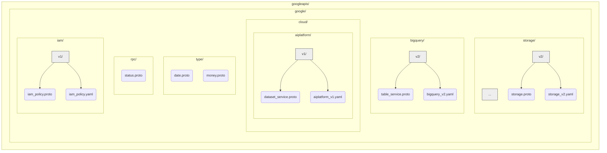

# Chapter 3: Repository Structure

In [Chapter 2: API Service Definition (YAML)](02_api_service_definition__yaml__.md), we saw how YAML files define the overall API service, like its name and authentication rules. We already knew from [Chapter 1: Protocol Buffers (Proto) & gRPC](01_protocol_buffers__proto____grpc_.md) that `.proto` files define the specific data structures and methods.

Now, imagine you need to work with a specific Google API, like Cloud Storage. How do you find the *right* `.proto` file for the storage bucket details, or the *correct* YAML file for the Cloud Storage service definition within the huge `googleapis` repository? It could be like searching for one specific book in a massive, disorganized library!

This chapter explains how the `googleapis` repository is organized to make finding these files easy and predictable.

## The Problem: Finding Your Way Around

The `googleapis` repository contains definitions for *hundreds* of Google APIs and their different versions. Without a clear system, finding the specific files you need would be a nightmare.

**Use Case:** Let's say you need to understand how Google Cloud Storage represents a "Bucket" in its newer API (version 2). You'd need to find:

1.  The `.proto` file that defines the `Bucket` message for `google.storage.v2`.
2.  The main `.yaml` service definition file for the `google.storage.v2` API.

How can we locate these efficiently?

## The Solution: A Hierarchical Filing System

The `googleapis` repository uses a simple and consistent **directory hierarchy** (folders within folders) to organize API definitions. This structure mirrors Google's API products and their versions.

**Analogy:** Think of it like a well-organized library:

*   **Main Section:** `google/` (Most Google APIs are under this folder)
*   **Subject/Aisle:** `storage/` (The specific product, like Cloud Storage)
*   **Edition/Version:** `v2/` (The specific major version of the API)
*   **Books/Files:** `.proto` and `.yaml` files specific to that product and version.

**The General Pattern:**

```
google / <product_name> / <version> / <files>
```

*   **`google/`**: The top-level directory for most Google-owned APIs.
*   **`<product_name>/`**: A directory named after the specific Google Cloud product or API family. Examples include:
    *   `storage/` (for Cloud Storage)
    *   `bigquery/` (for BigQuery)
    *   `pubsub/` (for Cloud Pub/Sub)
    *   `cloud/aiplatform/` (for Vertex AI - sometimes products are nested under `cloud/`)
*   **`<version>/`**: A directory representing a major version of the API, like `v1`, `v1beta1`, `v2`, etc. A new major version number (like `v1` -> `v2`) usually indicates a "breaking change," meaning the API structure might be significantly different and not compatible with the previous version.
*   **`<files>`**: Inside the version directory, you'll find the relevant files:
    *   `.proto` files defining the messages and services for that specific API version.
    *   `.yaml` files containing the service definition for that specific API version.
    *   Sometimes other configuration files used for generating client libraries (see [Chapter 7: GAPIC (Generated API Client) Configuration](07_gapic__generated_api_client__configuration_.md)).

## Solving the Use Case: Finding Cloud Storage v2 Files

Let's use this structure to find the Cloud Storage v2 files we needed:

1.  **Start:** Go into the main `google/` directory.
2.  **Product:** Find and enter the `storage/` directory.
3.  **Version:** Find and enter the `v2/` directory.
4.  **Files:** Now, look inside `google/storage/v2/`:
    *   You'll find `.proto` files like `storage.proto`. If you look inside this file, you'll likely find the `message Bucket { ... }` definition. You'll also see the line `package google.storage.v2;` near the top, confirming it's for this specific API and version. Notice how the package name matches the directory path!
    *   You'll find the corresponding YAML service definition file, usually named after the product and version, like `storage_v2.yaml`. This is the file we looked at in Chapter 2.

So, the paths are predictable:

*   Proto definition: `google/storage/v2/storage.proto`
*   YAML definition: `google/storage/v2/storage_v2.yaml`

You can apply this pattern to find definitions for other APIs as well. For BigQuery v2, you'd look in `google/bigquery/v2/`. For Vertex AI v1, you'd look in `google/cloud/aiplatform/v1/`.

## Why This Structure is Helpful

This consistent organization provides several key benefits:

1.  **Findability:** It's easy to browse or programmatically locate the definition files for any specific Google API and version.
2.  **Consistency:** The structure is predictable across almost all APIs in the repository. Once you understand the pattern, you can navigate to any API.
3.  **Clear Versioning:** Separating API versions into different directories makes it obvious which definitions belong to which version and prevents clashes between potentially incompatible versions. `google/storage/v1/` is clearly distinct from `google/storage/v2/`.
4.  **Tooling Integration:** Automated tools rely heavily on this structure.
    *   Build systems like Bazel (mentioned in the `README.md`) use these paths to build specific libraries (e.g., `bazel build //google/storage/v2/...` builds everything under that path).
    *   Code generation tools ([Chapter 1: Protocol Buffers (Proto) & gRPC](01_protocol_buffers__proto____grpc_.md), [Chapter 7: GAPIC (Generated API Client) Configuration](07_gapic__generated_api_client__configuration_.md)) look for `.proto`, `.yaml`, and other config files in these expected locations.
    *   Documentation generators can traverse this structure to create organized API reference documentation.

## Under the Hood: Organization, Not Execution

It's important to remember that this directory structure itself isn't code that *runs*. It's purely an **organizational principle** – a convention that makes the repository manageable and usable by both humans and tools.

Here's a simplified view of the hierarchy for a few example APIs:



Tools navigate this tree to find the files they need based on the API name and version they are configured to process.

## Special Directories: Common Files

While most API definitions live under their specific product directory (like `storage/` or `bigquery/`), some definitions are so commonly used across *many* different Google APIs that they live in shared, top-level directories directly under `google/`:

*   **`google/type/`**: Contains definitions for common, well-known data types like `Date`, `DateTime`, `Money`, `LatLng`, etc. These are used as field types within many different API messages.
*   **`google/rpc/`**: Contains definitions related to the gRPC protocol itself, most importantly `Status`, which defines the standard error reporting structure used by Google APIs.
*   **`google/longrunning/`**: Defines the standard mechanism for APIs that perform tasks that take a long time to complete (Long-Running Operations, or LROs).
*   **`google/iam/v1/`**: Contains definitions for Google's Identity and Access Management (IAM) system, used for managing permissions (e.g., `Policy`, `SetIamPolicyRequest`).

We'll explore these common types and concepts in the upcoming chapters.

## Conclusion

You've learned that the `googleapis` repository isn't just a random collection of files. It follows a clear **hierarchical structure** based on `google / product / version`. This predictable organization makes it easy to locate the `.proto` and `.yaml` files for any specific Google API and version. It's like having a well-cataloged library, enabling both developers and automated tools to efficiently find and use the API definitions.

Now that we know how to find API definitions, let's look at some of the common building blocks used *within* those definitions – the fundamental data types and RPC structures found in `google/type` and `google/rpc`.

**Next:** [Chapter 4: Common Types (`google.type`, `google.rpc`)](04_common_types___google_type____google_rpc___.md)

---

Generated by [AI Codebase Knowledge Builder](https://github.com/The-Pocket/Tutorial-Codebase-Knowledge)