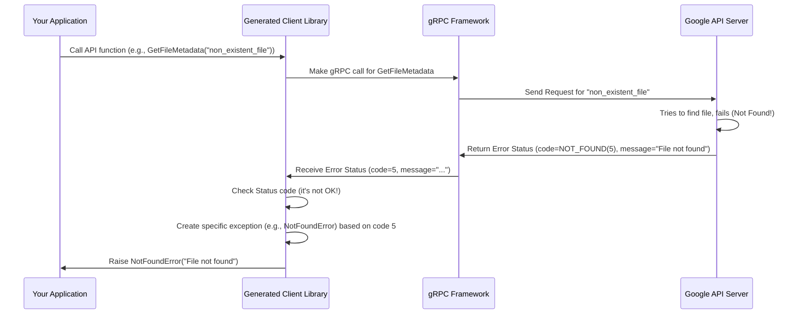

# Chapter 4: Common Types (`google.type`, `google.rpc`)

In [Chapter 3: Repository Structure](03_repository_structure_.md), we learned how the `googleapis` repository is neatly organized. We saw that most API definitions live under product-specific folders like `google/storage/v2/`, but we also noticed some special directories like `google/type/` and `google/rpc/`. What are these for?

Imagine you're building an application that uses several different Google APIs – maybe Cloud Storage to manage files and Google Calendar to schedule events. You notice both APIs deal with dates. Wouldn't it be confusing if Cloud Storage represented a date like `"2023-10-27"` and Google Calendar used something like `{ "year": 2023, "day_of_year": 300 }`? How would you easily compare these dates? Similarly, if an API call fails, wouldn't it be helpful if *all* Google APIs reported errors in a consistent way, so you always know how to check if something went wrong and why?

This chapter introduces the **Common Types** found in `google/type` and `google.rpc`. They provide standard definitions for fundamental concepts used across many Google APIs, ensuring everyone speaks the same language.

## The Problem: Avoiding Confusion and Redundancy

Without standard types, each API team at Google might invent its own way to represent common things like dates, times, money, or error messages. This would lead to:

*   **Inconsistency:** Developers using multiple APIs would constantly have to learn different ways of handling the same basic concepts.
*   **Redundancy:** The same ideas (like a date) would be defined over and over again in different `.proto` files.
*   **Interoperability Issues:** Comparing or converting data between APIs would be difficult and error-prone.

**Use Case:** You want to use the Cloud Storage API to find out when a file was last updated and the Google Calendar API to see when an event starts. You need to be confident that the "date" information you get from both APIs has the same structure and meaning, so you can easily work with both. Also, when you make a call to either API, you need a reliable, standard way to check if the call succeeded or failed.

## The Solution: Standard Blueprints (`google.type` and `google.rpc`)

To solve this, `googleapis` provides shared directories containing Protocol Buffer definitions for commonly needed concepts:

1.  **`google/type/`**: Defines common data types.
2.  **`google/rpc/`**: Defines common structures for Remote Procedure Call (RPC) results, especially for errors.

Think of these as providing a standard set of tools and signals that all APIs can use.

### `google.type`: The Standard Toolbox for Data

The `google/type/` directory contains `.proto` files defining fundamental data types that aren't built directly into Protocol Buffers but are widely useful.

**Analogy:** Imagine building something complex. Instead of everyone inventing their own screws, bolts, and measuring units, we agree on standards like metric screws (M3, M5) and units (meters, kilograms). `google.type` provides these standard "units" for data.

Some common examples found in `google/type/`:

*   **`google.type.Date`**: Represents a calendar date (year, month, day).
    ```protobuf
    // Simplified from google/type/date.proto
    message Date {
      int32 year = 1;
      int32 month = 2;
      int32 day = 3;
    }
    ```
*   **`google.type.TimeOfDay`**: Represents a time of day (hours, minutes, seconds, nanos), without a date or timezone.
    ```protobuf
    // Simplified from google/type/timeofday.proto
    message TimeOfDay {
      int32 hours = 1;
      int32 minutes = 2;
      int32 seconds = 3;
      int32 nanos = 4;
    }
    ```
*   **`google.type.Money`**: Represents an amount of money with a currency code.
    ```protobuf
    // Simplified from google/type/money.proto
    message Money {
      string currency_code = 1; // e.g., "USD", "EUR"
      int64 units = 2;         // Whole units of amount
      int32 nanos = 3;         // Fractional units (e.g., cents)
    }
    ```
*   **`google.type.LatLng`**: Represents a Latitude/Longitude pair for geographic locations.
    ```protobuf
    // Simplified from google/type/latlng.proto
    message LatLng {
      double latitude = 1;
      double longitude = 2;
    }
    ```

**How are they used?** Other `.proto` files can simply `import` these definitions and use them as the type for a field.

**Example:** Let's imagine a hypothetical `FileInfo` message in Cloud Storage and an `Event` message in Google Calendar.

```protobuf
// hypothetical_storage.proto
syntax = "proto3";

// Import the standard Date type
import "google/type/date.proto";

package google.example.storage.v1;

message FileInfo {
  string name = 1;
  int64 size_bytes = 2;
  google.type.Date last_updated_date = 3; // Use the standard Date!
}
```

```protobuf
// hypothetical_calendar.proto
syntax = "proto3";

// Import the standard Date and TimeOfDay types
import "google/type/date.proto";
import "google/type/timeofday.proto";

package google.example.calendar.v1;

message Event {
  string summary = 1;
  google.type.Date start_date = 2;     // Use the standard Date!
  google.type.TimeOfDay start_time = 3; // Use standard TimeOfDay!
}
```

By using `google.type.Date` in both files, we guarantee that the date information is structured identically.

### `google.rpc`: Standard Signals for API Calls

The `google/rpc/` directory defines standard structures related to the results of API calls, especially how errors are reported.

**Analogy:** Think of traffic lights. Red, yellow, and green have standard meanings everywhere. `google.rpc` defines the standard "signals" for API communication results.

The most important definitions here are:

*   **`google.rpc.Status`**: The standard way to represent the outcome of an API call. It contains an error code, a human-readable error message, and optionally more detailed error information.
    ```protobuf
    // Simplified from google/rpc/status.proto
    message Status {
      // The status code, chosen from google.rpc.Code
      int32 code = 1;
      // A developer-facing error message
      string message = 2;
      // Optional: More details about the error
      repeated google.protobuf.Any details = 3;
    }
    ```
*   **`google.rpc.Code`**: An enumeration (`enum`) listing standard error codes used across Google APIs.
    ```protobuf
    // Simplified from google/rpc/code.proto
    enum Code {
      OK = 0;                 // Success!
      CANCELLED = 1;
      UNKNOWN = 2;
      INVALID_ARGUMENT = 3;
      DEADLINE_EXCEEDED = 4;
      NOT_FOUND = 5;          // Resource not found
      ALREADY_EXISTS = 6;
      PERMISSION_DENIED = 7;  // User doesn't have permission
      UNAUTHENTICATED = 16; // Missing or invalid credentials
      // ... and many more
    }
    ```

**How are they used?** You usually don't explicitly put `google.rpc.Status` in your request or response message definitions in your `.proto` files. Instead, the underlying [Chapter 1: Protocol Buffers (Proto) & gRPC](01_protocol_buffers__proto____grpc_.md) framework uses `google.rpc.Status` *automatically* to communicate the outcome of an RPC call. When a gRPC call finishes, the framework provides a status. If the `code` is `OK (0)`, the call was successful. If it's anything else, an error occurred, and the `message` (and potentially `details`) explain why.

Client libraries generated for different languages often translate non-OK `Status` messages into native exceptions (like `NotFoundError` or `PermissionDeniedError`), making error handling feel natural in that language.

## Solving the Use Case: Consistency Achieved!

Let's revisit our use case:

1.  **Consistent Dates:** Because both the hypothetical Cloud Storage API (`hypothetical_storage.proto`) and Calendar API (`hypothetical_calendar.proto`) decided to use `google.type.Date` (by importing `google/type/date.proto`), you are guaranteed that the `last_updated_date` from Storage and the `start_date` from Calendar will have the exact same structure (`year`, `month`, `day`). Your application code can handle dates from both APIs using the same logic. Success!

2.  **Consistent Error Handling:** If your call to the Cloud Storage API fails because the file doesn't exist, the gRPC framework will return a `google.rpc.Status` with `code = 5` (which corresponds to `NOT_FOUND`). If your call to the Calendar API fails because you don't have permission to view that calendar, it will return a `google.rpc.Status` with `code = 7` (`PERMISSION_DENIED`). Your error handling logic can check this standard status code, regardless of which API you called. The client library might even raise specific `FileNotFoundError` or `PermissionDeniedError` exceptions, making it even easier. Success again!

## Under the Hood: Just More `.proto` Files

How does this actually work? It's quite simple: `google/type` and `google/rpc` are just directories containing `.proto` files, exactly like the ones we learned about in [Chapter 1: Protocol Buffers (Proto) & gRPC](01_protocol_buffers__proto____grpc_.md).

**Importing:** When one `.proto` file needs to use a message type defined in another `.proto` file, it uses an `import` statement. The path used in the `import` statement is typically relative to the root of the Protobuf source tree (often the repository root or a specific include directory).

```protobuf
// In google/example/storage/v1/hypothetical_storage.proto

syntax = "proto3";

// This line tells the protobuf compiler to find the definition
// of types like "Date" inside the 'google/type/date.proto' file.
import "google/type/date.proto";

package google.example.storage.v1;

message FileInfo {
  string name = 1;
  google.type.Date last_updated_date = 3; // Now the compiler knows what google.type.Date is
}
```

The Protocol Buffer compiler (`protoc`) knows how to find these imported files based on include paths provided during compilation (often configured in build tools like `Makefile` or Bazel `BUILD` files).

**gRPC Status Handling:** The `google.rpc.Status` message is fundamental to how gRPC reports errors. When a server-side gRPC method encounters an error, it typically terminates the call by returning a `Status` object indicating what went wrong. The gRPC framework transmits this status back to the client.



Your application code usually interacts with the language-specific exceptions raised by the client library, rather than directly handling the raw `google.rpc.Status` proto message. But underneath, the standard `Status` message is doing the work.

## Conclusion

You've learned about the **Common Types** defined in `google/type/` and `google/rpc/`. These are standard Protocol Buffer definitions for fundamental data types (like `Date`, `Money`, `LatLng`) and RPC status/error reporting (`Status`, `Code`).

By using these common definitions, Google APIs ensure:

*   **Consistency:** Dates, times, errors, etc., are represented the same way across different APIs.
*   **Interoperability:** Data can be more easily shared and compared between services.
*   **Reduced Redundancy:** Common concepts are defined once in a shared location.

This makes life much easier for developers using multiple Google APIs. It's like having a shared dictionary and set of signal flags that everyone agrees to use.

Some API operations, however, don't finish immediately. How do APIs handle tasks that might take seconds, minutes, or even longer? That's where another common pattern, defined using these basic building blocks, comes into play.

**Next:** [Chapter 5: Long Running Operations (LRO)](05_long_running_operations__lro__.md)

---

Generated by [AI Codebase Knowledge Builder](https://github.com/The-Pocket/Tutorial-Codebase-Knowledge)