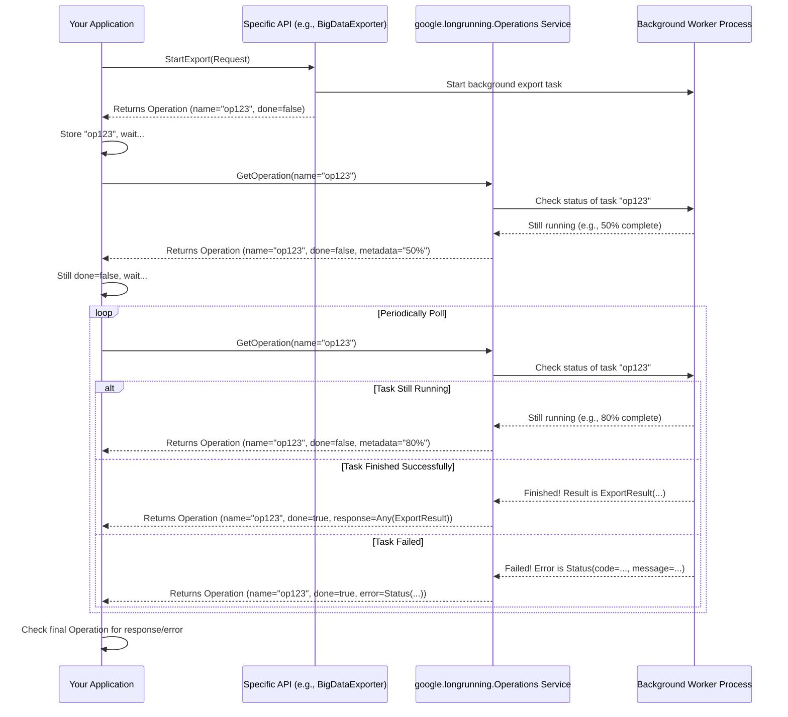

# Chapter 5: Long Running Operations (LRO)

In [Chapter 4: Common Types (`google.type`, `google.rpc`)](04_common_types___google_type____google_rpc___.md), we learned about standard ways Google APIs represent common data like dates (`google.type.Date`) and report errors (`google.rpc.Status`). These common types ensure consistency across different services.

But what happens when an API call can't finish instantly? Imagine asking an API to do something complex, like creating a large database instance, training a machine learning model, or exporting terabytes of data. These tasks might take minutes or even hours! If your application simply waited for the API call to return, it would be stuck, potentially timing out. How do APIs handle these time-consuming tasks without blocking the client?

That's where **Long Running Operations (LRO)** come in.

## The Problem: Waiting is Hard (and Often Impossible)

When you make a regular API call (like getting the details of an existing file), you expect a response almost immediately. The server does its work quickly and sends back the result.

However, for long tasks:

*   **Blocking:** Making your application wait for minutes or hours is usually impractical. The user interface would freeze, or background jobs might stall.
*   **Timeouts:** Network connections and systems often have timeouts. A connection might drop before the long task finishes.
*   **Uncertainty:** If the connection drops, how do you know if the task even started? Did it finish? Did it fail?

**Use Case:** Let's say you want to use a hypothetical "Big Data Export" API. You call the `StartExport` method, providing details about the data you want to export and where it should go. This export might take 30 minutes. You *don't* want your application to just sit there waiting for 30 minutes. You want to start the export, get confirmation that it began, and then check back later to see if it's done and get the results (like a link to the exported file).

## The Solution: The LRO Pattern (Get a Receipt and Check Back Later)

The Long Running Operation pattern solves this by changing how the API responds to requests that initiate long tasks.

**Analogy:** Think about ordering a custom-made piece of furniture.

1.  **Place Order:** You go to the store and place your order.
2.  **Get Receipt/Tracking:** You don't wait in the store for weeks while they build it! Instead, they give you a receipt and maybe a tracking number *immediately*. This confirms your order is placed and gives you a way to check its status.
3.  **Check Status:** You can go online later or call the store, using your tracking number, to see if the furniture is ready for delivery.
4.  **Get Result:** Once it's ready, they deliver it (the final result). If there was a problem (e.g., they couldn't get the right materials), they'll tell you that instead (an error).

The LRO pattern in Google APIs works exactly like this:

1.  **Initiate Task:** Your application calls the API method that starts the long task (e.g., `StartExport`).
2.  **Get `Operation` Object:** Instead of waiting for the task to finish, the API *immediately* returns a special object called an **`Operation`**. This `Operation` object acts like your receipt and tracking number. It contains a unique ID (`name`) for this specific task.
3.  **Check Status (`GetOperation`):** Your application can now use the `Operation`'s `name` to periodically call a standard method (usually `GetOperation` from the `google.longrunning.Operations` service) to check the status of the ongoing task. The response tells you if the task is `done` or still running.
4.  **Get Result/Error:** Once the `GetOperation` call shows the task is `done`, the `Operation` object will also contain either the final `result` (if successful) or an `error` (if it failed).

## How It Works: The Key Components

There are two main parts to the LRO pattern defined in `googleapis`:

### 1. The `Operation` Message (`google.longrunning.Operation`)

This is the "receipt" or "tracking object" returned immediately by an LRO-enabled API call. It's defined in `google/longrunning/operations.proto`.

Here's a simplified view of its structure:

```protobuf
// Simplified from google/longrunning/operations.proto
syntax = "proto3";

import "google/protobuf/any.proto"; // For holding arbitrary result/metadata
import "google/rpc/status.proto";   // For holding standard error info (Chapter 4)

package google.longrunning;

// Represents the state of a long-running operation.
message Operation {
  // A unique name for this operation, assigned by the server.
  // Often looks like: "operations/your_project/your_location/SOME_UNIQUE_ID"
  string name = 1;

  // Optional: Service-specific metadata about the operation's progress.
  // The actual type depends on the API (e.g., CreateInstanceMetadata).
  google.protobuf.Any metadata = 2;

  // If the value is `false`, it means the operation is still in progress.
  // If `true`, the operation is completed, and either `error` or `response` is set.
  bool done = 3;

  // The error result of the operation in case of failure or cancellation.
  // Uses the standard Status message from Chapter 4!
  google.rpc.Status error = 4;

  // The normal response of the operation when completed successfully.
  // The actual type depends on the API (e.g., the created Instance resource).
  google.protobuf.Any response = 5;

  // Note: The actual message definition uses a 'oneof result' field
  // to ensure only 'error' or 'response' can be set, but this simplified
  // view captures the essence.
}
```

**Explanation:**

*   `name`: The unique tracking ID for your task. You use this to check the status later.
*   `metadata`: Can hold extra information about the progress, specific to the task being performed (e.g., percentage complete, steps finished). The type of data here is described in the specific API's documentation. `google.protobuf.Any` is a special type that can hold *any* other Proto message.
*   `done`: A simple boolean flag. `false` means "still working," `true` means "finished (check `error` or `response`)."
*   `error`: If `done` is `true` and the task failed, this field will contain a `google.rpc.Status` message explaining what went wrong. (Remember `google.rpc.Status` from [Chapter 4: Common Types (`google.type`, `google.rpc`)](04_common_types___google_type____google_rpc__.md)?)
*   `response`: If `done` is `true` and the task succeeded, this field will contain the actual result of the operation (e.g., the details of the resource that was created). Again, `google.protobuf.Any` allows it to hold the specific response message type defined by the API.

### 2. The `Operations` Service (`google.longrunning.Operations`)

This is the standard "customer service desk" you contact to check on your order. It's a gRPC service defined in `google/longrunning/operations.proto` that provides methods to manage `Operation` objects.

The most important method is `GetOperation`:

```protobuf
// Simplified from google/longrunning/operations.proto
package google.longrunning;

// Defines the standard service for managing long-running operations.
service Operations {
  // Gets the latest status of a long-running operation.
  // Clients can use this method to poll the operation result.
  rpc GetOperation(GetOperationRequest) returns (Operation);

  // Other methods often included (simplified here):
  // rpc ListOperations(...) returns (...); // List recent operations
  // rpc CancelOperation(...) returns (...); // Request cancellation
  // rpc DeleteOperation(...) returns (...); // Remove an operation record
  // rpc WaitOperation(...) returns (...); // Server-side wait (less common for clients to call directly)
}

// Request message for GetOperation.
message GetOperationRequest {
  // The unique name of the operation to get.
  string name = 1;
}
```

**Explanation:**

*   `service Operations`: Defines the service.
*   `rpc GetOperation`: The key method. It takes a `GetOperationRequest` (which just needs the `name` of the operation you want to check) and returns the latest `Operation` object for that task, including its current `done` status and potentially `metadata`, `error`, or `response`.

## Solving the Use Case: Exporting Data

Let's see how you'd use this for our "Big Data Export" use case:

**Step 1: Start the Export**

You call the API's `StartExport` method. Since this is a long task, the API implements the LRO pattern.

```protobuf
// Example API definition snippet (hypothetical)
service BigDataExporter {
  // Starts an export. Returns an Operation that will eventually
  // contain an ExportResult or an error Status.
  rpc StartExport(StartExportRequest) returns (google.longrunning.Operation);
}

message StartExportRequest {
  string source_table = 1;
  string destination_uri = 2;
  // ... other export options ...
}

message ExportResult {
  // URI of the final exported file/folder.
  string exported_uri = 1;
  int64 num_rows_exported = 2;
}
```

Your client code calls `StartExport`:

```python
# Assume 'client' is an initialized gRPC client for BigDataExporter
# Assume 'operations_client' is for google.longrunning.Operations

request = StartExportRequest(
    source_table="projects/p1/tables/t1",
    destination_uri="gs://my-bucket/exports/data.csv"
)

# 1. Call the method that starts the LRO
operation = client.start_export(request)

# 2. The call returns *immediately* with an Operation object
print(f"Export started! Operation name: {operation.name}")
print(f"Is it done yet? {operation.done}")

# Keep the operation_name safe!
operation_name = operation.name
```

**Output (Example):**

```
Export started! Operation name: operations/export-jobs/123456789
Is it done yet? False
```

Notice the API returned right away, `done` is `false`, but you have the `operation.name`.

**Step 2: Check the Status Periodically**

Now, your application needs to "poll" the `Operations` service using the `operation_name` until `done` becomes `true`. You'd typically wait a few seconds between checks.

```python
import time

# Use the operation_name obtained in Step 1
get_request = GetOperationRequest(name=operation_name)

while True:
    # 3. Call GetOperation to check status
    current_operation_status = operations_client.get_operation(get_request)
    print(f"Checking status... Done: {current_operation_status.done}")

    if current_operation_status.done:
        # Finished! Store the final status and exit the loop
        final_operation_status = current_operation_status
        break # Exit the loop

    # Optional: Check metadata for progress updates if available
    # if current_operation_status.metadata...

    # Wait before checking again (e.g., 15 seconds)
    print("Not done yet, waiting...")
    time.sleep(15)

print("Operation finished!")
```

**Output (Example over time):**

```
Checking status... Done: False
Not done yet, waiting...
Checking status... Done: False
Not done yet, waiting...
# ... many checks later ...
Checking status... Done: False
Not done yet, waiting...
Checking status... Done: True
Operation finished!
```

**Step 3: Get the Final Result (or Error)**

Once the loop finishes (`done` is true), you inspect the `final_operation_status` object:

```python
# 4. Check if it finished with an error or a successful response
if final_operation_status.error.code != 0: # 0 is the code for OK/Success
    print(f"Operation failed! Error: {final_operation_status.error.message}")
else:
    # Success! Need to unpack the result from the 'Any' type.
    # Client libraries often do this automatically.
    export_result = ExportResult() # Create an empty result message
    final_operation_status.response.Unpack(export_result) # Unpack the Any proto
    print("Operation succeeded!")
    print(f"  Exported file: {export_result.exported_uri}")
    print(f"  Rows exported: {export_result.num_rows_exported}")
```

**Output (Example Success):**

```
Operation succeeded!
  Exported file: gs://my-bucket/exports/data.csv/part-00000
  Rows exported: 1500000
```

**Output (Example Failure):**

```
Operation failed! Error: Permission denied on source table 'projects/p1/tables/t1'.
```

This sequence – initiate, get operation name, poll `GetOperation`, check final result/error – is the standard way to interact with APIs using LROs.

## Under the Hood: How It Connects

Let's visualize the flow:



**Key Points:**

*   The original API (`BigDataExporter`) only handles starting the task and returning the initial `Operation` object.
*   A separate, standard service (`google.longrunning.Operations`) is responsible for reporting the status via `GetOperation`.
*   Some background process (the Worker) actually performs the long-running task and updates its status where the `Operations` service can find it.
*   The `Operation` message defined in `google/longrunning/operations.proto` is the standard container for the name, status, metadata, and final outcome.
*   APIs indicate LRO usage in their definition (e.g., the `returns (google.longrunning.Operation)` in our example) and often provide details about the specific `metadata` and `response` types in their documentation or service config YAMLs (like the `long_running:` sections seen in `google/bigtable/admin/v2/bigtableadmin_gapic.yaml` or the list of `OperationMetadata` types in `google/cloud/aiplatform/v1/aiplatform_v1.yaml`).

**Client Library Simplification:** Manually writing the polling loop can be tedious. Modern client libraries generated for Google APIs (see [Chapter 7: GAPIC (Generated API Client) Configuration](07_gapic__generated_api_client__configuration_.md)) often hide this complexity. They might provide a function that looks synchronous but handles the LRO polling automatically behind the scenes, returning the final result or raising an error directly. However, understanding the underlying LRO pattern is crucial for knowing what's happening and for situations where you need more control.

## Conclusion

You've learned about the **Long Running Operations (LRO)** pattern, a standard way Google APIs handle tasks that take significant time to complete.

Key takeaways:

1.  **Problem:** API calls for long tasks can't block the client.
2.  **Solution:** The API immediately returns an `Operation` object (like a receipt/tracking number).
3.  **Mechanism:** The client uses the `Operation`'s `name` to poll the standard `google.longrunning.Operations` service (`GetOperation`) until the `done` flag is true.
4.  **Outcome:** The final `Operation` object contains either the successful `response` or an `error` status.

This asynchronous pattern allows your application to initiate long tasks without waiting indefinitely, check progress periodically, and reliably get the final outcome. It relies heavily on the common structures defined in `google/longrunning/operations.proto` and `google/rpc/status.proto` ([Chapter 4: Common Types (`google.type`, `google.rpc`)](04_common_types___google_type____google_rpc___.md)).

Now that we understand how APIs handle long tasks, how do they handle security? Who is allowed to call these APIs in the first place?

**Next:** [Chapter 6: IAM (Identity and Access Management)](06_iam__identity_and_access_management_.md)

---

Generated by [AI Codebase Knowledge Builder](https://github.com/The-Pocket/Tutorial-Codebase-Knowledge)