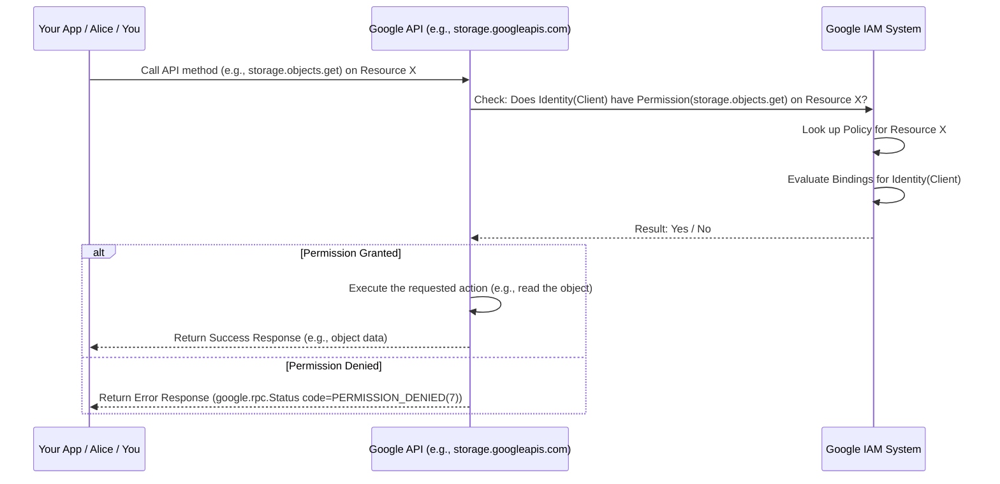
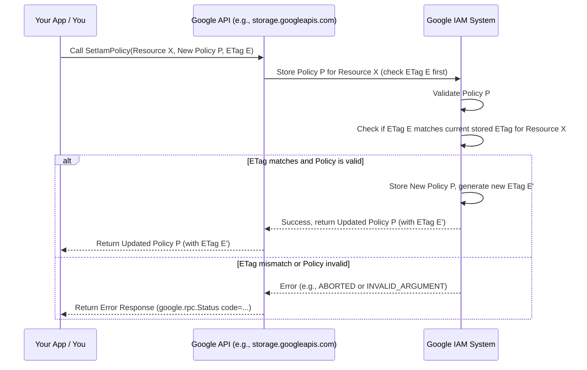

# Chapter 6: IAM (Identity and Access Management)

In [Chapter 5: Long Running Operations (LRO)](05_long_running_operations__lro__.md), we saw how Google APIs handle tasks that take a long time, using a standard "check back later" pattern. But we haven't really discussed *who* is allowed to start those tasks, or any other API actions, in the first place. How does Google Cloud know if *you* are allowed to create a virtual machine, read a file from Cloud Storage, or start a data export?

This chapter introduces **IAM (Identity and Access Management)**, the fundamental security system used across Google Cloud to control access to resources.

## The Problem: Who Can Do What?

Imagine a company using Google Cloud. They have many employees and many different cloud resources (like virtual machines, databases, storage buckets).

*   How do they ensure only the database team can manage the company's critical databases?
*   How do they allow the web development team to update website files in a Cloud Storage bucket, but prevent them from accidentally deleting the database?
*   How can an automated script (running without a human) be given permission to write logs, but nothing else?

Without a robust access control system, it would be chaos! Anyone could potentially access or modify sensitive resources, leading to security breaches, data loss, or unexpected costs.

**Use Case:** Let's say you have a Cloud Storage bucket named `my-important-files`. You want to set up the following rules:

1.  Your web application (running as a specific automated identity called a "service account") needs to be able to *read* files from this bucket.
2.  Your colleague, Alice (identified by her Google account `alice@example.com`), should be able to *list* the files in the bucket, but *not* read their contents or delete them.
3.  You (identified by your Google account `you@example.com`) should have *full control* over the bucket (read, write, delete, change settings).
4.  Nobody else should be able to access the bucket at all.

How can we precisely define and enforce these rules?

## The Solution: IAM = Who + What + Which

IAM solves this by defining **who (identity)** can do **what (role/permission)** on **which Google Cloud resource**. Think of it like a sophisticated security system for a large building.

### 1. Who: The Identity (Principal)

This is the "who" part. An identity (also called a "principal" in IAM terms) represents a user, application, or group that can be authenticated and authorized.

*   **Analogy:** The specific keycard issued to an individual or a department.

Common types of identities in Google Cloud:

*   **Google Account:** A specific user identified by their email address (like `alice@example.com` or `you@example.com`). This is for humans logging in.
*   **Service Account:** A special identity used by applications or virtual machines to authenticate and make API calls automatically, without a human involved (like `my-web-app@my-project.iam.gserviceaccount.com`). Think of it as a keycard specifically for a robot or automated system.
*   **Google Group:** A collection of Google Accounts and/or service accounts (like `database-admins@example.com`). Granting access to a group gives access to all its members.
*   **Special Identifiers:** Like `allUsers` (literally anyone on the internet, even unauthenticated users - use with extreme caution!) or `allAuthenticatedUsers` (anyone logged in with any Google account).

### 2. What: The Role (Permissions)

This is the "what" part. It defines what actions an identity is allowed to perform.

*   **Permissions:** These are fine-grained actions, usually tied directly to API methods. Examples:
    *   `storage.objects.get` (Permission to read a file from Cloud Storage)
    *   `storage.objects.list` (Permission to list files in a bucket)
    *   `storage.objects.delete` (Permission to delete a file)
    *   `compute.instances.start` (Permission to start a virtual machine)
*   **Roles:** Permissions are rarely assigned individually. Instead, they are grouped into **Roles**. A role is a collection of permissions that represents a common job function or access level.
    *   **Analogy:** An access level assigned to a keycard. A "Standard Employee" keycard might open the main entrance and office floors (basic permissions). A "Security Guard" keycard might also open server rooms and equipment closets (more permissions).
    *   Examples of built-in roles:
        *   `roles/storage.objectViewer`: Includes `storage.objects.get` and `storage.objects.list`. Allows viewing objects.
        *   `roles/storage.objectAdmin`: Includes permissions to get, list, create, and delete objects.
        *   `roles/storage.admin`: Includes all permissions related to Cloud Storage, including managing buckets themselves.
        *   `roles/viewer`: A project-level role allowing read-only access to most resources in a project.
        *   `roles/editor`: Allows viewing and modifying most resources.
        *   `roles/owner`: Allows full control over a project, including managing IAM itself.

You typically grant *roles* to identities, not individual permissions.

### 3. Which: The Resource

This is the "which" part. Permissions are not granted globally; they are always granted *on* a specific Google Cloud resource.

*   **Analogy:** Which specific door(s) or area(s) in the building a keycard is allowed to open. A keycard might open the front door (a shared resource) but only the door to your specific office (a specific resource).

Permissions can be set at different levels of the resource hierarchy:

*   **Organization:** Top level, applies to all folders and projects within.
*   **Folder:** Applies to all projects within that folder.
*   **Project:** Applies to all resources within that project (e.g., all Cloud Storage buckets, all Compute Engine instances).
*   **Specific Resource:** Applies only to that single resource (e.g., just one specific Cloud Storage bucket `my-important-files`, or just one specific Compute Engine instance `my-vm`).

Permissions granted at a higher level (like the project) are inherited by resources lower down (like a bucket within that project), unless overridden by a more specific policy.

## Putting It Together: The IAM Policy

How do we combine the "Who," "What," and "Which"? This is done using an **IAM Policy**.

An **IAM Policy** is attached to a specific resource ("Which") and defines the access rules for that resource. It's essentially a list of statements that say "These identities (Who) get this role (What)".

*   **Analogy:** The official security policy document for a specific floor or area in the building. It lists exactly which keycard IDs (identities) have which access levels (roles) for that specific area (resource).

The core structure of an IAM Policy is a list of **bindings**:

*   **Binding:** Connects one or more identities (members) to a single role.

```protobuf
// Simplified representation of google.iam.v1.Policy
message Policy {
  int32 version = 1; // Policy format version
  repeated Binding bindings = 4; // The list of bindings
  bytes etag = 3; // Used for concurrency control when updating policies
}

// Simplified representation of google.iam.v1.Binding
message Binding {
  string role = 1; // The role being granted (e.g., "roles/storage.objectViewer")
  repeated string members = 2; // List of identities getting this role
                               // (e.g., "user:alice@example.com",
                               //  "serviceAccount:my-app@project.iam.gserviceaccount.com")
}
```

*   `Policy`: Contains the overall list of `bindings`.
*   `Binding`: A single entry in the policy.
    *   `role`: Specifies the role (the "What").
    *   `members`: A list of identities (the "Who") that are granted that `role` on the resource this policy is attached to ("Which"). Identities are specified with prefixes like `user:`, `serviceAccount:`, `group:`, etc.

## How IAM is Defined in `googleapis`

The `googleapis` repository defines the standard structures and services for interacting with IAM policies. You'll find these definitions in the `google/iam/v1/` directory ([Chapter 3: Repository Structure](03_repository_structure_.md)).

*   **`google/iam/v1/policy.proto`**: Defines the `Policy` and `Binding` messages shown above.
*   **`google/iam/v1/iam_policy.proto`**: Defines the standard gRPC service `IAMPolicy` with three key methods:
    *   `SetIamPolicy`: Replaces the existing IAM policy on a resource with a new one.
    *   `GetIamPolicy`: Retrieves the current IAM policy for a resource.
    *   `TestIamPermissions`: Checks if the caller (the identity making the API call) has a specific set of permissions on a resource.

**How APIs Use IAM Definitions:**

Many Google Cloud APIs need to manage access control for the resources they manage (like Cloud Storage buckets, Pub/Sub topics, etc.). Instead of each API inventing its own way, they *reuse* the standard `google.iam.v1.IAMPolicy` service definition.

You can see this in the API Service Definition YAML files ([Chapter 2: API Service Definition (YAML)](02_api_service_definition__yaml__.md)). For example, in `google/api/servicemanagement/v1/servicemanagement_v1.yaml` or `google/cloud/aiplatform/v1/aiplatform_v1.yaml`, you'll find `google.iam.v1.IAMPolicy` listed under the `apis:` section.

```yaml
# Snippet from an API's service definition YAML
apis:
- name: google.some.api.v1.SpecificService # The API's own service
- name: google.iam.v1.IAMPolicy          # Includes standard IAM methods
- name: google.longrunning.Operations     # Includes standard LRO methods
```

This means that the endpoint for that API (e.g., `aiplatform.googleapis.com`) also supports the standard `SetIamPolicy`, `GetIamPolicy`, and `TestIamPermissions` methods for the resources managed by that API.

## Solving the Use Case: Securing `my-important-files`

Let's create an IAM Policy for our Cloud Storage bucket `my-important-files` to meet the requirements:

1.  Web app (`serviceAccount:my-web-app@my-project.iam.gserviceaccount.com`) needs to read files (`roles/storage.objectViewer`).
2.  Alice (`user:alice@example.com`) needs to list files (`roles/storage.legacyBucketReader` - this role grants list but not get). *Note: Sometimes finding the exact minimal role requires looking at IAM documentation.*
3.  You (`user:you@example.com`) need full control (`roles/storage.admin`).

Here's what the `Policy` object would look like (represented as simplified YAML/JSON for readability):

```json
{
  "version": 3, // Current version format
  "bindings": [
    {
      "role": "roles/storage.objectViewer",
      "members": [
        "serviceAccount:my-web-app@my-project.iam.gserviceaccount.com"
      ]
    },
    {
      "role": "roles/storage.legacyBucketReader",
      "members": [
        "user:alice@example.com"
      ]
    },
    {
      "role": "roles/storage.admin",
      "members": [
        "user:you@example.com"
      ]
    }
    // Anyone not listed here has no access (by default).
  ],
  "etag": "BwX..." // An etag provided by GetIamPolicy
}
```

**How to Apply This:**

1.  **Get Current Policy:** You would first call `GetIamPolicy` on the bucket resource (`projects/_/buckets/my-important-files`). This gives you the current policy and its `etag`.
2.  **Modify Policy:** You would modify the retrieved policy object in your code to add/update the bindings as shown above.
3.  **Set New Policy:** You would then call `SetIamPolicy`, providing the resource name and your modified policy object (including the `etag` you received from `GetIamPolicy`). The `etag` prevents conflicts if someone else changed the policy while you were modifying it.

**How to Check Permissions:**

Alice could use `TestIamPermissions` before trying to read a file. She would call `TestIamPermissions` on the bucket, asking if she has the `storage.objects.get` permission.

```protobuf
// Simplified TestIamPermissionsRequest
message TestIamPermissionsRequest {
  string resource = 1; // e.g., "projects/_/buckets/my-important-files"
  repeated string permissions = 2; // e.g., ["storage.objects.get"]
}

// Simplified TestIamPermissionsResponse
message TestIamPermissionsResponse {
  // The subset of the requested permissions that the caller actually has.
  repeated string permissions = 1;
}
```

If Alice calls this with `permissions: ["storage.objects.get"]`, the response would be `permissions: []` (an empty list), because her role `roles/storage.legacyBucketReader` does not grant `storage.objects.get`. If she checked for `storage.objects.list`, the response would include that permission.

## Under the Hood: Centralized Control

How does this actually work when you make an API call?

**High-Level Flow (Checking Permissions):**



**Key Points:**

*   When you call a method like `GetObject` on Cloud Storage, the Storage service doesn't figure out permissions itself.
*   It makes an internal check against the central **Google IAM system**.
*   The IAM system looks up the policy attached to the specific resource (or its parent project/folder/org) and evaluates if the identity making the request has the required permission based on the roles assigned in the policy bindings.
*   The API call only proceeds if the IAM check passes.

**Setting Policies:** Similarly, when you call `SetIamPolicy`, the API service relays that request to the central IAM system to store the policy securely against the resource.



The `.proto` files in `google/iam/v1/` define the standard *interface* (the messages and methods) for interacting with this central IAM system, ensuring consistency across all Google Cloud services that use it.

## Conclusion

You've learned about **IAM (Identity and Access Management)**, the cornerstone of Google Cloud security. It provides a consistent way to manage permissions based on three key questions:

1.  **Who?** (Identity/Principal: User, Service Account, Group)
2.  **What?** (Role: A collection of Permissions)
3.  **Which?** (Resource: Project, Bucket, Instance, etc.)

These are linked together by an **IAM Policy** attached to each resource, which contains **Bindings** mapping identities to roles. The `googleapis` repository defines the standard `Policy` message structure and the `IAMPolicy` service (`SetIamPolicy`, `GetIamPolicy`, `TestIamPermissions`) in `google/iam/v1/`, which many APIs incorporate for consistent access control.

Now that we understand the core concepts like Protobuf, gRPC, Service Definitions, Common Types, LROs, and IAM, how do we actually *use* these APIs easily in our code? Google provides tools to generate helpful client libraries.

**Next:** [Chapter 7: GAPIC (Generated API Client) Configuration](07_gapic__generated_api_client__configuration_.md)

---

Generated by [AI Codebase Knowledge Builder](https://github.com/The-Pocket/Tutorial-Codebase-Knowledge)