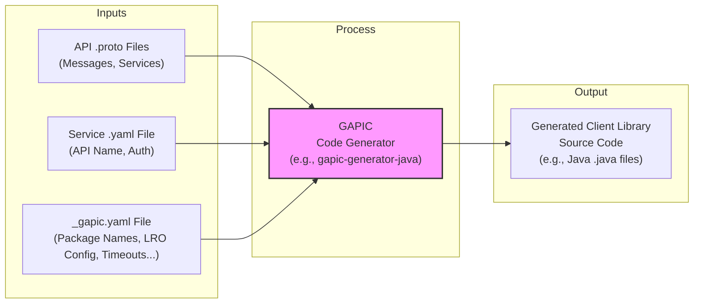

# Chapter 7: GAPIC (Generated API Client) Configuration

In [Chapter 6: IAM (Identity and Access Management)](06_iam__identity_and_access_management_.md), we learned how Google Cloud controls *who* can do *what* on *which* resource using IAM policies. We've now covered the core components defining Google APIs: the data structures ([Chapter 1: Protocol Buffers (Proto) & gRPC](01_protocol_buffers__proto____grpc_.md)), the overall service ([Chapter 2: API Service Definition (YAML)](02_api_service_definition__yaml__.md)), common patterns like ([Chapter 5: Long Running Operations (LRO)](05_long_running_operations__lro__.md)), and security ([Chapter 6: IAM (Identity and Access Management)](06_iam__identity_and_access_management_.md)).

But how do we make using these APIs *easy* for developers writing code in languages like Python, Java, or Go? Manually handling gRPC connections, authentication, LRO polling, and other complexities for every API call would be tedious and error-prone. Google provides pre-built **Generated API Clients (GAPICs)** to simplify this. But how are these helpful client libraries generated with language-specific details and behaviors? That's where **GAPIC Configuration** comes in.

## The Problem: Making API Use Simple and Idiomatic

Imagine you're a Java developer wanting to use the Google Cloud Bigtable API. You've learned about the `.proto` files defining the requests/responses and the LRO pattern for creating tables.

1.  You'd prefer to work with standard Java classes and methods, not raw gRPC calls.
2.  You'd like the Java library to have a sensible package name, like `com.google.cloud.bigtable.admin.v2`.
3.  When you call a method that starts an LRO (like `createTable`), you'd rather not write the polling loop yourself every time; it would be great if the library handled it automatically.

How does Google ensure that the generated client libraries feel natural ("idiomatic") in each language and include helpful features like automatic LRO polling? The `.proto` and service `.yaml` files define the *core* API, but they don't specify these language-specific details or client-side behaviors.

## The Solution: The GAPIC Config (`_gapic.yaml`) File

The solution lies in **GAPIC Configuration files**, which typically end in `_gapic.yaml` (e.g., `bigtableadmin_gapic.yaml`).

Think of the process like building with Lego:

*   **`.proto` files:** Define the individual Lego brick shapes (messages) and how they connect (services/RPCs).
*   **Service `.yaml` files:** Define the overall Lego set (the API service name, address, basic rules like authentication).
*   **`_gapic.yaml` files:** Provide the specific, detailed instruction manual for building a *really nice version* of the set using, say, specialized Java-Technic pieces or Python-Mindstorms parts. It tells the builder (the code generator) how to assemble the client library with language-specific touches and convenience features.

These `_gapic.yaml` files contain configuration details specifically for the **GAPIC Generator**, a tool that automatically creates client libraries for various languages. These files fine-tune how the generated code behaves.

## Anatomy of a GAPIC Config File

Let's look at snippets from a real file, like `google/bigtable/admin/v2/bigtableadmin_gapic.yaml`, to see what kinds of instructions it provides.

**1. Language-Specific Settings (e.g., Package Name)**

This tells the generator basic information needed for a specific language, like the package or namespace name.

```yaml
# Example from google/bigtable/admin/v2/bigtableadmin_gapic.yaml

type: com.google.api.codegen.ConfigProto
config_schema_version: 2.0.0

# Settings grouped by programming language
language_settings:
  # Settings specifically for Java
  java:
    # Tells the generator what Java package name to use
    # for the generated Bigtable Admin client code.
    package_name: com.google.cloud.bigtable.admin.v2
  # python:
  #   package_name: google.cloud.bigtable_admin_v2
  #   ... other python settings ...
  # go:
  #   package_name: cloud.google.com/go/bigtable/admin/apiv2/adminpb
  #   ... other go settings ...
```

**Explanation:**

*   `language_settings:` groups configuration that applies only to certain languages.
*   `java:` indicates the following settings are for Java code generation.
*   `package_name: com.google.cloud.bigtable.admin.v2`: This instructs the generator to place the generated Java classes for the Bigtable Admin API v2 into this standard Java package structure. This makes the library feel familiar and organized for Java developers. Similar settings exist for other languages like Python (`google.cloud.bigtable_admin_v2`) or Go.

**2. Configuring Method Behavior (e.g., LRO Polling)**

This is where we can customize how specific API methods behave in the generated client library. A common example is configuring the automatic polling for [Chapter 5: Long Running Operations (LRO)](05_long_running_operations__lro__.md).

```yaml
# Example from google/bigtable/admin/v2/bigtableadmin_gapic.yaml

# Configuration specific to API interfaces (services)
interfaces:
# Settings for the 'BigtableTableAdmin' service defined in the proto
- name: google.bigtable.admin.v2.BigtableTableAdmin
  # Settings for specific methods within this service
  methods:
  # Settings for the 'CreateTableFromSnapshot' RPC method
  - name: CreateTableFromSnapshot
    # Configuration for how the client library should handle
    # the Long Running Operation returned by this method.
    long_running:
      # How long to wait before the *first* poll (milliseconds)
      initial_poll_delay_millis: 5000
      # Multiplier for increasing delay between polls (e.g., 1.5x longer each time)
      poll_delay_multiplier: 1.5
      # Maximum delay between any two polls (milliseconds)
      max_poll_delay_millis: 60000
      # Total maximum time to keep polling before giving up (milliseconds)
      total_poll_timeout_millis: 3600000 # (1 hour)
```

**Explanation:**

*   `interfaces:` groups settings by the gRPC `service` defined in the `.proto` file.
*   `name: google.bigtable.admin.v2.BigtableTableAdmin`: Specifies that these settings apply to the `BigtableTableAdmin` service.
*   `methods:` lists configurations for specific RPC methods within that service.
*   `name: CreateTableFromSnapshot`: Focuses on the `CreateTableFromSnapshot` method, which we know returns an LRO (from its `.proto` definition or documentation).
*   `long_running:` contains parameters telling the generator how to implement the *automatic polling loop* inside the generated client library method:
    *   `initial_poll_delay_millis: 5000`: Wait 5 seconds before the first status check.
    *   `poll_delay_multiplier: 1.5`: Wait 1.5 times longer between subsequent checks (5s, 7.5s, 11.25s, etc., respecting the max).
    *   `max_poll_delay_millis: 60000`: Don't wait more than 60 seconds between checks.
    *   `total_poll_timeout_millis: 3600000`: Give up polling after 1 hour.

**Other Potential Configurations:**

GAPIC config files can specify other behaviors too, such as:

*   **Default Timeouts:** How long should a regular (non-LRO) API call wait before timing out?
*   **Retry Settings:** Which errors should be automatically retried, and how many times?
*   **Request Batching:** For methods that support it, group multiple small requests into a single larger API call for efficiency.
*   **Pagination:** How to automatically handle list methods that return results in pages.
*   **Resource Names:** How to parse and format resource names (like `projects/p/tables/t`) conveniently.

## Solving the Use Case: Easier Development

How does this `_gapic.yaml` configuration help our Java developer using Cloud Bigtable?

1.  **Easy Installation & Import:** Because the `language_settings` specified `package_name: com.google.cloud.bigtable.admin.v2`, the developer can easily find and import the generated classes using standard Java conventions.
    ```java
    // Developer can easily import the client
    import com.google.cloud.bigtable.admin.v2.BigtableTableAdminClient;
    import com.google.cloud.bigtable.admin.v2.TableName;
    // ... other necessary imports ...

    // Library usage feels natural in Java
    BigtableTableAdminClient adminClient = BigtableTableAdminClient.create();
    TableName tableName = TableName.of("[PROJECT]", "[INSTANCE]", "[TABLE]");
    ```
2.  **Simplified LRO Handling:** Because the `long_running` section was configured for `CreateTableFromSnapshot`, the generated Java client library can offer a simplified method that *hides the polling loop*. The developer might call a method that looks like it waits, but behind the scenes, the library is using the configured parameters to poll `GetOperation`.
    ```java
    // Hypothetical simplified usage (exact API might differ)
    try {
      // Call a method that handles LRO polling internally
      Table resultTable = adminClient.createTableFromSnapshotAsync(request).get();
      // Code here runs *after* the LRO finished successfully
      System.out.println("Table created: " + resultTable.getName());
    } catch (ExecutionException | InterruptedException e) {
      // Handle errors, including potential LRO timeouts or failures
      System.err.println("Failed to create table: " + e.getMessage());
    }
    ```

The `_gapic.yaml` file allows the generated library to provide these convenient, language-idiomatic features, making the developer's life much easier compared to interacting with the raw gRPC API directly.

## Under the Hood: The Generation Process

It's crucial to understand that the `_gapic.yaml` file is **not used at runtime** by your application or the Google API servers. It's only used **at build time** by the GAPIC code generator.

**Analogy Revision:** The `_gapic.yaml` is the instruction manual used *in the factory* (by the generator) to build the furniture (the client library). Once the furniture is delivered to your house (you install the library), you don't need the factory's instruction manual anymore. You just use the furniture.

**How the Generator Uses It:**

1.  **Inputs:** The GAPIC generator tool takes several inputs:
    *   The `.proto` files defining the API messages and services ([Chapter 1: Protocol Buffers (Proto) & gRPC](01_protocol_buffers__proto____grpc_.md)).
    *   The service `.yaml` file defining the overall service attributes ([Chapter 2: API Service Definition (YAML)](02_api_service_definition__yaml__.md)).
    *   The `_gapic.yaml` file containing language-specific settings and behavior overrides.
    *   Target language (e.g., "Java", "Python").
2.  **Processing:** The generator reads all these configuration files. It uses the `.proto` as the primary blueprint for classes and methods. It then applies the settings from the service `.yaml` and, crucially, the `_gapic.yaml` to customize the output for the target language.
3.  **Output:** The generator outputs source code files (e.g., `.java`, `.py`) that constitute the client library for that specific API and language. This generated code includes:
    *   Classes for request and response messages.
    *   Client classes with methods for each RPC.
    *   Helper code for authentication, LRO polling (based on `_gapic.yaml` settings), pagination, retries, etc.

Here's a simplified diagram of the process:



The `_gapic.yaml` files within the `googleapis` repository are essential inputs to this generation process, ensuring that the resulting client libraries are not just functional but also robust and developer-friendly.

## Conclusion

You've now learned about **GAPIC (Generated API Client) Configuration** files (`_gapic.yaml`). These files act as the detailed instruction manuals for the code generators that build Google Cloud client libraries.

Key takeaways:

1.  **Purpose:** To fine-tune the generation of client libraries for specific languages, making them easier and more idiomatic to use.
2.  **Content:** They specify language-specific details (like package names) and configure client-side behaviors (like LRO polling parameters, timeouts, retries).
3.  **Usage:** They are used *only* during the code generation process, not at runtime.
4.  **Benefit:** They enable the creation of high-quality, developer-friendly client libraries that hide much of the underlying complexity of authentication, gRPC, LROs, etc.

Understanding these configuration files helps explain *why* the official Google Cloud client libraries behave the way they do and provides insight into the sophisticated tooling used to create and maintain APIs and their corresponding libraries based on the definitions found in the `googleapis` repository.

This concludes our tour through the core concepts found within the `googleapis` repository! From the fundamental building blocks of Protocol Buffers and gRPC, through service definitions, common types, standard patterns like LRO and IAM, and finally to the configuration that helps create user-friendly client libraries, you now have a solid foundation for understanding how Google designs and defines its APIs.

---

Generated by [AI Codebase Knowledge Builder](https://github.com/The-Pocket/Tutorial-Codebase-Knowledge)