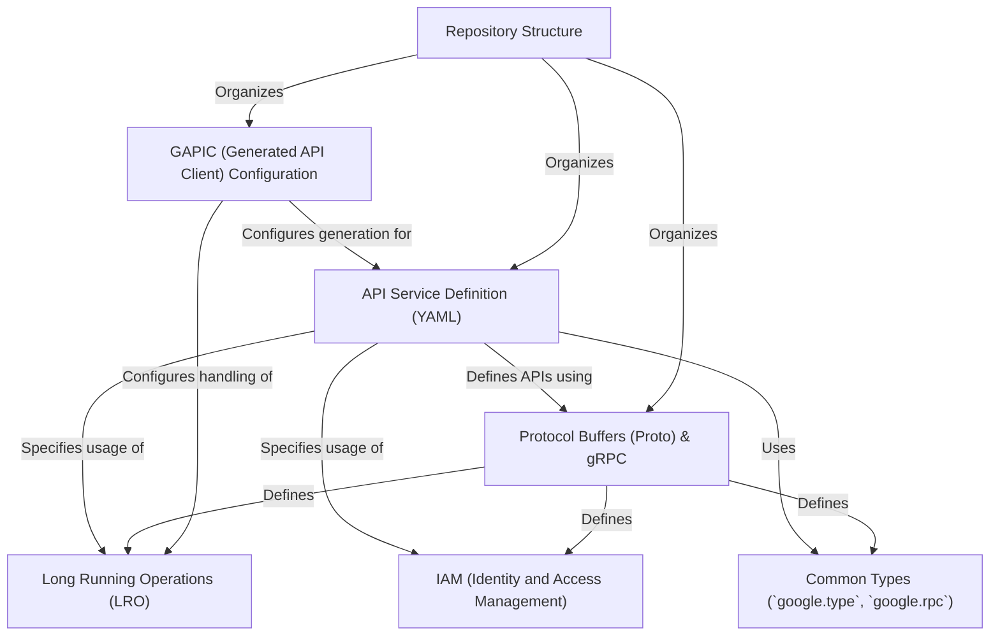

# Tutorial: googleapis

This project hosts the *original interface definitions* for public Google APIs. It uses **Protocol Buffers (protobuf)** as the language to describe API structures and **gRPC** as the communication protocol, supporting both REST and RPC styles.

Think of it as the central library of blueprints for various Google services (like Cloud Storage or AI Platform). Developers can use these definitions to understand the APIs better or generate their own client libraries and tools. The repository also includes configuration files (`YAML`) that define service behavior, manage long-running tasks (*LROs*), handle access control (**IAM**), and fine-tune code generation (**GAPIC**) for different programming languages, all organized in a consistent *directory structure*.

**Source Repository:** [None](None)

## Chapters

1. [Protocol Buffers (Proto) & gRPC
](01_protocol_buffers__proto____grpc_.md)
2. [API Service Definition (YAML)
](02_api_service_definition__yaml__.md)
3. [Repository Structure
](03_repository_structure_.md)
4. [Common Types (`google.type`, `google.rpc`)
](04_common_types___google_type____google_rpc___.md)
5. [Long Running Operations (LRO)
](05_long_running_operations__lro__.md)
6. [IAM (Identity and Access Management)
](06_iam__identity_and_access_management__.md)
7. [GAPIC (Generated API Client) Configuration
](07_gapic__generated_api_client__configuration_.md)

---

Generated by [AI Codebase Knowledge Builder](https://github.com/The-Pocket/Tutorial-Codebase-Knowledge)