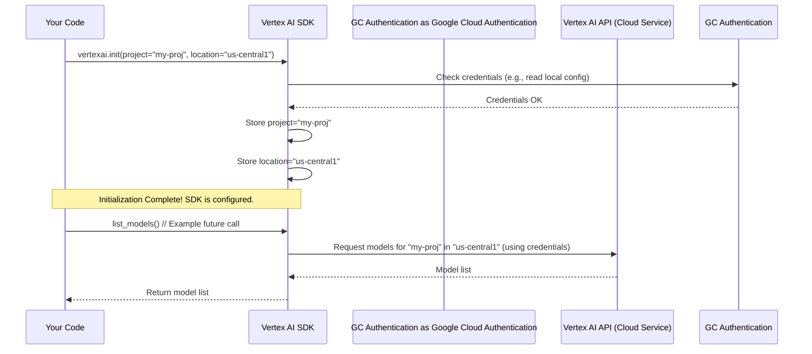

# Chapter 1: Vertex AI Initialization

Welcome to the Model Garden tutorials! Before we can start exploring and using powerful AI models, we need to perform a crucial first step: **Vertex AI Initialization**.

Think of Google Cloud's Vertex AI as a giant workshop filled with amazing AI tools and models. Before you can enter and start working, you need to tell the system who you are and which part of the workshop (which specific building or area) you want to work in. This process is called "initialization".

**Why do we need this?**

Imagine you have multiple projects in Google Cloud, maybe one for personal experiments and another for a team project. When you write code to use Vertex AI, it needs to know *which* project's resources (like models or computing power) you want to use. You also need to specify the *location* (a specific Google Cloud region, like `us-central1` or `europe-west4`) where you want your AI tasks to run. Different locations have different resources available and might be closer to your users or data.

Initializing Vertex AI solves this by setting up your working context right at the beginning of your script.

**How to Initialize Vertex AI**

Let's look at a simple example. Suppose our goal is just to connect to Vertex AI so we can later ask it questions, like listing available models. Here’s how you do the initialization part in Python:

```python
# Import the necessary libraries
import os
import vertexai

# --- Initialization Step ---

# TODO(developer): Replace 'your-project-id' with your actual Google Cloud Project ID
PROJECT_ID = "your-project-id"
# Or, get it from an environment variable if set
# PROJECT_ID = os.getenv("GOOGLE_CLOUD_PROJECT")

# Choose a location, e.g., 'us-central1'
LOCATION = "us-central1"

# Initialize Vertex AI! This connects your code to your project and location.
vertexai.init(project=PROJECT_ID, location=LOCATION)

print("Vertex AI Initialized!")
print(f"Project: {PROJECT_ID}")
print(f"Location: {LOCATION}")

# --- Ready to use Vertex AI features ---
# Now you can call other Vertex AI functions, like listing models...
# (We'll cover this in the next chapter!)
```

**Explanation:**

1.  **`import vertexai`**: This line brings in the Vertex AI library, giving you access to its functions.
2.  **`PROJECT_ID = "your-project-id"`**: You need to replace `"your-project-id"` with the unique ID of *your* Google Cloud project. Think of this as your workshop membership ID. You can find this ID in your Google Cloud Console. Sometimes, this is set up as an environment variable (`os.getenv("GOOGLE_CLOUD_PROJECT")`), especially when running code in a Google Cloud environment.
3.  **`LOCATION = "us-central1"`**: This sets the specific geographical region where you want to work. It's like choosing which building in the giant workshop complex you'll use. `us-central1` is a common choice.
4.  **`vertexai.init(project=PROJECT_ID, location=LOCATION)`**: This is the core initialization command! It tells the `vertexai` library: "Okay, for the rest of this script, whenever I ask you to do something, do it within *this* project (`PROJECT_ID`) and in *this* region (`LOCATION`)."

Once this line runs successfully, your code has "unlocked the door" and is ready to interact with Vertex AI services within your specified project and location.

**What Happens Under the Hood? (A Simple View)**

When you call `vertexai.init()`, the library doesn't immediately send lots of data to Google Cloud. It mainly does two things locally within your script's environment:

1.  **Stores Configuration:** It remembers the `project` ID and `location` you provided. Think of it like writing down the workshop ID and building number on a sticky note for later reference.
2.  **Checks Credentials (Implicitly):** It usually relies on authentication you've already set up. If you're running this on your local machine, it might use credentials set up via the `gcloud auth application-default login` command. If running inside Google Cloud (like on a virtual machine or Cloud Function), it often uses the built-in service account credentials. It makes sure you *have* permission to access the specified project.

Let's visualize this basic setup process:



This diagram shows that `init` mainly configures the SDK locally. The actual communication with the Vertex AI service in the cloud happens later when you call other functions that *use* this configuration (like listing, deploying, or predicting with models).

**Conclusion**

Initializing Vertex AI with `vertexai.init(project=..., location=...)` is the essential first step before interacting with any Vertex AI service through the Python SDK. It's like showing your ID and specifying your work area before entering the AI workshop. It sets up the context (your project and region) so all subsequent commands know where to operate.

Now that we know how to initialize Vertex AI, we're ready to start exploring what's inside the workshop!

**Next Up:** Let's learn how to interact with the Model Garden to find available models in [Chapter 2: Model Garden Interaction](02_model_garden_interaction_.md).

---

Generated by [AI Codebase Knowledge Builder](https://github.com/The-Pocket/Tutorial-Codebase-Knowledge)