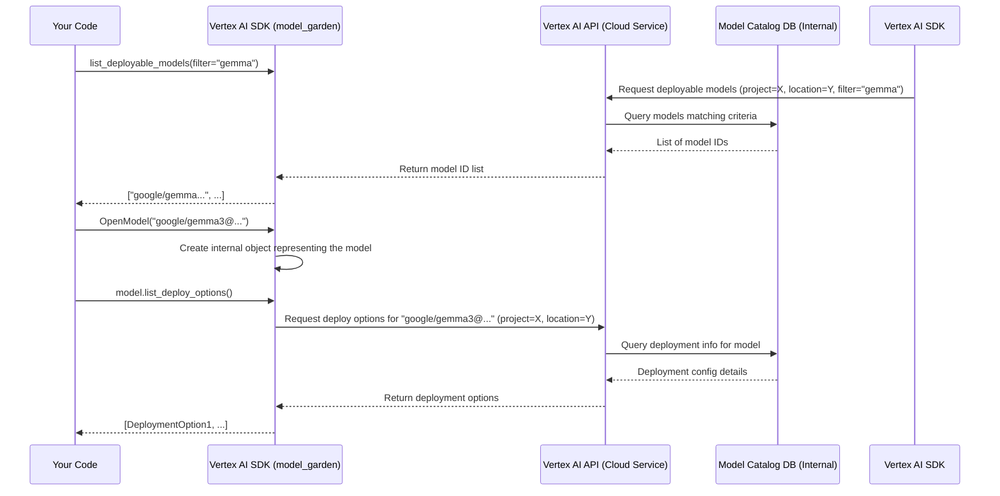

# Chapter 2: Model Garden Interaction

Welcome back! In [Chapter 1: Vertex AI Initialization](01_vertex_ai_initialization_.md), we learned how to set up our connection to Google Cloud's Vertex AI by specifying our project and location using `vertexai.init()`. Now that we've "unlocked the door" to the AI workshop, let's explore what's inside!

**What is the Model Garden?**

Imagine walking into a huge public library or browsing an app store, but instead of books or apps, it's filled with powerful, pre-built AI models created by Google and its partners. This is the **Vertex AI Model Garden**. It's a curated collection of state-of-the-art models like Gemma, Llama, Claude, Stable Diffusion, and many more, ready for you to discover and use.

**Why Interact with the Model Garden?**

Building large AI models from scratch is incredibly complex and requires vast amounts of data and computing power. The Model Garden saves you all that effort! It allows you to:

1.  **Discover:** See what amazing AI models are available.
2.  **Select:** Choose a specific model that fits your needs (e.g., a model good at writing code, answering questions, or generating images).
3.  **Understand:** Find out how you can use or deploy the model (what kind of computer resources it needs).

Our goal in this chapter is simple: **Find out which Gemma models are available in the Model Garden and check the recommended ways to deploy one specific Gemma model.**

**Exploring the Model Garden with Code**

The `vertexai` library provides a convenient way to interact with the Model Garden through its `model_garden` module. Let's look at the key tools:

1.  **`model_garden.list_deployable_models()`**: Your Catalog Browser
2.  **`model_garden.OpenModel()`**: Selecting Your Model
3.  **`model.list_deploy_options()`**: Checking Deployment Requirements

Let's use these tools to achieve our goal.

**1. Listing Available Models (`list_deployable_models`)**

First, let's ask the Model Garden to show us all the available models, specifically filtering for those with "gemma" in their name. Think of this like searching the library catalog for "Gemma".

```python
# Import necessary libraries
import os
import vertexai
from vertexai.preview import model_garden

# --- Initialization (from Chapter 1) ---
# TODO(developer): Replace 'your-project-id' with your actual Google Cloud Project ID
PROJECT_ID = "your-project-id"
# Or, get it from an environment variable if set
# PROJECT_ID = os.getenv("GOOGLE_CLOUD_PROJECT")
LOCATION = "us-central1" # Or your preferred location

vertexai.init(project=PROJECT_ID, location=LOCATION)
print(f"Vertex AI Initialized for project {PROJECT_ID} in {LOCATION}")

# --- List Gemma models in the Model Garden ---
print("Looking for Gemma models...")
# We can filter the list, e.g., only show models with 'gemma' in the name
gemma_models = model_garden.list_deployable_models(model_filter="gemma")

print("Found Gemma models:")
# Print the first 5 found models for brevity
for model_name in gemma_models[:5]:
    print(f"- {model_name}")

# Example Output:
# Vertex AI Initialized for project your-project-id in us-central1
# Looking for Gemma models...
# Found Gemma models:
# - google/gemma2@gemma-2-27b
# - google/gemma2@gemma-2-27b-it
# - google/gemma2@gemma-2-9b
# - google/gemma2@gemma-2-9b-it
# - google/gemma3@gemma-3-12b-it
```

**Explanation:**

*   We first perform the `vertexai.init()` as learned in Chapter 1. This is always required.
*   `model_garden.list_deployable_models(model_filter="gemma")` asks the Model Garden API: "Give me a list of all models I can deploy, but only include the ones that have 'gemma' in their unique ID."
*   The result (`gemma_models`) is a list of strings, where each string is the unique identifier for a model (like `google/gemma2@gemma-2-9b-it`). The format often indicates the publisher (`google`), the model family (`gemma2`), and the specific variant (`gemma-2-9b-it` which might mean 9 billion parameters, instruction-tuned).

**2. Getting Details for a Specific Model (`OpenModel`)**

Now that we have a list, let's say we're interested in the `google/gemma3@gemma-3-1b-it` model (a smaller, instruction-tuned Gemma 3 model). We use `OpenModel` to "pick up" this specific model entry from the Garden.

```python
# --- Select a specific Gemma model ---
# Let's choose a specific Gemma model from the list we saw
selected_model_id = "google/gemma3@gemma-3-1b-it"

# Create an 'OpenModel' object representing this specific model
# Think of this as getting the info page for this model
gemma_model_info = model_garden.OpenModel(selected_model_id)

print(f"Selected model: {gemma_model_info.resource_name}")

# Example Output:
# Selected model: projects/vertex-ai-restricted/locations/us-central1/publishers/google/models/gemma3@gemma-3-1b-it
```

**Explanation:**

*   `model_garden.OpenModel(selected_model_id)` takes the unique model ID string we chose.
*   It doesn't download the whole model yet! It creates a Python object (`gemma_model_info`) that represents this specific model within the Vertex AI system. This object holds information about the model and allows us to perform further actions on it, like checking deployment options or actually deploying it (which we'll cover in the next chapter).
*   `gemma_model_info.resource_name` shows the full, unique identifier for this model within Google Cloud.

**3. Checking Deployment Options (`list_deploy_options`)**

We've selected our model. Now, how can we actually use it? Specifically, how can we deploy it onto Vertex AI infrastructure? The `list_deploy_options()` method tells us the recommended configurations. Think of this as checking the installation requirements or hardware recommendations for an app.

```python
# --- Check how we can deploy this model ---
print(f"Checking deployment options for: {selected_model_id}")

# Ask the model object for its recommended deployment configurations
deploy_options = gemma_model_info.list_deploy_options()

print("Available deployment recommendations:")
# The output is complex, let's just print the first recommendation simply
if deploy_options:
    first_option = deploy_options[0]
    machine_spec = first_option.dedicated_resources.machine_spec
    print(f"- Recommended Machine Type: {machine_spec.machine_type}")
    print(f"- Recommended Accelerator: {machine_spec.accelerator_type} (Count: {machine_spec.accelerator_count})")
else:
    print("- No specific deployment recommendations found.")

# Example Output:
# Checking deployment options for: google/gemma3@gemma-3-1b-it
# Available deployment recommendations:
# - Recommended Machine Type: g2-standard-12
# - Recommended Accelerator: NVIDIA_L4 (Count: 1)
```

**Explanation:**

*   `gemma_model_info.list_deploy_options()` queries the Vertex AI service for the suggested hardware setups (like machine types and accelerators/GPUs) that are optimized for running *this specific model* (`google/gemma3@gemma-3-1b-it`).
*   The result (`deploy_options`) is a list of recommended configurations. Each configuration typically specifies:
    *   `machine_type`: The type of virtual machine (e.g., `g2-standard-12`).
    *   `accelerator_type`: The type of GPU (e.g., `NVIDIA_L4`).
    *   `accelerator_count`: How many GPUs are recommended (e.g., `1`).
*   This information is crucial for the next step: actually deploying the model, as we'll see in [Chapter 3: Model Deployment](03_model_deployment_.md).

**What Happens Under the Hood?**

When you call these `model_garden` functions, your Python code isn't doing the searching locally. It's using the configuration from `vertexai.init()` (your project ID and location) to send requests over the internet to the Google Cloud Vertex AI API.

Here’s a simplified view:



The Python SDK (`vertexai.preview.model_garden`) acts as a user-friendly interface, translating your Python function calls into the necessary API requests sent to Google Cloud. The code snippets we used (like in `models_deployable_list.py` and `models_deploy_options_list.py`) wrap these SDK calls.

**Conclusion**

The Vertex AI Model Garden is your gateway to accessing powerful, pre-built AI models. Using the `vertexai.preview.model_garden` module, you can easily:

*   **Browse** the available models using `list_deployable_models()`.
*   **Select** a specific model using `OpenModel()`.
*   **Check** its deployment requirements using `list_deploy_options()`.

You've now learned how to explore the Model Garden and gather information about a model you might want to use. We found some Gemma models and checked the recommended hardware for one of them.

**Next Up:** Knowing *how* a model can be deployed isn't the same as actually deploying it. In the next chapter, we'll take the information we just gathered and learn how to make the model ready for predictions in [Chapter 3: Model Deployment](03_model_deployment_.md).

---

Generated by [AI Codebase Knowledge Builder](https://github.com/The-Pocket/Tutorial-Codebase-Knowledge)