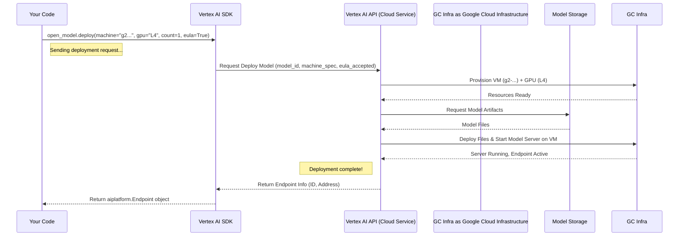

# Chapter 3: Model Deployment

Welcome back! In [Chapter 2: Model Garden Interaction](02_model_garden_interaction_.md), we explored the Vertex AI Model Garden, learned how to find specific models like Gemma, and discovered the recommended hardware (like machine types and GPUs) needed to run them using `list_deploy_options()`.

But just knowing the requirements isn't enough to actually *use* the model. We need to take that model from the "library shelf" (Model Garden) and set it up on our "workbench" so it's ready to answer questions or perform tasks. This process is called **Model Deployment**.

**Why Deploy a Model? Making it Live!**

Imagine you've chosen the perfect tool (our AI model) from the library (Model Garden). Now, you want to use it right away whenever you need it. Deploying the model creates a live, running version of it that sits and waits for your instructions (prediction requests). It's like plugging in your tool on your workbench and having it powered on, ready for action.

This live version is called an **Endpoint**. It's a specific address on the internet (managed by Google Cloud) that you can send data to, and the deployed model running behind that address will process the data and send back a result (a prediction).

**What Do We Need for Deployment?**

Deploying a model involves telling Vertex AI a few key things:

1.  **Which Model:** We already selected this in Chapter 2 (e.g., `google/gemma3@gemma-3-1b-it`).
2.  **The Workbench Setup (Resources):** What kind of virtual computer and how much power (like GPUs) does this specific model need to run effectively? We got recommendations for this in Chapter 2 (e.g., machine type `g2-standard-12`, 1 `NVIDIA_L4` GPU). We need to provide these specifications.
3.  **Agreeing to Terms (EULA):** Some models, especially powerful ones, come with usage rules or licenses (End-User License Agreements or EULAs). You often need to explicitly agree to these terms before Google Cloud will deploy the model for you.

**Deploying the Model with Code**

Let's take the `OpenModel` object we created in the previous chapter (representing `google/gemma3@gemma-3-1b-it`) and deploy it using the recommended resources.

```python
# Import necessary libraries (assuming previous setup)
import os
import vertexai
from vertexai.preview import model_garden
from google.cloud import aiplatform # We need this for the Endpoint object type

# --- Initialization (from Chapter 1) ---
# TODO(developer): Replace 'your-project-id' with your actual Google Cloud Project ID
PROJECT_ID = "your-project-id"
# Or, get it from an environment variable if set
# PROJECT_ID = os.getenv("GOOGLE_CLOUD_PROJECT")
LOCATION = "us-central1" # Or your preferred location

vertexai.init(project=PROJECT_ID, location=LOCATION)
print(f"Vertex AI Initialized for project {PROJECT_ID} in {LOCATION}")

# --- Get the Model Info (from Chapter 2) ---
selected_model_id = "google/gemma3@gemma-3-1b-it"
gemma_model_info = model_garden.OpenModel(selected_model_id)
print(f"Ready to deploy model: {gemma_model_info.resource_name}")

# --- Deploy the Model ---
print("Starting deployment... This can take several minutes (15-30+).")

# Use the deploy() method on our model object
# Provide the machine specs recommended in Chapter 2
# Set accept_eula=True to agree to the terms
endpoint = gemma_model_info.deploy(
    machine_type="g2-standard-12",      # Recommended machine
    accelerator_type="NVIDIA_L4",     # Recommended GPU
    accelerator_count=1,              # Recommended GPU count
    accept_eula=True                  # Agree to the model's terms
)

print(f"Deployment finished!")
print(f"Endpoint created with ID: {endpoint.name}")
print(f"Endpoint resource name: {endpoint.resource_name}")

# Now the endpoint is live and ready for prediction requests!
# (We won't send predictions in this chapter, but it's ready)

# Example Output (after waiting):
# Vertex AI Initialized for project your-project-id in us-central1
# Ready to deploy model: projects/vertex-ai-restricted/locations/us-central1/publishers/google/models/gemma3@gemma-3-1b-it
# Starting deployment... This can take several minutes (15-30+).
# Deployment finished!
# Endpoint created with ID: 1234567890123456789 # (This will be a unique number)
# Endpoint resource name: projects/your-project-id/locations/us-central1/endpoints/1234567890123456789
```

**Explanation:**

1.  **`gemma_model_info.deploy(...)`**: This is the core command. We're telling the `OpenModel` object representing our chosen Gemma model: "Go ahead and deploy yourself!"
2.  **`machine_type="g2-standard-12"`**: We specify the type of virtual machine to use, based on the recommendations we found earlier.
3.  **`accelerator_type="NVIDIA_L4"`**: We specify the type of GPU accelerator needed.
4.  **`accelerator_count=1`**: We specify how many GPUs are needed.
5.  **`accept_eula=True`**: We explicitly state that we accept the terms of use for this Gemma model. **Important:** Make sure you understand the terms before setting this to `True` in a real application. You can usually find links to the EULA on the model's page in the Google Cloud Console Model Garden UI.
6.  **`endpoint = ...`**: The `deploy()` function *starts* the deployment process. This process takes time (often 15-30 minutes or more) because Google Cloud needs to allocate the physical computers (VMs and GPUs), download the potentially very large model files, and start the necessary software. The function will wait until the deployment is complete and then return an `aiplatform.Endpoint` object.
7.  **`aiplatform.Endpoint` Object**: This object represents your live, deployed model. It contains information like its unique ID (`endpoint.name`) and its full resource name. You'll use this object later to send prediction requests.

**What Happens Under the Hood? (Creating the Workbench)**

When you call `gemma_model_info.deploy()`, the Vertex AI SDK sends instructions to the Google Cloud Vertex AI service. Here's a simplified step-by-step:

1.  **Request Received:** The Vertex AI service gets your request, including the model ID, the desired machine/GPU specifications, and your EULA acceptance.
2.  **Resource Provisioning:** Vertex AI asks the underlying Google Cloud infrastructure to reserve and set up the virtual machine (`g2-standard-12`) and attach the GPU (`NVIDIA_L4`) you requested in the specified `LOCATION`.
3.  **Model Download:** Once the hardware is ready, Vertex AI copies the actual model files (weights, code, etc.) for `google/gemma3@gemma-3-1b-it` from its internal storage onto the provisioned VM.
4.  **Server Startup:** Vertex AI starts a special web server program on the VM. This program loads the model into memory (often onto the GPU for speed) and sets up an interface to listen for incoming prediction requests.
5.  **Endpoint Creation:** Vertex AI creates an "Endpoint" resource associated with your project. This Endpoint acts as the public entry point and load balancer – it knows how to route incoming requests to the VM(s) running your model.
6.  **Health Check:** The system checks if the model server is running correctly and ready to accept requests.
7.  **Confirmation:** Once everything is healthy, the Vertex AI service confirms back to the SDK that the deployment is successful. The SDK then creates the `aiplatform.Endpoint` Python object and returns it to your script.

Let's visualize this:



The code snippet `gemma/gemma3_deploy.py` in the project encapsulates exactly this logic: initializing Vertex AI, getting the `OpenModel`, and calling the `deploy()` method with the specific parameters for a Gemma 3 model.

```python
# Example from gemma/gemma3_deploy.py (Simplified)

# ... (imports and vertexai.init) ...

# Get the model from Model Garden
open_model = model_garden.OpenModel("google/gemma3@gemma-3-12b-it") # Note: Example uses 12b

# Deploy it with specified resources and EULA acceptance
endpoint = open_model.deploy(
    machine_type="g2-standard-48",  # Different spec for 12b model
    accelerator_type="NVIDIA_L4",
    accelerator_count=4,            # Different count for 12b model
    accept_eula=True,
)

# The 'endpoint' variable now holds the live endpoint object
print(f"Endpoint deployed: {endpoint.resource_name}")
```

**Conclusion**

You've successfully learned how to deploy a model from the Vertex AI Model Garden! By using the `.deploy()` method on an `OpenModel` object and providing the necessary resource specifications and EULA acceptance, you created a live **Endpoint**. This Endpoint runs your chosen model on dedicated hardware, ready to receive prediction requests. Think of it as setting up your specialized tool on your powered workbench, ready for work.

This real-time Endpoint is great for interactive applications (like chatbots or live recommendations). However, what if you have a large dataset of inputs you want to process all at once, perhaps overnight? For that, a different approach is often better.

**Next Up:** Let's explore how to run predictions on large datasets without needing a constantly running endpoint in [Chapter 4: Batch Prediction Job Management](04_batch_prediction_job_management_.md).

---

Generated by [AI Codebase Knowledge Builder](https://github.com/The-Pocket/Tutorial-Codebase-Knowledge)