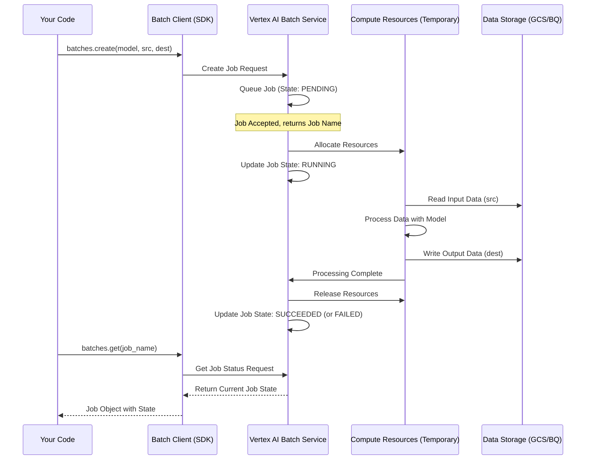

# Chapter 4: Batch Prediction Job Management

Welcome back! In [Chapter 3: Model Deployment](03_model_deployment_.md), we learned how to deploy a model from the Model Garden to create a live **Endpoint**. This is great for getting predictions immediately, one request at a time.

But what if you don't need instant answers? Imagine you have a huge file containing thousands of customer reviews, and you want an AI model to read each review and determine if it's positive or negative (sentiment analysis). You don't necessarily need the results *right now*, maybe having them ready by tomorrow morning is perfectly fine. Keeping a powerful model deployed and running 24/7 just for this task might be expensive and unnecessary.

This is where **Batch Prediction** comes in! It's designed for processing large amounts of data *offline*, without needing a constantly running, dedicated endpoint.

**What is a Batch Prediction Job? The Shipment Tracking Analogy**

Think of requesting a batch prediction like sending a large shipment:

1.  **You place the order:** You tell the service (Vertex AI) what you want to ship (your input data, e.g., the file of reviews), which shipping company to use (which AI model, e.g., a sentiment analysis model), and where it should be delivered (where to store the results, e.g., another file in cloud storage). This is like **creating a batch prediction job**.
2.  **You get a tracking number:** The service gives you a unique ID for your shipment (your job).
3.  **The shipment travels:** The service works on your request in the background. This takes time, just like shipping. Your job goes through different stages: `PENDING` (order received), `RUNNING` (processing the data), `SUCCEEDED` (delivery complete!), or `FAILED` (delivery failed).
4.  **You check the status:** You use the tracking number periodically to see where your shipment is. Similarly, you can **check the status** of your batch prediction job using its ID to see if it's still running or if it has finished.

So, **Batch Prediction Job Management** is all about creating these background processing requests (jobs) and keeping track of their progress until they are complete.

**Key Steps for Managing a Batch Job**

There are two main actions you'll perform:

1.  **Create the Job:** Using a function like `client.batches.create`, you specify:
    *   The AI model to use.
    *   Where your input data lives (e.g., a file path in Google Cloud Storage).
    *   Where the output (predictions) should be saved.
2.  **Monitor the Job:** Using a function like `client.batches.get` and the job's unique name/ID, you periodically ask Vertex AI: "What's the status of this job?". You'll get back a state like `PENDING`, `RUNNING`, `SUCCEEDED`, or `FAILED`.

Let's see this in action with some simplified code.

**Example: Running Batch Sentiment Analysis**

Imagine we have a file `gs://my-input-bucket/customer_reviews.jsonl` in Google Cloud Storage containing our reviews. We want to use a hypothetical model `sentiment-analyzer-model` to process them and save the results to `gs://my-output-bucket/review_sentiments.jsonl`.

*(Note: We'll use a `client` object here. Setting this up is covered in detail in [Chapter 6: Batch Prediction Client (genai.Client)](06_batch_prediction_client__genai_client__.md). For now, just assume `client` is ready to use.)*

**1. Creating the Batch Job (`batches.create`)**

```python
# Import necessary libraries (simplified)
from google import genai
from google.genai.types import CreateBatchJobConfig, JobState

# Assume 'client' is already initialized (See Chapter 6)
# client = genai.Client(...)

# --- Define Input and Output ---
# TODO: Replace with your actual GCS paths
input_gcs_uri = "gs://my-input-bucket/customer_reviews.jsonl"
output_gcs_uri = "gs://my-output-bucket/review_sentiments.jsonl"

# --- Create the Batch Prediction Job ---
print("Creating batch prediction job...")
job = client.batches.create(
    # Specify the model to use
    model="models/sentiment-analyzer-model", # Example model name
    # Where is the input data?
    src=input_gcs_uri,
    # Where should the results go?
    config=CreateBatchJobConfig(dest=output_gcs_uri),
)

print(f"Job created!")
print(f"Job Name (Tracking ID): {job.name}")
print(f"Initial Job State: {job.state}")

# Example Output:
# Creating batch prediction job...
# Job created!
# Job Name (Tracking ID): projects/your-project-id/locations/us-central1/batchPredictionJobs/1234567890987654321
# Initial Job State: JobState.JOB_STATE_PENDING
```

**Explanation:**

*   We import `JobState` to understand the status codes later.
*   `client.batches.create(...)` is like placing the shipment order.
*   `model`: Specifies which AI model will process the data.
*   `src`: Tells Vertex AI where to find the input data file(s). This needs to be a location Vertex AI can access, like Google Cloud Storage (GCS). We'll learn more about data formats in [Chapter 5: Batch Job Data Configuration](05_batch_job_data_configuration_.md).
*   `config=CreateBatchJobConfig(dest=...)`: Specifies where the output file(s) containing the predictions should be saved, usually another GCS path.
*   The function returns a `job` object. `job.name` is the unique "tracking number" for this job. `job.state` initially shows `PENDING`, meaning Vertex AI has received the request but hasn't started processing yet.

**2. Monitoring the Job (`batches.get`)**

The job is now running in the background on Google Cloud. Our script can either exit, or it can wait and periodically check the status until the job finishes.

```python
import time # Needed to pause between checks

# --- Monitor the Job Status ---
print(f"\nMonitoring job: {job.name}")

# Define the states that mean the job has finished (successfully or not)
completed_states = {
    JobState.JOB_STATE_SUCCEEDED,
    JobState.JOB_STATE_FAILED,
    JobState.JOB_STATE_CANCELLED,
}

# Keep checking until the job is in a completed state
while job.state not in completed_states:
    # Wait for 30 seconds before checking again
    print("Job not finished yet, waiting 30 seconds...")
    time.sleep(30)

    # Get the latest status using the job name
    job = client.batches.get(name=job.name)
    print(f"Current Job State: {job.state}")

# --- Job Finished ---
print(f"\nJob finished with state: {job.state}")

# Example Output during monitoring:
# Monitoring job: projects/your-project-id/locations/us-central1/batchPredictionJobs/1234567890987654321
# Job not finished yet, waiting 30 seconds...
# Current Job State: JobState.JOB_STATE_PENDING
# Job not finished yet, waiting 30 seconds...
# Current Job State: JobState.JOB_STATE_RUNNING
# Job not finished yet, waiting 30 seconds...
# Current Job State: JobState.JOB_STATE_RUNNING
# Job not finished yet, waiting 30 seconds...
# Current Job State: JobState.JOB_STATE_SUCCEEDED
#
# Job finished with state: JobState.JOB_STATE_SUCCEEDED
```

**Explanation:**

*   We define `completed_states` which includes success (`SUCCEEDED`), failure (`FAILED`), and cancellation (`CANCELLED`).
*   The `while` loop continues as long as the current `job.state` is *not* one of the completed states.
*   `time.sleep(30)`: Pauses the script for 30 seconds. We don't want to check constantly, as the job might take minutes or hours.
*   `client.batches.get(name=job.name)`: This is like checking the shipment tracking website using the tracking number (`job.name`). It fetches the *latest* status of the job from Vertex AI.
*   We update the `job` variable with the latest status and print it.
*   Once the loop exits, the job is finished, and we print the final state. If it's `SUCCEEDED`, the results will be available in the output GCS location we specified (`output_gcs_uri`).

**What Happens Under the Hood? (Temporary Workbench)**

Unlike the dedicated endpoint from Chapter 3, a batch prediction job doesn't require you to manage long-running resources. When you create a job:

1.  **Request Queued:** Vertex AI receives your `batches.create` request and puts it in a queue (`PENDING`).
2.  **Resource Allocation (Temporary):** When resources become available, Vertex AI spins up the necessary computing power (like VMs, maybe even GPUs depending on the model) specifically for *your* job. This is like the shipping company assigning a truck and driver just for your delivery.
3.  **Data Processing (`RUNNING`):** Vertex AI reads your input data from the `src` location, feeds it through the specified `model`, and collects the predictions.
4.  **Output Writing:** The generated predictions are written to the `dest` location you specified.
5.  **Resource Release:** Once the job is `SUCCEEDED` or `FAILED`, Vertex AI automatically shuts down and releases the temporary computing resources it used. The truck and driver are now free for other jobs.
6.  **Status Update:** The final status (`SUCCEEDED` or `FAILED`) is recorded and available when you call `batches.get`.

Here’s a simplified view:



The code snippets provided in the project, like `anthropic/anthropic_batchpredict_with_gcs.py` and `anthropic/anthropic_batchpredict_with_bq.py`, demonstrate exactly this flow. They initialize a client, call `batches.create` with specific Anthropic models and data locations (either Google Cloud Storage `gcs` or BigQuery `bq`), and then loop using `batches.get` to monitor the job until completion.

```python
# Simplified snippet inspired by anthropic_batchpredict_with_gcs.py

# ... (imports and client setup) ...

output_uri = "gs://your-output-bucket/results/" # Example output path

# Create the job (like placing the shipment order)
job = client.batches.create(
    model="publishers/anthropic/models/claude-3-5-haiku", # Specific model
    src="gs://cloud-samples-data/anthropic-test-data-gcs.jsonl", # Input data
    config=CreateBatchJobConfig(dest=output_uri), # Output destination
)
print(f"Job name: {job.name}, State: {job.state}") # Show tracking number and initial state

# Monitor the job (like checking tracking)
while job.state not in completed_states:
    time.sleep(30)
    job = client.batches.get(name=job.name) # Get latest status
    print(f"Job state: {job.state}")

print("Batch job finished.")
```

**Conclusion**

Batch Prediction Job Management allows you to process large datasets using powerful AI models without needing a continuously running endpoint. You simply create a job specifying the model, input, and output locations. Vertex AI handles the rest in the background, allocating resources temporarily and notifying you of the job's state (`PENDING`, `RUNNING`, `SUCCEEDED`, `FAILED`). You can monitor the job's progress using its unique name, much like tracking a package.

This is a cost-effective and efficient way to get predictions when real-time results aren't necessary.

**Next Up:** We've seen how to specify input (`src`) and output (`dest`) locations, but what format does the data need to be in? Let's dive into configuring the data for batch jobs in [Chapter 5: Batch Job Data Configuration](05_batch_job_data_configuration_.md).

---

Generated by [AI Codebase Knowledge Builder](https://github.com/The-Pocket/Tutorial-Codebase-Knowledge)