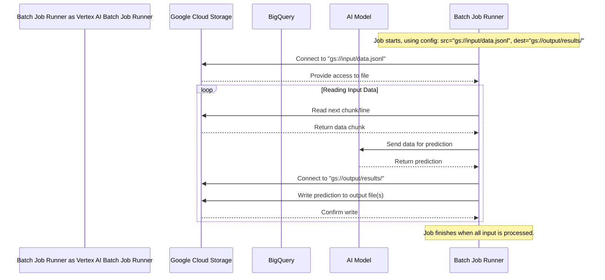

# Chapter 5: Batch Job Data Configuration

Welcome back! In [Chapter 4: Batch Prediction Job Management](04_batch_prediction_job_management_.md), we learned how to create and monitor batch prediction jobs – those background tasks perfect for processing lots of data without needing a live endpoint. We saw how to start a job (like placing a shipment order) and check its status (like tracking the shipment).

But when you place that order, you need to give clear instructions: Where should the shipping company pick up the items? And where should they deliver the finished package? Similarly, when you create a batch prediction job, you need to tell Vertex AI exactly where to find your input data and where to save the results. This is **Batch Job Data Configuration**.

**Why Configure Data Locations? Giving Directions!**

Imagine you want your AI model to read 10,000 customer emails stored in a file and generate a one-sentence summary for each. You'll create a batch job for this. But how does the job know *which* file contains the emails? And where should it put the file containing the 10,000 summaries once it's done?

Data configuration answers these questions. It's like providing precise delivery instructions:

*   **Input Source:** "Pick up the data from this specific location."
*   **Output Destination:** "Deliver the results to this specific location."

Vertex AI batch jobs typically work with data stored in Google Cloud. The two most common places are:

1.  **Google Cloud Storage (GCS):** Think of this like a massive online file cabinet. You store your input data in files here (like `.jsonl` files) and tell the job the path, which starts with `gs://` (e.g., `gs://my-data-bucket/input_emails.jsonl`).
2.  **BigQuery (BQ):** This is a powerful database service for handling huge datasets organized into tables. You can tell the job to read data directly from a BQ table, using a path that starts with `bq://` (e.g., `bq://my-project.my_dataset.input_table`).

Similarly, you specify a GCS path or a BQ table for the output.

**How to Configure Data: Using `src` and `CreateBatchJobConfig`**

When you create the batch job using the `client.batches.create` function (which we saw in the previous chapter), you provide these locations:

*   **`src` parameter:** This directly tells the function where the *input* data lives (the pickup address).
*   **`config` parameter:** This takes a special configuration object called `CreateBatchJobConfig`. Inside this object, you specify the `dest` (destination) for the *output* results (the delivery address).

Let's look at a simplified code example focused just on the data configuration part. Assume `client` is already set up (more on this in [Chapter 6: Batch Prediction Client (genai.Client)](06_batch_prediction_client__genai_client__.md)).

```python
# Import necessary configuration class
from google.genai.types import CreateBatchJobConfig

# Assume 'client' is initialized and ready
# client = genai.Client(...)

# --- Define Input and Output Locations ---

# Input: A JSON Lines file in Google Cloud Storage
input_source_uri = "gs://cloud-samples-data/batch/anthropic-test-data-gcs.jsonl"

# Output: A folder in Google Cloud Storage where result files will be saved
# IMPORTANT: Usually ends with a '/' to indicate a folder/prefix
output_destination_uri = "gs://your-output-bucket/results/"

# --- Create the Batch Job with Data Configuration ---
print(f"Configuring job with:")
print(f"  Input : {input_source_uri}")
print(f"  Output: {output_destination_uri}")

job = client.batches.create(
    model="publishers/anthropic/models/claude-3-5-haiku", # Example model
    # Input Source: Where to get the data
    src=input_source_uri,
    # Output Destination: Where to save the results
    config=CreateBatchJobConfig(dest=output_destination_uri),
)

print(f"\nJob created! Name: {job.name}")
print("Vertex AI will now read from the input GCS path and write results to the output GCS path.")

# Example Output:
# Configuring job with:
#   Input : gs://cloud-samples-data/batch/anthropic-test-data-gcs.jsonl
#   Output: gs://your-output-bucket/results/
#
# Job created! Name: projects/your-project-id/locations/us-central1/batchPredictionJobs/some-unique-job-id
# Vertex AI will now read from the input GCS path and write results to the output GCS path.
```

**Explanation:**

1.  **`input_source_uri`**: We define a string variable holding the path to our input file in GCS. It starts with `gs://`. This file should contain our data in a format the model understands (often JSON Lines, where each line is a separate input).
2.  **`output_destination_uri`**: We define another GCS path where Vertex AI will write the results. Notice it ends with `/`. This tells Vertex AI to treat it as a folder or "prefix". It will create one or more files *inside* this location containing the predictions.
3.  **`client.batches.create(...)`**:
    *   `src=input_source_uri`: We pass our input path directly to the `src` parameter.
    *   `config=CreateBatchJobConfig(dest=output_destination_uri)`: We create a `CreateBatchJobConfig` object and set its `dest` attribute to our output path. This configuration object is then passed to the `config` parameter.

**Using BigQuery Instead**

If your data is in BigQuery, the process is very similar, but the paths start with `bq://`:

```python
# Example using BigQuery (replace with your actual BQ paths)
input_bq_table = "bq://your-project.your_dataset.input_table"
output_bq_table = "bq://your-project.your_dataset.output_table"

# Create the job using BQ paths
job = client.batches.create(
    model="publishers/anthropic/models/claude-3-5-haiku",
    src=input_bq_table, # Input from BQ
    config=CreateBatchJobConfig(dest=output_bq_table), # Output to BQ
)
print(f"Job created to process data between BigQuery tables: {job.name}")
```

**What Happens Under the Hood? Following the Instructions**

When the batch prediction job starts running (after being `PENDING`, as discussed in Chapter 4), the Vertex AI system uses the `src` and `dest` paths you provided:

1.  **Connect to Source:** The system running the job connects to either Google Cloud Storage or BigQuery based on the `src` path prefix (`gs://` or `bq://`).
2.  **Read Input Data:** It reads the data from the specified file(s) or table. It typically reads the data in chunks or streams to handle large datasets efficiently.
3.  **Process Data:** Each piece of input data is sent to the AI model for prediction.
4.  **Connect to Destination:** The system connects to the GCS path or BQ table specified in `dest`.
5.  **Write Output Data:** As predictions are generated, they are written to the destination file(s) or table. If writing to GCS, it might create multiple output files, especially for large jobs. If writing to BQ, it inserts rows into the destination table.

Here's a simple diagram showing the flow:



This diagram illustrates the GCS case, but a similar interaction happens if `src` or `dest` points to BigQuery (`bq://`).

**Code References**

The code examples from Chapter 4 already demonstrated this configuration in practice:

*   **`anthropic/anthropic_batchpredict_with_gcs.py`**: This script uses GCS for both input and output.

    ```python
    # From anthropic_batchpredict_with_gcs.py (simplified)

    # Input source is a public GCS file
    src="gs://cloud-samples-data/anthropic-test-data-gcs.jsonl"
    # Output destination is a GCS path you provide
    output_uri = "gs://your-bucket/your-prefix" # Must end with '/'

    job = client.batches.create(
        model="...",
        src=src,
        config=CreateBatchJobConfig(dest=output_uri),
    )
    ```

*   **`anthropic/anthropic_batchpredict_with_bq.py`**: This script uses BigQuery tables.

    ```python
    # From anthropic_batchpredict_with_bq.py (simplified)

    # Input source is a BigQuery table
    src="bq://python-docs-samples-tests.anthropic_bq_sample.test_data"
    # Output destination is a BigQuery table you provide
    output_uri = f"bq://your-project.your_dataset.your_table"

    job = client.batches.create(
        model="...",
        src=src,
        config=CreateBatchJobConfig(dest=output_uri),
    )
    ```

These examples clearly show how the `src` and `dest` parameters are used with `gs://` and `bq://` paths to configure the data flow for the batch job.

**Conclusion**

Configuring the data for a batch prediction job is like providing clear pickup and delivery instructions. You use the `src` parameter in `client.batches.create` to specify the input data location (usually a `gs://` path for GCS or `bq://` for BigQuery) and the `dest` parameter within `CreateBatchJobConfig` to specify where the results should be saved. Getting these paths right ensures Vertex AI knows exactly where to find the work and where to deliver the output.

We've seen `client.batches.create` and `client.batches.get` used in the last two chapters. But what exactly is this `client` object and how do we set it up?

**Next Up:** Let's dive into the `genai.Client`, the main tool for interacting with batch prediction services, in [Chapter 6: Batch Prediction Client (genai.Client)](06_batch_prediction_client__genai_client__.md).

---

Generated by [AI Codebase Knowledge Builder](https://github.com/The-Pocket/Tutorial-Codebase-Knowledge)