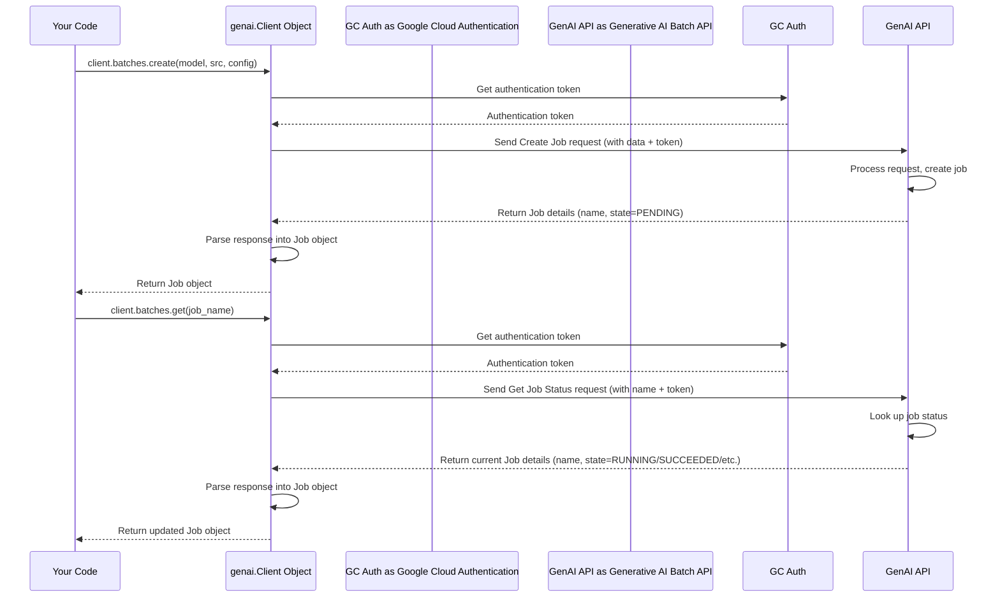

# Chapter 6: Batch Prediction Client (`genai.Client`)

Welcome back! In [Chapter 5: Batch Job Data Configuration](05_batch_job_data_configuration_.md), we learned how to tell our batch prediction jobs exactly where to find their input data (`src`) and where to save the results (`dest`), using paths like `gs://...` for Google Cloud Storage or `bq://...` for BigQuery. We saw functions like `client.batches.create(...)` and `client.batches.get(...)` in action.

But what exactly *is* that `client` object we've been using? How do we get it? This chapter introduces the **Batch Prediction Client (`genai.Client`)**, our main tool for talking to Google's Generative AI batch processing service.

**Motivation: The Right Contact Person for Bulk Orders**

Imagine you need to place a large, custom order with a factory (like getting predictions for thousands of inputs using a powerful AI model). You wouldn't just shout your order into the air! You'd need to contact the right department or person who handles these bulk requests.

Similarly, when we want to interact with Google's specific services for running batch predictions, especially with advanced Generative AI models (like Google's Gemma or partner models like Anthropic's Claude), we need a dedicated way to communicate. The `genai.Client` is like that specific contact point or specialized order form. It's designed specifically for these large-scale, asynchronous prediction tasks via the Generative AI APIs.

**What is `genai.Client`? Your Dedicated Connection**

The `genai.Client` is a Python object provided by the `google-generativeai` library. When you create an instance of this client, you're essentially establishing an authenticated connection from your Python script to the Google Generative AI backend services that manage batch jobs.

Think of it as getting a dedicated, secure phone line to the batch processing department:

1.  **It knows who you are:** It uses your Google Cloud credentials (usually found automatically if you're logged in via `gcloud` or running in a Google Cloud environment) to prove you have permission to make requests.
2.  **It knows where to call:** It's configured to talk to the correct Google Cloud API endpoints for batch predictions.
3.  **It provides the tools:** Once connected, it gives you access to specific functions (like `create` and `get` under the `batches` attribute) designed for managing batch jobs.

**How to Use It: Initializing the Client**

Getting started is straightforward. First, you need to import the library, and then you create an instance of the client.

```python
# Import the necessary library
from google import genai
from google.genai.types import HttpOptions # Optional: for specific configurations

# --- Initialize the Batch Prediction Client ---

# Simplest way: It usually finds credentials automatically
client = genai.Client()

# Optional: Sometimes you might specify an API version (like in our examples)
# client = genai.Client(http_options=HttpOptions(api_version="v1"))

print("genai.Client initialized successfully!")

# Now the 'client' object is ready to be used.
```

**Explanation:**

1.  **`from google import genai`**: This line imports the main package needed.
2.  **`client = genai.Client()`**: This is the core step! It creates the client object. Under the hood, it typically looks for your Google Cloud authentication details (like Application Default Credentials).
3.  **(Optional) `http_options=HttpOptions(api_version="v1")`**: In some cases, particularly when using preview features or specific API versions (as seen in the example code from previous chapters), you might pass extra configuration like this. For basic use, `genai.Client()` is often enough.
4.  Once this line runs without errors, your `client` variable holds the ready-to-use connection object.

**Using the Client: Creating and Checking Jobs**

Now that you have your `client` (your "phone line"), you can use it to interact with the batch service. As we saw in previous chapters, the client object has an attribute called `batches`, which holds the methods for managing batch jobs.

Let's revisit a simplified example of creating and checking a job, highlighting the client's role:

```python
# Assuming 'client' is already initialized as shown above
# and necessary imports like CreateBatchJobConfig, JobState are done.
import time
from google.genai.types import CreateBatchJobConfig, JobState

# --- Define job parameters ---
# (Using placeholder values from previous chapters)
model_to_use = "publishers/anthropic/models/claude-3-5-haiku" # Example model
input_data_path = "gs://cloud-samples-data/anthropic-test-data-gcs.jsonl" # Example input
output_data_path = "gs://your-output-bucket/results/" # Example output

# --- 1. Use the client to CREATE the job ---
print("Creating job using client.batches.create...")
job = client.batches.create(
    model=model_to_use,
    src=input_data_path,
    config=CreateBatchJobConfig(dest=output_data_path),
)
print(f"Job created with name: {job.name}")
print(f"Initial state: {job.state}")

# --- 2. Use the client to GET the job status ---
print("\nMonitoring job using client.batches.get...")
completed_states = {JobState.JOB_STATE_SUCCEEDED, JobState.JOB_STATE_FAILED} # Simplified

while job.state not in completed_states:
    time.sleep(10) # Check every 10 seconds (shortened for example)
    # Fetch the latest status using the job name
    job = client.batches.get(name=job.name)
    print(f"Current state: {job.state}")

print(f"\nJob finished with state: {job.state}")
```

**Explanation:**

1.  **`client.batches.create(...)`**: We access the `batches` attribute of our initialized `client` object and call the `create` method. We pass the required details (model, input source `src`, output destination `config.dest`). The client sends this request to Google Cloud.
    *   **Input:** Model name, input path (`src`), output configuration (`config`).
    *   **Output:** A `job` object representing the newly created batch job, containing its name and initial state (`PENDING`).
2.  **`client.batches.get(name=job.name)`**: Inside the monitoring loop, we again use `client.batches` but call the `get` method, passing the unique `job.name` we received earlier. The client sends a request to check the status of that specific job.
    *   **Input:** The `name` of the job to check.
    *   **Output:** An updated `job` object reflecting the job's current state (`RUNNING`, `SUCCEEDED`, `FAILED`, etc.).

The `genai.Client` acts as the central object that enables these interactions.

**What Happens Under the Hood? Making the Call**

When you use the `client`, like calling `client.batches.create()`:

1.  **Prepare Request:** The `genai.Client` takes the arguments you provided (model, src, config) and formats them into a structured API request according to the Google Generative AI API specifications.
2.  **Authenticate:** It retrieves your Google Cloud credentials (which it likely found during initialization) and attaches the necessary authentication information (like an access token) to the request. This proves to Google Cloud that *you* are making the request and have permission.
3.  **Send Request:** It sends the formatted, authenticated request over HTTPS to the appropriate Google Cloud Generative AI API endpoint for creating batch jobs.
4.  **Receive Response:** Google Cloud processes the request. If successful, it creates the job and sends back a response containing the job's details (like its name and initial state).
5.  **Parse Response:** The `genai.Client` receives this response and parses it, converting the raw API data into the convenient Python `job` object you work with in your script.

A similar process happens for `client.batches.get()`, but the request asks for the status of an *existing* job name.

Here's a simplified sequence diagram:



**Code References in `model_garden`**

The examples we used in the previous chapters clearly show the initialization and use of this client. For instance, in `anthropic/anthropic_batchpredict_with_gcs.py`:

```python
# Simplified snippet from anthropic/anthropic_batchpredict_with_gcs.py

# Import necessary classes
from google import genai
from google.genai.types import CreateBatchJobConfig, JobState, HttpOptions

# ---> Initialize the client <---
# Here, it specifies the v1 API explicitly
client = genai.Client(http_options=HttpOptions(api_version="v1"))

# ... (define output_uri, etc.) ...

# ---> Use the client to create the job <---
job = client.batches.create(
    model="publishers/anthropic/models/claude-3-5-haiku",
    src="gs://cloud-samples-data/anthropic-test-data-gcs.jsonl",
    config=CreateBatchJobConfig(dest=output_uri),
)
print(f"Job name: {job.name}") # Use the returned job object

# ---> Use the client to get job status <---
while job.state not in completed_states:
    time.sleep(30)
    job = client.batches.get(name=job.name) # Fetch update via client
    print(f"Job state: {job.state}")
```

This snippet perfectly illustrates initializing the `genai.Client` (line 6) and then using the resulting `client` object to call `batches.create` (line 11) and `batches.get` (line 19).

**Conclusion**

The `genai.Client` is your essential entry point for interacting with the Google Generative AI batch prediction service. You initialize it once, and it handles the connection and authentication details. Through its `batches` attribute, you gain access to methods like `create` and `get` that allow you to submit new batch prediction jobs and monitor their progress, enabling you to process large datasets asynchronously using powerful generative models. Think of it as the authenticated "order form" you need to place and track your bulk AI processing requests.

Now that we understand how to write code that interacts with Vertex AI models and batch services, how can we ensure our code works correctly and continues to work as we make changes? We need a way to automate testing.

**Next Up:** Let's explore how the `model_garden` project uses a tool called Nox to configure and run automated tests in [Chapter 7: Nox Test Configuration](07_nox_test_configuration_.md).

---

Generated by [AI Codebase Knowledge Builder](https://github.com/The-Pocket/Tutorial-Codebase-Knowledge)