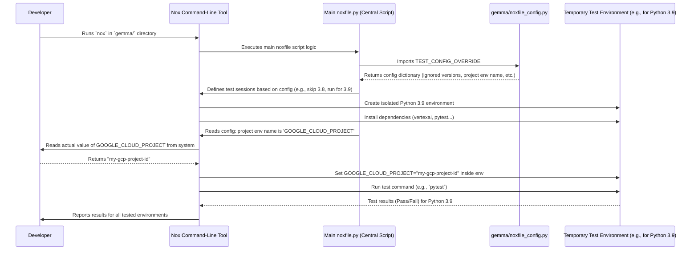

# Chapter 7: Nox Test Configuration

Welcome! In the previous chapters, especially [Chapter 6: Batch Prediction Client (`genai.Client`)](06_batch_prediction_client__genai_client__.md), we learned how to use Python code to interact with powerful Vertex AI services like the Model Garden and Batch Prediction. But how do we make sure this code actually works as expected, and continues to work even if we make changes later or when Google updates its libraries? We need a reliable way to test our code automatically.

**Motivation: The Need for Consistent Testing**

Imagine you've written a helpful script that uses the `model_garden` code to deploy a Gemma model (like in [Chapter 3: Model Deployment](03_model_deployment_.md)). It works perfectly on your computer with Python 3.9. But will it work for your colleague who uses Python 3.12? What happens if a new version of the `vertexai` library is released?

Running tests manually every time something changes is tedious and error-prone. We need an automated process. Furthermore, some tests might need specific setup, like knowing which Google Cloud project to use. How do we manage these test settings consistently across the project?

This is where **Nox Test Configuration** comes in. Nox is a tool used in Python projects to automate testing and other tasks in isolated environments. The "Nox Test Configuration" is essentially a settings file (`noxfile_config.py`) that tells Nox exactly *how* to set up and run the tests for a specific part of the `model_garden` project. Think of it as a detailed checklist and setup guide for an automated test robot (Nox).

**Key Settings: The Test Robot's Checklist**

The `noxfile_config.py` file contains a Python dictionary called `TEST_CONFIG_OVERRIDE`. This dictionary holds key settings that guide the testing process. Let's look at the common ones using an analogy of instructing our test robot:

1.  **`ignored_versions`**: Which Python versions should the robot *skip*?
    *   **Why?** Maybe some code is not compatible with very old or very new Python versions, or we only want to focus testing on the versions most people use.
    *   **Analogy:** Telling the robot, "Don't bother testing with the rusty old wrench (Python 2.7) or the brand-new experimental laser cutter (Python 3.13) for this specific task."

2.  **`enforce_type_hints`**: Should the robot check if the code includes specific labels (type hints) describing what kind of data functions expect and return?
    *   **Why?** Type hints help catch errors early and make code easier to understand. New code should ideally have them.
    *   **Analogy:** Instructing the robot to verify that the blueprints (code) have clear labels on all the parts (function inputs/outputs).

3.  **`gcloud_project_env`**: How does the robot find the key to the workshop (Google Cloud Project ID)? This setting tells Nox the *name* of the environment variable where the Project ID is stored.
    *   **Why?** Tests that interact with Google Cloud (like deploying a model) need to know which project to use. We usually store this ID in an environment variable for security and flexibility.
    *   **Analogy:** Telling the robot, "The workshop key (Project ID) is stored in a box labeled 'GOOGLE\_CLOUD\_PROJECT'. Go find that box and use the key inside."

4.  **`envs`**: Does the robot need any extra tools or notes? This allows adding custom environment variables specifically for the tests.
    *   **Why?** Some tests might need specific flags or configuration values passed in.
    *   **Analogy:** Giving the robot a sticky note with extra instructions or a special screwdriver needed only for this test.

**Example Configurations in `model_garden`**

Let's look at the configuration files provided for the Gemma and Anthropic examples:

*   **File: `gemma/noxfile_config.py`**

```python
# gemma/noxfile_config.py (Simplified view)
TEST_CONFIG_OVERRIDE = {
    # Don't test on these Python versions for Gemma examples
    "ignored_versions": ["2.7", "3.7", "3.8", "3.10", "3.11", "3.13"],
    # Yes, check for type hints
    "enforce_type_hints": True,
    # Find the Project ID in the 'GOOGLE_CLOUD_PROJECT' environment variable
    "gcloud_project_env": "GOOGLE_CLOUD_PROJECT",
    # No extra environment variables needed for these tests
    "envs": {},
}
```

**Interpretation:**

*   When testing the Gemma code, Nox should *not* use Python 2.7, 3.7, 3.8, 3.10, 3.11, or 3.13. It will likely test on Python 3.9 and 3.12 (or whichever versions are supported and not ignored).
*   The tests should enforce type hints.
*   To run tests that need Google Cloud access, Nox should look for the project ID in the `GOOGLE_CLOUD_PROJECT` environment variable.

*   **File: `anthropic/noxfile_config.py`**

```python
# anthropic/noxfile_config.py (Simplified view)
TEST_CONFIG_OVERRIDE = {
    # Don't test on these Python versions for Anthropic examples
    "ignored_versions": ["2.7", "3.7", "3.8", "3.10", "3.11", "3.12"],
    # Yes, check for type hints
    "enforce_type_hints": True,
    # Find the Project ID in the 'GOOGLE_CLOUD_PROJECT' environment variable
    "gcloud_project_env": "GOOGLE_CLOUD_PROJECT",
    # No extra environment variables needed
    "envs": {},
}
```

**Interpretation:**

*   Very similar to the Gemma config, but note the `ignored_versions` list is slightly different (it ignores 3.12 but *not* 3.13 compared to the Gemma one in the example provided - although the actual files might be identical in the real repo). This shows how configurations can be tailored.
*   It also enforces type hints and uses `GOOGLE_CLOUD_PROJECT` for the project ID.

**How Nox Uses This Configuration**

It's important to understand that these `noxfile_config.py` files don't run the tests themselves. They are configuration *read* by a central `noxfile.py` script (usually located at the root of the project or a higher-level directory). Here's a simplified step-by-step of what happens when a developer runs the `nox` command in their terminal within a directory like `gemma/`:

1.  **Run `nox`**: The developer types `nox` in the terminal.
2.  **Nox Starts**: The Nox tool activates.
3.  **Find Main Noxfile**: Nox finds the main `noxfile.py` script responsible for defining test sessions.
4.  **Import Config**: The main `noxfile.py` is written to look for and import the `TEST_CONFIG_OVERRIDE` dictionary from the local `noxfile_config.py` (e.g., `gemma/noxfile_config.py`).
5.  **Read Settings**: Nox now knows the specific settings for this directory (which Python versions to ignore, where to find the project ID, etc.).
6.  **Create Environments**: For each Python version that is *not* ignored, Nox creates a temporary, clean virtual environment. This ensures tests run in isolation without interference from other projects or libraries installed on the system.
7.  **Install Dependencies**: Inside each environment, Nox installs the necessary Python packages required for the code and its tests (like `google-cloud-aiplatform`, `google-generativeai`, `pytest`).
8.  **Set Environment Variables**: Nox reads the environment variable name specified by `gcloud_project_env` (e.g., `GOOGLE_CLOUD_PROJECT`) from the developer's system and makes that value available inside the test environment. It also sets any variables defined in the `envs` dictionary.
9.  **Run Tests**: Nox executes the testing commands defined in the main `noxfile.py` (commonly using a tool like `pytest`) within each isolated environment.
10. **Report Results**: Nox collects the results (pass or fail) from each environment and presents a summary to the developer.

Let's visualize this flow:



This configuration-driven approach ensures that tests are run consistently, regardless of who runs them or minor differences in their local setup. It clearly defines the supported environments and necessary runtime information like the project ID.

**Conclusion**

The Nox Test Configuration files (`noxfile_config.py`) are simple yet powerful tools within the `model_garden` project. They act as instruction manuals for the Nox automation tool, specifying crucial settings like which Python versions to test against, how to find necessary credentials like the Google Cloud Project ID, and whether to enforce coding standards like type hints. By using these configuration files, the project ensures that its code examples are tested reliably and consistently, helping maintain code quality and catch potential issues early.

This concludes our introductory tour through key concepts of the `model_garden` project, from initializing Vertex AI and interacting with models to managing batch jobs and understanding the testing setup. We hope this gives you a solid foundation for exploring and using the powerful features of Vertex AI Model Garden!

---

Generated by [AI Codebase Knowledge Builder](https://github.com/The-Pocket/Tutorial-Codebase-Knowledge)