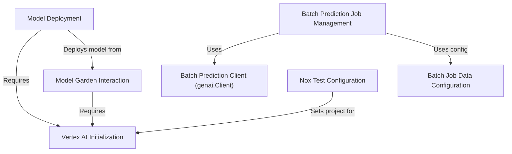

# Tutorial: model_garden

This project shows how to interact with **Google Cloud Vertex AI** services.
You can explore the *Model Garden* to find pre-built AI models (like Gemma or Claude), **deploy** them to create live prediction endpoints, or run large-scale **batch prediction** jobs using data from *Google Cloud Storage* or *BigQuery*. It also includes configurations for running automated tests.

**Source Repository:** [None](None)

## Chapters

1. [Vertex AI Initialization
](01_vertex_ai_initialization_.md)
2. [Model Garden Interaction
](02_model_garden_interaction_.md)
3. [Model Deployment
](03_model_deployment_.md)
4. [Batch Prediction Job Management
](04_batch_prediction_job_management_.md)
5. [Batch Job Data Configuration
](05_batch_job_data_configuration_.md)
6. [Batch Prediction Client (genai.Client)
](06_batch_prediction_client__genai_client__.md)
7. [Nox Test Configuration
](07_nox_test_configuration_.md)

---

Generated by [AI Codebase Knowledge Builder](https://github.com/The-Pocket/Tutorial-Codebase-Knowledge)